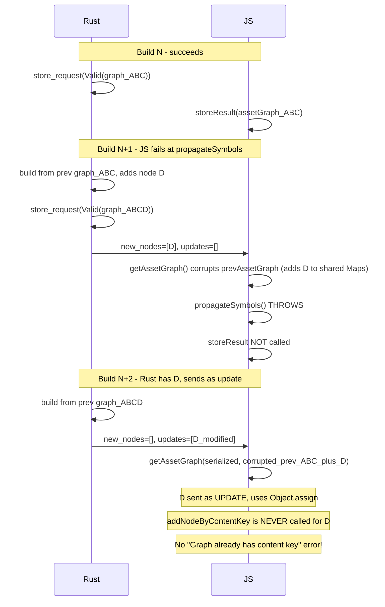

# Integration Test: "Graph already has content key" Reproduction

## Why the exact error is hard to trigger end-to-end

The error requires the **same content key** to be sent as a **new node** (via `addNodeByContentKey`) when the JS `_contentKeyToNodeId` Map already has that key (from corruption). Through deep analysis of the Rust-JS interaction, I found this cannot happen in the normal propagateSymbols failure path:

The root cause: Rust **always caches its graph** after a successful build (in `store_request` at [request_tracker.rs:286](crates/atlaspack/src/request_tracker/request_tracker.rs)). On the next build, `get_cached_request_result` returns the latest graph ([line 330](crates/atlaspack/src/request_tracker/request_tracker.rs)), and `AssetGraph::from(prev)` sets `starting_node_count` to the previous node count. Previously-new nodes are always below `starting_node_count` and are sent as `updates`, not `nodes`.

The only scenario where the error manifests is when **Rust and JS disagree** about which nodes exist -- Rust thinks a node is new (sends it in `nodes`), but JS already has it in its corrupted Maps. This requires Rust's state to be "behind" JS's corrupted state, which could happen during:

- **Build aborts** at specific timing (after `getAssetGraph` corrupts Maps, before Rust commits)
- **Race conditions** between concurrent builds
- **Process crashes** that lose Rust state but preserve JS state

## Proposed approach: Two-phase test

Given the constraints, I propose a test with **two complementary parts**.

### Part 1: New-file-addition + propagateSymbols failure (regression test)

A test that exercises the full corruption path (new nodes + build failure) even though it may not trigger the exact error today. After the fix is applied (cloning Maps instead of sharing), this test validates the fix works end-to-end.

**Fixture**: A new `v3-graph-corruption-recovery` fixture under `integration/scope-hoisting/es6/` with files:

- `a.js` - entry, imports `b.js` and conditionally `c.js`
- `a.1.js` - imports only `b.js` (initial state)
- `a.2.js` - imports `b.js` AND new `c.js` (c.js re-exports broken symbol from `d.js`)
- `a.3.js` - same as `a.1.js` (restores initial state)
- `b.js` - stable module, exports `foo`
- `c.js` - new module, does `export {baz} from './d.js'`
- `d.js` - exports `quux` (NOT `baz`) -- triggers propagateSymbols error

**Sequence**:

1. Build with `a.1.js` (imports only b.js) -- succeeds
2. Switch to `a.2.js` (adds import of c.js, which re-exports broken symbol from d.js). Rust adds new nodes for c.js and d.js. `getAssetGraph` adds their content keys to the shared Maps. `propagateSymbols` fails (d.js doesn't export `baz`). Build fails.
3. Switch back to `a.1.js` (removes the broken import). Build should succeed, proving no fatal graph corruption.

### Part 2: Rapid file changes to attempt build abort (opportunistic)

A second test that tries to trigger a build abort at the right time by making rapid file changes without awaiting between them:

1. Build with `a.1.js` -- succeeds
2. Switch to `a.2.js` (adds new file + broken export)
3. **Immediately** (without awaiting) switch to `a.3.js` (fix/restore)
4. Await whatever build completes -- should eventually succeed

This is less deterministic but exercises the build abort path. If a build abort happens between `getAssetGraph` and `storeResult`, AND Rust hasn't committed yet, the exact error would manifest.

## Files to create

- `packages/core/integration-tests/test/integration/scope-hoisting/es6/v3-graph-corruption-recovery/a.1.js` - `import {foo} from './b.js'; output = foo;`
- `packages/core/integration-tests/test/integration/scope-hoisting/es6/v3-graph-corruption-recovery/a.2.js` - `import {foo} from './b.js'; import {baz} from './c.js'; output = foo + baz;`
- `packages/core/integration-tests/test/integration/scope-hoisting/es6/v3-graph-corruption-recovery/b.js` - `export const foo = 123;`
- `packages/core/integration-tests/test/integration/scope-hoisting/es6/v3-graph-corruption-recovery/c.js` - `export {baz} from './d.js';`
- `packages/core/integration-tests/test/integration/scope-hoisting/es6/v3-graph-corruption-recovery/d.js` - `export const quux = 456;` (note: no `baz` export)

## Test code location

Add tests in [packages/core/integration-tests/test/scope-hoisting.ts](packages/core/integration-tests/test/scope-hoisting.ts) inside the existing `describe.v3('recovery after symbol propagation error (graph corruption)')` block (which currently has one test that does NOT add new files).

## Update to the root cause analysis

After the tests are implemented, update the root cause analysis document to note that the exact end-to-end trigger requires Rust/JS state desync (likely from build aborts), and that the unit tests remain the definitive proof of the shared mutable state bug.
