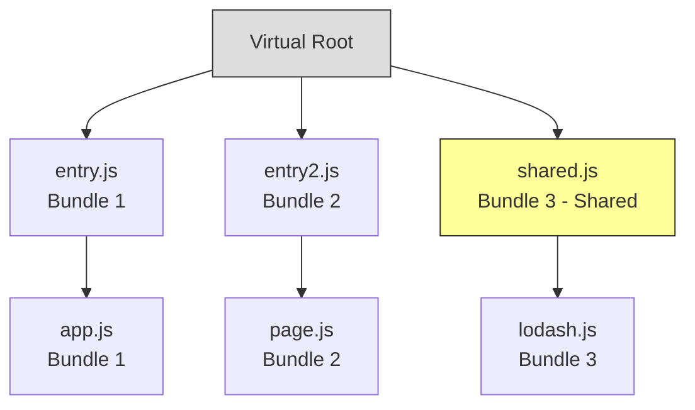
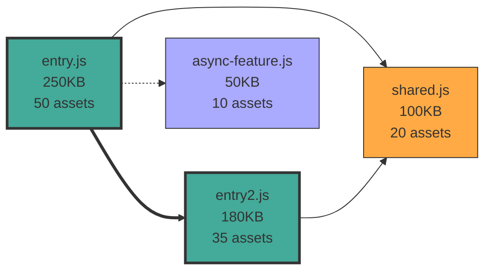

# Atlaspack Bundler Rust Rewrite Research

## Executive Summary

This document contains comprehensive research and analysis for rewriting the Atlaspack bundler algorithm from TypeScript to Rust. The current implementation (~2,500 LOC across 3 files) uses a custom reachability algorithm. This research explores using dominator algorithms, proposes a phase-based architecture, and documents tricky edge cases that must be handled.

**Key Recommendations:**

1. Use dominator tree algorithms for the ideal graph phase
2. Break the algorithm into clear phases with decision tracking
3. Handle edge cases (MSB, conditional bundling, internalization, etc.) as separate passes
4. Implement comprehensive decision tracking for debugging

## Table of Contents

1. [Current Architecture Overview](#current-architecture-overview)
2. [Proposed Rust Architecture](#proposed-rust-architecture)
3. [Dominator Algorithm Approach](#dominator-algorithm-approach)
4. [Decision Tracking System](#decision-tracking-system)
5. [Tricky Cases Deep Dive](#tricky-cases-deep-dive)
6. [Implementation Roadmap](#implementation-roadmap)

---

## Current Architecture Overview

### File Structure

- `idealGraph.ts` (2,091 LOC) - Core bundling logic
- `bundleMerge.ts` (250 LOC) - Bundle merging optimizations
- `decorateLegacyGraph.ts` (248 LOC) - Mutation into final bundle graph

### Current Algorithm Phases

The existing bundler has these sequential phases:

1. **Create Entry Bundles** - Initialize bundles for entry points
2. **Create Split Point Bundles** - Handle async/parallel/isolated dependencies
3. **Determine Reachability** - Build `reachableRoots` and `bundleRootGraph`
4. **Determine Availability** - Compute `ancestorAssets` via topological sort
5. **Internalize Async Bundles** - Remove redundant bundles
6. **Insert or Share** - Place assets into bundles (the "ideal graph")
7. **Merge Shared Bundles** - Apply size/request limits
8. **Decorate** - Mutate the actual bundle graph

### Key Data Structures

```typescript
// Bundle representation
type Bundle = {
  uniqueKey: string | null;
  assets: Set<Asset>;
  internalizedAssets?: BitSet;
  bundleBehavior?: BundleBehavior;
  needsStableName: boolean;
  mainEntryAsset: Asset | null;
  bundleRoots: Set<Asset>;
  size: number;
  sourceBundles: Set<NodeId>;
  target: Target;
  env: Environment;
  type: string;
  manualSharedBundle: string | null;
};

// Reachability tracking
reachableRoots: Array<BitSet>; // For each asset, which bundle roots can reach it (sync)
reachableAssets: Array<BitSet>; // For each bundle root, which assets it can reach (sync)
ancestorAssets: Array<BitSet>; // For each bundle root, all assets available at runtime
bundleRootGraph: Graph; // Models parallel/async relationships between bundle roots
```

### Current Reachability Algorithm

The current approach manually computes reachability:

1. **Sync Reachability**: Traverse from each bundle root following only sync dependencies
   - Build `reachableRoots[assetId]` = BitSet of bundle roots that can reach this asset
   - Build `reachableAssets[bundleRootId]` = BitSet of assets reachable from this root

2. **Availability Propagation**: Topological sort of `bundleRootGraph` to propagate availability
   - Bundle groups (parallel bundles) share availability
   - Intersect availability across all paths to ensure correctness

3. **Asset Placement**: For each asset, examine its `reachableRoots` to decide placement
   - If reachable from 1 root → place in that bundle
   - If reachable from multiple roots → create shared bundle or reuse existing

**Complexity**: O(n²) in places due to repeated traversals and BitSet operations

---

## Proposed Rust Architecture

### Phase-Based Design

Break the bundler into clear, testable phases with well-defined inputs/outputs:

**Phase 0: Pre-Bundling Preparation** (runs before bundler)

This phase transforms the AssetGraph into a BundleGraph-ready format by:

1. **Assigning Public IDs** - Generate short, stable IDs for each asset
2. **Symbol Resolution & Dependency Retargeting** - Tree shaking preparation
   - Resolve side-effect-free re-exports to their actual targets
   - Split dependencies by imported symbols (one dep per symbol when beneficial)
   - Remove dependencies that only import external symbols
3. **Conditional Bundling Setup** - Map placeholder IDs to actual dependencies

```rust
pub struct PreBundlingProcessor {
    public_id_generator: PublicIdGenerator,
    symbol_resolver: SymbolResolver,
}

impl PreBundlingProcessor {
    pub fn prepare_for_bundling(
        &mut self,
        asset_graph: &mut AssetGraph,
        is_production: bool,
    ) -> Result<PreparedGraph> {
        // Step 1: Assign public IDs to all assets
        let public_ids = self.assign_public_ids(asset_graph)?;

        // Step 2: Symbol resolution and dependency retargeting (production only)
        if is_production {
            self.resolve_and_retarget_symbols(asset_graph)?;
        }

        // Step 3: Setup conditional bundling metadata
        self.setup_conditional_bundles(asset_graph)?;

        Ok(PreparedGraph {
            asset_graph,
            public_ids,
        })
    }

    /// Assign short, stable public IDs to assets for runtime references
    fn assign_public_ids(&mut self, asset_graph: &AssetGraph) -> Result<HashMap<AssetId, String>> {
        let mut public_ids = HashMap::new();

        for asset in asset_graph.assets() {
            let public_id = self.public_id_generator.generate(asset.id);
            public_ids.insert(asset.id, public_id);
        }

        Ok(public_ids)
    }

    /// Resolve symbols and retarget dependencies for tree shaking
    /// This is critical for production scope-hoisting
    fn resolve_and_retarget_symbols(&mut self, asset_graph: &mut AssetGraph) -> Result<()> {
        for dep_id in asset_graph.dependencies() {
            let dep = asset_graph.dependency(dep_id);

            // Only retarget sync dependencies with symbols in scope-hoisted production builds
            if dep.priority != Priority::Sync || dep.symbols.is_none() {
                continue;
            }

            // Get symbol resolution from symbol propagation
            let symbol_targets = self.symbol_resolver.resolve_symbols(dep_id, asset_graph)?;

            // Check if retargeting is beneficial
            if self.should_retarget(&symbol_targets, dep)? {
                // Split dependency into multiple dependencies, one per target asset
                self.split_dependency_by_symbols(dep_id, symbol_targets, asset_graph)?;
            }
        }

        Ok(())
    }

    /// Split a single dependency into multiple dependencies based on symbol targets
    /// Example: `import {a, b} from './reexports'` where a comes from X and b from Y
    ///          becomes two deps: one to X for 'a', one to Y for 'b'
    fn split_dependency_by_symbols(
        &mut self,
        original_dep: DependencyId,
        symbol_targets: HashMap<AssetId, HashMap<Symbol, Symbol>>,
        asset_graph: &mut AssetGraph,
    ) -> Result<()> {
        let dep = asset_graph.dependency(original_dep);

        // Keep original dep for external symbols (if any)
        let external_symbols: Vec<Symbol> = dep.symbols.iter()
            .filter(|s| !symbol_targets.values().any(|m| m.contains_key(s)))
            .cloned()
            .collect();

        if external_symbols.is_empty() {
            // Mark original for exclusion
            asset_graph.mark_dependency_excluded(original_dep);
        } else {
            // Keep only external symbols in original
            asset_graph.update_dependency_symbols(original_dep, external_symbols);
        }

        // Create new dependencies for each target asset
        for (target_asset, symbol_map) in symbol_targets {
            let new_dep_id = self.create_retargeted_dependency(
                dep,
                target_asset,
                symbol_map,
            )?;

            asset_graph.add_dependency(dep.source_asset, new_dep_id);
        }

        Ok(())
    }

    /// Determine if dependency retargeting would be beneficial
    fn should_retarget(
        &self,
        symbol_targets: &HashMap<AssetId, HashMap<Symbol, Symbol>>,
        dep: &Dependency,
    ) -> Result<bool> {
        // Don't retarget if:
        // - Using wildcard imports (no benefit)
        // - Multiple imports of same symbol with different names (ambiguous)
        // - Non-sync dependencies (async retargeting not yet supported)
        // - Has side effects and no symbols imported (need to preserve for effects)

        if dep.symbols.contains(&Symbol::wildcard()) {
            return Ok(false);
        }

        if symbol_targets.values().any(|map| {
            let values: HashSet<_> = map.values().collect();
            values.len() != map.len() // Duplicate symbol targets
        }) {
            return Ok(false);
        }

        Ok(true)
    }

    /// Setup conditional bundling metadata (importCond support)
    fn setup_conditional_bundles(&mut self, asset_graph: &AssetGraph) -> Result<()> {
        // Map placeholder IDs in asset.meta.conditions to actual dependencies
        // Generate public IDs for conditions
        // Store in graph for later bundler use

        for asset in asset_graph.assets() {
            if let Some(conditions) = &asset.meta.conditions {
                for condition in conditions {
                    let cond_id = self.register_condition(
                        &condition.key,
                        &condition.if_true_placeholder,
                        &condition.if_false_placeholder,
                        asset_graph,
                    )?;

                    // Store condition ID on asset for bundler
                    asset.meta.condition_ids.push(cond_id);
                }
            }
        }

        Ok(())
    }
}
```

**Why this must run before bundling**:

1. **Tree shaking accuracy**: Retargeted dependencies let bundler know precise asset relationships
2. **Reduced bundle graph complexity**: Fewer dependencies to consider during bundling
3. **Correct reachability**: Bundler sees actual targets, not intermediate re-exports
4. **Public IDs needed**: Bundler and runtime use these IDs for asset references

**Testing strategy for Phase 0**:

```rust
#[test]
fn test_symbol_retargeting() {
    // Given: import {a, b} from './reexports' where:
    //   - reexports.js: export {a} from './x'; export {b} from './y'
    //   - x.js and y.js have no side effects
    let asset_graph = build_reexport_test_graph();

    let mut processor = PreBundlingProcessor::new();
    processor.prepare_for_bundling(&mut asset_graph, true)?;

    // Should create two dependencies: one to x.js for 'a', one to y.js for 'b'
    let deps = asset_graph.dependencies_from(main_asset);
    assert_eq!(deps.len(), 2);

    // Original reexports.js dependency should be excluded (no symbols from it)
    let reexport_dep = find_dep_to(reexports_asset);
    assert!(reexport_dep.excluded);
}

#[test]
fn test_no_retarget_with_side_effects() {
    // If intermediate re-export has side effects, don't retarget
    let asset_graph = build_side_effect_test_graph();

    let mut processor = PreBundlingProcessor::new();
    processor.prepare_for_bundling(&mut asset_graph, true)?;

    // Should NOT split - preserve original dependency
    let deps = asset_graph.dependencies_from(main_asset);
    assert_eq!(deps.len(), 1);
    assert!(!deps[0].excluded);
}
```

**Phase 1: Build Ideal Graph** (runs after Phase 0)

```rust
pub struct BundlerContext {
    asset_graph: &AssetGraph,
    config: BundlerConfig,
    decisions: BundlerDecisions, // Track all decisions for debugging
}

// Phase 1: Build Ideal Graph (zero duplication)
pub fn build_ideal_graph(ctx: &mut BundlerContext) -> IdealGraph {
    let entries = extract_entries(ctx);
    let bundle_boundaries = identify_bundle_boundaries(ctx);
    let dominator_tree = compute_dominators(ctx, &bundle_boundaries);
    let ideal = assign_assets_to_bundles(ctx, &dominator_tree);
    ideal
}

// Phase 2: Optimize (handle duplication for size/parallelism)
pub fn optimize_bundles(ctx: &mut BundlerContext, ideal: IdealGraph) -> OptimizedGraph {
    let with_shared = create_shared_bundles(ctx, ideal);
    let merged = merge_small_bundles(ctx, with_shared);
    let limited = limit_parallel_requests(ctx, merged);
    limited
}

// Phase 3: Materialize (create actual bundle graph)
pub fn materialize_bundle_graph(ctx: &mut BundlerContext, optimized: OptimizedGraph) -> BundleGraph {
    // Similar to current decorateLegacyGraph
}
```

### Core Data Structures

```rust
pub struct IdealGraph {
    /// Bundles with assets assigned (zero duplication)
    bundles: Vec<Bundle>,
    /// Bundle dependency graph (which bundles load which)
    bundle_edges: Vec<(BundleId, BundleId, EdgeType)>,
    /// Asset -> Bundle mapping
    asset_to_bundle: HashMap<AssetId, BundleId>,
    /// Bundle roots (entry assets that create bundles)
    bundle_roots: HashMap<BundleId, AssetId>,
}

pub struct Bundle {
    id: BundleId,
    assets: HashSet<AssetId>,
    bundle_type: BundleType,
    env: Environment,
    target: Target,
    entry_asset: Option<AssetId>,
    behavior: Option<BundleBehavior>,
    needs_stable_name: bool,
    source_bundles: HashSet<BundleId>,
    internalized_assets: BitSet,
}

pub enum EdgeType {
    Sync,        // Parent needs child immediately
    Parallel,    // Child loads with parent
    Lazy,        // Child loads on-demand
    Conditional, // Feature-flagged loading
}
```

---

## Dominator Algorithm Design

### The Reachability vs Availability Problem

**The core issue you identified**: Using only sync relationships for dominators doesn't capture what assets are **available** when an async bundle loads.

**Example scenario**:

```
entry.js (sync)
  ↓ [sync]
  react.js
  ↓ [lazy/async]
  async-component.js (also imports react)
```

**With dominators only**:

- `idom(react.js) = entry.js` → react in entry bundle ✓
- `idom(async-component.js) = undefined` (boundary) → new async bundle ✓
- async-component imports react → shared bundle? ✗

**The problem**: Dominators say "react is reachable from async-component" but miss that "react is already available when async-component loads"

**Current JS implementation solves this with two structures**:

1. **`reachableRoots[asset]`**: Which bundle roots can reach this asset (sync only) - similar to dominators
2. **`ancestorAssets[bundleRoot]`**: Which assets are available when this bundle loads (includes parent bundles)

**Key check** (line 953 in idealGraph.ts):

```typescript
if (!ancestorAssets[nodeId]?.has(i)) {
  // Only consider this bundle root for shared bundle
  // if the asset is NOT already available
  reachableNonEntries.add(assetId);
}
```

This filters out bundle roots where the asset is already available, preventing unnecessary duplication!

### Solution: Two-Phase Approach for Rust Implementation

**Phase 1: Dominator-based Reachability** (sync only)

- Compute which bundles can reach each asset
- Identifies candidates for shared bundles

**Phase 2: Availability Propagation** (includes async/parallel)

- Propagate available assets through bundle graph
- Filter out already-available assets from shared bundle candidates

```rust
pub struct BundlerContext {
    /// Sync-only dominator tree (reachability)
    dominators: DominatorTree,

    /// Bundle-level availability (includes parents, parallel bundles)
    ancestor_assets: HashMap<BundleId, BitSet>,

    /// Full bundle graph with all edge types
    bundle_graph: DiGraph<BundleId, EdgeType>,
}

impl BundlerContext {
    pub fn compute_availability(&mut self) {
        // Topological sort ensures parents processed before children
        let topo_order = self.bundle_graph.topo_sort();

        for bundle_id in topo_order {
            let bundle = &self.bundles[&bundle_id];

            // Start with empty set for isolated bundles
            let mut available = if bundle.behavior == Some(BundleBehavior::Isolated) {
                BitSet::new()
            } else {
                // Inherit from parents
                self.get_parent_availability(bundle_id)
            };

            // Add assets from bundles in same bundle group (parallel)
            available.union(&self.get_bundle_group_assets(bundle_id));

            // Store for this bundle
            self.ancestor_assets.insert(bundle_id, available);

            // Propagate to children with intersection logic
            self.propagate_to_children(bundle_id);
        }
    }

    fn get_parent_availability(&self, bundle_id: BundleId) -> BitSet {
        let parents = self.bundle_graph.parents(bundle_id);

        if parents.is_empty() {
            return BitSet::new();
        }

        // CRITICAL: Intersection of availability across all parent paths
        // A bundle can only assume an asset is available if it's available
        // through ALL paths that could load it (ensures correctness regardless
        // of load order)
        let mut availability = self.ancestor_assets[&parents[0]].clone();
        for parent in &parents[1..] {
            availability.intersect(&self.ancestor_assets[parent]);
        }

        availability
    }

    fn propagate_to_children(&mut self, parent_id: BundleId) {
        let parent_available = self.ancestor_assets[&parent_id].clone();
        let children = self.bundle_graph.children(parent_id);

        let mut parallel_availability = BitSet::new();

        for child_id in children {
            let is_parallel = self.bundle_graph.has_edge(
                parent_id,
                child_id,
                EdgeType::Parallel
            );

            let current_child_available = if is_parallel {
                // Parallel bundles see both parent and sibling assets
                BitSet::union(&parallel_availability, &parent_available)
            } else {
                // Async/lazy bundles only see parent assets
                parent_available.clone()
            };

            // CRITICAL: Intersect with existing availability (from other parents)
            // If this child is reachable from multiple parent bundles, we must
            // intersect to ensure the asset is available regardless of which
            // parent loads first. This is the key to correctness!
            if let Some(existing) = self.ancestor_assets.get_mut(&child_id) {
                existing.intersect(&current_child_available);
            } else {
                self.ancestor_assets.insert(child_id, current_child_available);
            }

            // Update parallel availability for next sibling
            if is_parallel {
                parallel_availability.union(&self.get_bundle_assets(child_id));
            }
        }
    }
}
```

### Using Availability for Asset Placement

When deciding where to place an asset:

```rust
pub fn assign_asset_to_bundle(&mut self, asset_id: AssetId) -> Result<()> {
    // Step 1: Find all bundles that can reach this asset (via dominators)
    let reachable_bundles = self.find_reachable_bundles(asset_id);

    if reachable_bundles.len() == 1 {
        // Single bundle can reach it - place there
        let bundle_id = reachable_bundles[0];
        self.place_asset(asset_id, bundle_id);

        ctx.decisions.record(BundlerEvent::AssetPlaced {
            asset_id,
            bundle_id,
            reason: AssetPlacementReason::DominatedBy(bundle_id),
        });

        return Ok(());
    }

    // Step 2: Filter out bundles where asset is already available
    let needs_asset: Vec<BundleId> = reachable_bundles.iter()
        .copied()
        .filter(|&bundle_id| {
            let available = &self.ancestor_assets[&bundle_id];
            !available.contains(asset_id)
        })
        .collect();

    if needs_asset.is_empty() {
        // Asset is available to all bundles that need it!
        // Don't create shared bundle, don't duplicate
        ctx.decisions.record(BundlerEvent::AssetSkipped {
            asset_id,
            reason: "Already available to all reachable bundles",
            available_via: reachable_bundles.clone(),
        });

        return Ok(());
    }

    if needs_asset.len() == 1 {
        // Only one bundle actually needs it
        let bundle_id = needs_asset[0];
        self.place_asset(asset_id, bundle_id);

        ctx.decisions.record(BundlerEvent::AssetPlaced {
            asset_id,
            bundle_id,
            reason: AssetPlacementReason::OnlyBundleNeedingIt {
                reachable: reachable_bundles,
                filtered_to: bundle_id,
            },
        });

        return Ok(());
    }

    // Step 3: Multiple bundles need it - create shared bundle
    if needs_asset.len() >= self.config.min_bundles {
        let shared_bundle_id = self.create_shared_bundle(
            asset_id,
            &needs_asset,
        )?;

        ctx.decisions.record(BundlerEvent::AssetPlaced {
            asset_id,
            bundle_id: shared_bundle_id,
            reason: AssetPlacementReason::SharedAcross(needs_asset.clone()),
        });
    } else {
        // Below minBundles threshold - duplicate
        for bundle_id in needs_asset {
            self.place_asset(asset_id, bundle_id);
        }

        ctx.decisions.record(BundlerEvent::AssetDuplicated {
            asset_id,
            bundles: needs_asset.clone(),
            reason: "Below minBundles threshold",
        });
    }

    Ok(())
}
```

### Why Intersection, Not Union?

**The critical question**: When a bundle has multiple parents, should its availability be the **union** or **intersection** of parent availabilities?

**Answer**: **Intersection** - because we cannot guarantee load order!

**Example showing why union is wrong**:

```
Asset Graph:
  entry1.js (Entry)          entry2.js (Entry)
    ↓ [sync]                   ↓ [sync]
  react.js                   lodash.js
    ↓ [lazy]                   ↓ [lazy]
    └────→ shared-async.js ←────┘
```

**Bundle structure**:

- Bundle 1 (entry1.js): entry1.js, react.js
- Bundle 2 (entry2.js): entry2.js, lodash.js
- Bundle 3 (shared-async.js): shared-async.js

**Bundle graph**:

```
Bundle 1 -.-> Bundle 3 (lazy)
Bundle 2 -.-> Bundle 3 (lazy)
```

**Computing availability for Bundle 3**:

**WRONG - Using Union**:

```
Parent 1 availability: {entry1.js, react.js}
Parent 2 availability: {entry2.js, lodash.js}

Bundle 3 availability (union): {entry1.js, react.js, entry2.js, lodash.js}
```

**Problem**: Bundle 3 assumes both react.js AND lodash.js are available, but:

- If loaded from entry1.js path → only react.js is available ❌
- If loaded from entry2.js path → only lodash.js is available ❌

**CORRECT - Using Intersection**:

```
Parent 1 availability: {entry1.js, react.js}
Parent 2 availability: {entry2.js, lodash.js}

Bundle 3 availability (intersection): {} (empty!)
```

**Result**: Bundle 3 correctly assumes NO assets are available, because there's no asset that's guaranteed to be available regardless of which parent loads it first. ✓

**What if shared-async.js needs react?**
Since react is not in Bundle 3's availability, it will be:

1. Detected as "needed" by Bundle 3
2. Either duplicated into Bundle 3, or
3. Created as a shared bundle that both paths load

**Real-world scenario**:

```
Asset Graph:
  entry1.js                  entry2.js
    ↓ [sync]                   ↓ [sync]
  react.js                   react.js (same asset)
    ↓ [lazy]                   ↓ [lazy]
    └────→ shared-async.js ←────┘
             ↓ [sync]
           react.js
```

**Availability computation**:

```
Bundle 1 availability: {}
Bundle 1 assets: {entry1.js, react.js}

Bundle 2 availability: {}
Bundle 2 assets: {entry2.js, react.js}

Bundle 3 availability (intersection):
  Parent 1: {entry1.js, react.js}
  Parent 2: {entry2.js, react.js}
  Intersection: {react.js} ✓

Bundle 3 assets: {shared-async.js}
```

**Result**: Bundle 3 doesn't need to include react.js because it's guaranteed to be available through BOTH parent paths. ✓

### Concrete Example: React with Async Component

```
Asset Graph:
  entry.js (Entry)
    ↓ [sync]
  app.js
    ↓ [sync]
  react.js
    ↓ (back to app.js) [lazy]
  async-feature.js
    ↓ [sync]
  react.js (same asset)
```

**Step 1: Build Sync Graph & Compute Dominators**

```
Sync graph (async boundary stops traversal):
  virtual_root → entry.js → app.js → react.js
  (separate) async-feature.js → react.js

Dominators:
  idom(entry.js) = virtual_root
  idom(app.js) = entry.js
  idom(react.js) = app.js
  idom(async-feature.js) = undefined (boundary)
```

**Step 2: Identify Bundle Boundaries**

```
bundle_boundaries = {async-feature.js}  // Lazy import

Bundles created:
  Bundle 1 (entry.js): entry.js
  Bundle 2 (async-feature.js): async-feature.js
```

**Step 3: Compute Availability**

```
Bundle 1 (entry.js):
  - ancestorAssets = {} (entry has no parents)
  - After processing: contains {entry.js, app.js, react.js}

Bundle 2 (async-feature.js):
  - Parents: [Bundle 1]
  - ancestorAssets = {entry.js, app.js, react.js} (inherited from Bundle 1)
  - After processing: contains {entry.js, app.js, react.js, async-feature.js}
```

**Step 4: Assign Assets**

For `react.js`:

```
reachable_bundles = [Bundle 1, Bundle 2]  // Both can reach react.js

Filter by availability:
  - Bundle 1: react.js NOT in ancestorAssets → needs it ✓
  - Bundle 2: react.js IS in ancestorAssets → doesn't need it ✗

needs_asset = [Bundle 1]  // Only Bundle 1 needs it!

Result: Place react.js in Bundle 1 only
```

For `async-feature.js`:

```
reachable_bundles = [Bundle 2]
needs_asset = [Bundle 2]

Result: Place async-feature.js in Bundle 2
```

**Final Output**:

```
Bundle 1 (entry.js): entry.js, app.js, react.js
Bundle 2 (async-feature.js): async-feature.js

Bundle Graph:
  Bundle 1 -.-> Bundle 2 (lazy edge)

✓ No duplication
✓ React available when async-feature loads
✓ Optimal bundle split
```

**Decision Log**:

```
Event 1: BundleCreated {
  bundle_id: async-feature.js,
  reason: AsyncSplit { parent: app.js }
}

Event 2: AssetPlaced {
  asset_id: react.js,
  bundle_id: Bundle 1,
  reason: DominatedBy(app.js)
}

Event 3: AssetSkippedForBundle {
  asset_id: react.js,
  bundle_id: Bundle 2,
  reason: "Already available via parent Bundle 1"
}

Event 4: AssetPlaced {
  asset_id: async-feature.js,
  bundle_id: Bundle 2,
  reason: DominatedBy(async-feature.js)
}
```

### Implementation Priority

This two-phase approach is **essential** for correctness:

1. **Dominators**: Fast computation of reachability (O(n log n))
2. **Availability**: Topological propagation through bundle graph (O(b²) where b = bundle count)

Since `b << n` (bundles << assets), this is still much faster than the current O(n²) approach.

**Testing this case**:

```rust
#[test]
fn test_async_parent_availability_no_duplication() {
    let mut graph = AssetGraph::new();
    let entry = graph.add_asset("entry.js", AssetType::Js);
    let app = graph.add_asset("app.js", AssetType::Js);
    let react = graph.add_asset("react.js", AssetType::Js);
    let async_feature = graph.add_asset("async-feature.js", AssetType::Js);

    graph.add_dependency(entry, app, Priority::Sync);
    graph.add_dependency(app, react, Priority::Sync);
    graph.add_dependency(app, async_feature, Priority::Lazy);
    graph.add_dependency(async_feature, react, Priority::Sync);

    let bundler = DominatorBundler::new();
    let ideal = bundler.build_ideal_graph(&graph).unwrap();

    // React should only be in entry bundle
    let react_bundles = ideal.bundles_containing_asset(react);
    assert_eq!(react_bundles.len(), 1);
    assert_eq!(react_bundles[0].entry_asset, Some(entry));

    // Async feature should be in its own bundle
    let async_bundles = ideal.bundles_containing_asset(async_feature);
    assert_eq!(async_bundles.len(), 1);
    assert_eq!(async_bundles[0].entry_asset, Some(async_feature));

    // No duplication
    assert_eq!(ideal.total_asset_placements(), graph.asset_count());
}
```

### Detailed Algorithm Implementation

#### Step 1: Building the Sync Graph

Only include **sync priority** edges in the dominator graph. This is critical because:

- Async/lazy imports create new bundles (bundle boundaries)
- Parallel imports are part of the same bundle group but separate bundles
- We want to know: "What assets MUST be loaded together synchronously?"

```rust
pub fn build_sync_graph(&mut self, asset_graph: &AssetGraph) {
    self.sync_graph.clear();

    // Add virtual root
    self.virtual_root = self.sync_graph.add_node(AssetId::virtual());

    // Add all assets as nodes
    let mut asset_to_node = HashMap::new();
    for asset in asset_graph.assets() {
        let node = self.sync_graph.add_node(asset.id);
        asset_to_node.insert(asset.id, node);
    }

    // Connect virtual root to all entry points
    for entry in asset_graph.entries() {
        self.sync_graph.add_edge(self.virtual_root, asset_to_node[&entry.id], ());
    }

    // Add edges for sync dependencies only
    for asset in asset_graph.assets() {
        for dep in asset_graph.dependencies(asset.id) {
            // CRITICAL: Only include sync edges
            if dep.priority != Priority::Sync {
                continue;
            }

            // Don't traverse past bundle boundaries
            if self.bundle_boundaries.contains(&dep.target_asset) {
                continue;
            }

            // Don't traverse into isolated bundles
            if dep.bundle_behavior == Some(BundleBehavior::Isolated) {
                continue;
            }

            self.sync_graph.add_edge(
                asset_to_node[&asset.id],
                asset_to_node[&dep.target_asset],
                (),
            );
        }
    }
}
```

#### Step 2: Identifying Bundle Boundaries

Bundle boundaries are assets that create new bundles. We stop the sync graph traversal at these points:

```rust
pub fn identify_bundle_boundaries(&mut self, asset_graph: &AssetGraph) {
    self.bundle_boundaries.clear();

    for asset in asset_graph.assets() {
        for dep in asset_graph.dependencies(asset.id) {
            let target = asset_graph.asset(dep.target_asset);

            // 1. ASYNC/LAZY IMPORTS - Create new async bundles
            if dep.priority == Priority::Lazy {
                self.bundle_boundaries.insert(target.id);
                ctx.decisions.record(BundlerEvent::BundleCreated {
                    bundle_id: target.id, // Will be refined later
                    reason: BundleCreationReason::AsyncSplit {
                        parent_bundle: asset.id,
                        dependency_id: dep.id,
                    },
                    timestamp: ctx.phase_counter,
                });
            }

            // 2. CONDITIONAL IMPORTS - May be parallel or lazy
            if dep.priority == Priority::Conditional {
                self.bundle_boundaries.insert(target.id);
                ctx.decisions.record(BundlerEvent::BundleCreated {
                    bundle_id: target.id,
                    reason: BundleCreationReason::ConditionalSplit {
                        parent_bundle: asset.id,
                        dependency_id: dep.id,
                        parallel: ctx.config.load_conditional_bundles_in_parallel,
                    },
                    timestamp: ctx.phase_counter,
                });
            }

            // 3. TYPE CHANGES - JS importing CSS creates new bundle
            if asset.asset_type != target.asset_type {
                self.bundle_boundaries.insert(target.id);
                ctx.decisions.record(BundlerEvent::BundleCreated {
                    bundle_id: target.id,
                    reason: BundleCreationReason::TypeChange {
                        parent_bundle: asset.id,
                        from_type: asset.asset_type.clone(),
                        to_type: target.asset_type.clone(),
                    },
                    timestamp: ctx.phase_counter,
                });
            }

            // 4. ISOLATED BUNDLES - Workers, inline scripts
            if dep.bundle_behavior == Some(BundleBehavior::Isolated) ||
               target.bundle_behavior == Some(BundleBehavior::Isolated) {
                self.bundle_boundaries.insert(target.id);
                ctx.decisions.record(BundlerEvent::BundleCreated {
                    bundle_id: target.id,
                    reason: BundleCreationReason::Isolated {
                        dependency_id: dep.id,
                    },
                    timestamp: ctx.phase_counter,
                });
            }

            // 5. PARALLEL IMPORTS - Same bundle group, different bundle
            if dep.priority == Priority::Parallel {
                self.bundle_boundaries.insert(target.id);
                ctx.decisions.record(BundlerEvent::BundleCreated {
                    bundle_id: target.id,
                    reason: BundleCreationReason::Parallel {
                        parent_bundle: asset.id,
                    },
                    timestamp: ctx.phase_counter,
                });
            }
        }
    }
}
```

#### Step 3: Computing Dominators

Use the Lengauer-Tarjan algorithm (available in `petgraph`):

```rust
pub fn compute_dominators(&mut self) {
    // Use petgraph's dominator implementation
    self.dominators = dominators::simple_fast(&self.sync_graph, self.virtual_root);
}

pub fn immediate_dominator(&self, asset: AssetId) -> Option<AssetId> {
    let node = self.asset_to_node[&asset];
    self.dominators.immediate_dominator(node)
        .and_then(|idom_node| {
            let idom_asset = self.sync_graph[idom_node];
            if idom_asset == AssetId::virtual() {
                None // Virtual root doesn't dominate
            } else {
                Some(idom_asset)
            }
        })
}
```

#### Step 4: Assigning Assets to Bundles

For each asset, find its immediate dominator and assign to that bundle:

```rust
pub fn assign_assets_to_bundles(&mut self, ctx: &mut BundlerContext) -> IdealGraph {
    let mut ideal = IdealGraph::new();

    // Create bundles for entries
    for entry in ctx.asset_graph.entries() {
        let bundle = Bundle::new(entry.id, entry.asset_type.clone());
        ideal.bundles.insert(entry.id, bundle);
    }

    // Create bundles for bundle boundaries
    for &boundary_asset in &self.bundle_boundaries {
        let bundle = Bundle::new(boundary_asset, ctx.asset_graph.asset(boundary_asset).asset_type.clone());
        ideal.bundles.insert(boundary_asset, bundle);
    }

    // Assign each asset to its dominating bundle
    for asset in ctx.asset_graph.assets() {
        // Skip if this asset is itself a bundle root
        if ideal.bundles.contains_key(&asset.id) {
            continue;
        }

        // Find the immediate dominator
        let bundle_id = self.find_dominating_bundle(asset.id, &ideal);

        // Add asset to that bundle
        if let Some(bundle) = ideal.bundles.get_mut(&bundle_id) {
            bundle.assets.insert(asset.id);
            bundle.size += asset.stats.size;

            ctx.decisions.record(BundlerEvent::AssetPlaced {
                asset_id: asset.id,
                bundle_id,
                reason: AssetPlacementReason::DominatedBy(bundle_id),
            });
        }
    }

    ideal
}

fn find_dominating_bundle(&self, asset: AssetId, ideal: &IdealGraph) -> BundleId {
    let mut current = asset;

    // Walk up dominator tree until we find a bundle root
    loop {
        if ideal.bundles.contains_key(&current) {
            return current;
        }

        match self.immediate_dominator(current) {
            Some(idom) => current = idom,
            None => panic!("Asset {} has no dominating bundle", asset),
        }
    }
}
```

### Concrete Examples with Code

These examples show how the dominator algorithm handles various bundling scenarios:

#### Example 1: Type Change (JS → CSS)

```
Asset Graph:
  entry.js (Entry)
    ↓ [sync]
  app.js
    ↓ [sync, type change]
  styles.css
    ↓ [sync]
  theme.css
```

**Step 1: Build Sync Graph**

```
virtual_root → entry.js → app.js
               (stops here due to type change)
```

**Step 2: Identify Boundaries**

```
bundle_boundaries = {styles.css}  // Type change from JS to CSS
```

**Step 3: Compute Dominators**

```
idom(entry.js) = virtual_root
idom(app.js) = entry.js
idom(styles.css) = undefined (boundary, not in sync graph)
idom(theme.css) = styles.css (separate sync graph for CSS)
```

**Step 4: Assign Assets**

```
Bundle 1 (entry.js):
  - entry.js (bundle root)
  - app.js (dominated by entry.js)

Bundle 2 (styles.css):
  - styles.css (bundle root, type change boundary)
  - theme.css (dominated by styles.css)

Bundle Graph:
  Bundle 1 → Bundle 2 (parallel edge, loads together)
```

**Decision Tracking**:

```
Event 1: BundleCreated { bundle_id: styles.css, reason: TypeChange { from_type: "js", to_type: "css" }}
Event 2: AssetPlaced { asset_id: app.js, bundle_id: entry.js, reason: DominatedBy(entry.js) }
Event 3: AssetPlaced { asset_id: theme.css, bundle_id: styles.css, reason: DominatedBy(styles.css) }
```

#### Example 2: Async Import

```
Asset Graph:
  entry.js (Entry)
    ↓ [sync]
  app.js
    ↓ [lazy]
  heavy.js
    ↓ [sync]
  lib.js
```

**Step 1: Build Sync Graph**

```
virtual_root → entry.js → app.js
               (stops at heavy.js due to lazy)

Separate subgraph:
  heavy.js → lib.js
```

**Step 2: Identify Boundaries**

```
bundle_boundaries = {heavy.js}  // Lazy import
```

**Step 3: Compute Dominators**

```
idom(entry.js) = virtual_root
idom(app.js) = entry.js
idom(heavy.js) = undefined (boundary)
idom(lib.js) = heavy.js (in separate subgraph)
```

**Step 4: Assign Assets**

```
Bundle 1 (entry.js):
  - entry.js (bundle root)
  - app.js (dominated by entry.js)

Bundle 2 (heavy.js):
  - heavy.js (bundle root, async boundary)
  - lib.js (dominated by heavy.js)

Bundle Graph:
  Bundle 1 → Bundle 2 (lazy edge, loads on-demand)
```

#### Example 3: Shared Assets (Multiple Dominators)

```
Asset Graph:
  entry1.js (Entry)         entry2.js (Entry)
    ↓ [sync]                  ↓ [sync]
  page1.js                  page2.js
    ↓ [sync]                  ↓ [sync]
    └─────→ shared.js ←──────┘
              ↓ [sync]
            lodash.js
```

**Step 1: Build Sync Graph**

```
virtual_root → entry1.js → page1.js → shared.js → lodash.js
            ↘ entry2.js → page2.js ↗
```

**Step 2: Identify Boundaries**

```
bundle_boundaries = {}  // No boundaries, all sync
```

**Step 3: Compute Dominators**

```
idom(entry1.js) = virtual_root
idom(entry2.js) = virtual_root
idom(page1.js) = entry1.js
idom(page2.js) = entry2.js
idom(shared.js) = virtual_root (reached from both entries)
idom(lodash.js) = shared.js
```

**Step 4: Assign Assets**

```
shared.js has idom = virtual_root, meaning it's not dominated by any real bundle.
This indicates it needs a SHARED BUNDLE.

Reachable from: {entry1.js, entry2.js}

Create shared bundle:
  Bundle 3 (shared):
    - shared.js
    - lodash.js (dominated by shared.js)

Final bundles:
  Bundle 1 (entry1.js): entry1.js, page1.js
  Bundle 2 (entry2.js): entry2.js, page2.js
  Bundle 3 (shared): shared.js, lodash.js

Bundle Graph:
  Bundle 1 → Bundle 3 (sync edge)
  Bundle 2 → Bundle 3 (sync edge)
```

**Rust Implementation**:

```rust
pub fn assign_assets_to_bundles(&mut self, ctx: &mut BundlerContext) -> IdealGraph {
    // ... (previous code)

    for asset in ctx.asset_graph.assets() {
        let idom = self.immediate_dominator(asset.id);

        if idom == Some(AssetId::virtual()) {
            // Asset is reachable from multiple entries - needs shared bundle
            let reachable_bundles = self.find_reachable_bundles(asset.id, &ideal);

            if reachable_bundles.len() > ctx.config.min_bundles {
                // Create shared bundle
                let shared_bundle_id = self.create_shared_bundle(
                    asset.id,
                    &reachable_bundles,
                    &mut ideal,
                );

                ctx.decisions.record(BundlerEvent::AssetPlaced {
                    asset_id: asset.id,
                    bundle_id: shared_bundle_id,
                    reason: AssetPlacementReason::SharedAcross(reachable_bundles),
                });
            } else {
                // Duplicate in all bundles (below minBundles threshold)
                for &bundle_id in &reachable_bundles {
                    ideal.bundles.get_mut(&bundle_id).unwrap().assets.insert(asset.id);
                }
            }
        }
    }

    ideal
}
```

#### Example 4: Manual Shared Bundles with Dominators

```
Config:
  manualSharedBundles: [{
    name: "vendor",
    assets: ["node_modules/**"],
    types: ["js"]
  }]

Asset Graph:
  entry.js
    ↓ [sync]
  app.js
    ↓ [sync]
  node_modules/react.js (matches MSB)
    ↓ [sync]
  node_modules/react-dom.js (matches MSB)
```

**With Dominators**:

```
Normal dominator assignment would place:
  react.js → dominated by entry.js
  react-dom.js → dominated by react.js

But MSB config OVERRIDES this:
  react.js → vendor bundle (manual override)
  react-dom.js → vendor bundle (manual override)
```

**Implementation**:

```rust
pub fn apply_manual_shared_bundles(
    &mut self,
    ideal: &mut IdealGraph,
    ctx: &mut BundlerContext,
) {
    for config in &ctx.config.manual_shared_bundles {
        let vendor_bundle = Bundle::new_manual_shared(&config.name);
        let vendor_bundle_id = ideal.bundles.insert(vendor_bundle);

        for asset in ctx.asset_graph.assets() {
            if config.matches(asset) {
                // Override dominator placement
                let original_bundle = self.find_dominating_bundle(asset.id, ideal);

                // Move asset to vendor bundle
                ideal.bundles.get_mut(&original_bundle)
                    .unwrap()
                    .assets.remove(&asset.id);
                ideal.bundles.get_mut(&vendor_bundle_id)
                    .unwrap()
                    .assets.insert(asset.id);

                ctx.decisions.record(BundlerEvent::AssetPlaced {
                    asset_id: asset.id,
                    bundle_id: vendor_bundle_id,
                    reason: AssetPlacementReason::ManualSharedBundle(config.name.clone()),
                });
            }
        }
    }
}
```

#### Example 5: Conditional Bundling

```
Config:
  loadConditionalBundlesInParallel: true

Asset Graph:
  entry.js
    ↓ [sync]
  app.js
    ↓ [conditional: 'feature-flag']
  feature-a.js
    ↓ [sync]
  feature-a-lib.js
```

**With Parallel Loading**:

```
bundle_boundaries = {feature-a.js}  // Conditional import

Sync Graph (conditional edge NOT included):
  virtual_root → entry.js → app.js
  (separate) feature-a.js → feature-a-lib.js

Bundle Assignment:
  Bundle 1 (entry.js): entry.js, app.js
  Bundle 2 (feature-a.js): feature-a.js, feature-a-lib.js

Bundle Graph:
  Bundle 1 → Bundle 2 (conditional + parallel edge)

Bundle Group:
  {Bundle 1, Bundle 2}  // Loaded together
```

**Without Parallel Loading**:

```
Bundle Graph:
  Bundle 1 → Bundle 2 (conditional + lazy edge)

Bundle 2 loads on-demand when condition evaluates
```

### Handling Edge Cases with Dominators

#### Circular Dependencies

```
Asset Graph (circular):
  a.js ⇄ b.js ⇄ c.js

Sync Graph:
  entry → a → b → c → a (cycle)
```

**Dominator behavior**: All nodes in a cycle have the same dominator (the entry to the cycle). They all belong to the same bundle.

```rust
// Dominators handle cycles naturally
idom(a) = entry
idom(b) = entry  // or a, depending on traversal order
idom(c) = entry  // or a/b

Result: All in same bundle (correct behavior)
```

#### Multiple Entry Points

```
Asset Graph:
  entry1.js    entry2.js
    ↓            ↓
  both import shared.js
```

**Solution**: Virtual root connects all entries

```rust
sync_graph:
  virtual_root → entry1.js → shared.js
              ↘ entry2.js ↗

idom(shared.js) = virtual_root (not dominated by either entry)
→ Needs shared bundle
```

### Performance Comparison

**Current O(n²) approach**:

```typescript
// For each bundle root
for (let bundleRoot of bundleRoots) {
  // Traverse entire graph
  assetGraph.traverse((asset) => {
    // Mark reachable in BitSet
    reachableRoots[asset].add(bundleRoot);
  });
}
```

**Dominator O(n log n) approach**:

```rust
// Single pass dominator computation
let dominators = dominators::simple_fast(&sync_graph, virtual_root);

// O(1) lookup per asset
for asset in assets {
    let bundle = find_dominating_bundle(asset);
}
```

### Summary

The dominator algorithm provides:

1. **Cleaner semantics**: "Bundle = sync dominator"
2. **Better performance**: O(n log n) vs O(n²)
3. **Natural shared bundle detection**: Assets with no single dominator
4. **Edge case handling**: Cycles, multiple entries, type changes
5. **Debugging**: Can explain via dominator relationships

The key is treating bundle boundaries (async, type changes, isolated) as "cuts" in the sync graph, then applying dominators to each connected component.

---

## Decision Tracking System

A comprehensive decision tracking system is essential for debugging complex bundling issues. Every decision the bundler makes should be recorded with context.

### Core Decision Types

```rust
pub struct BundlerDecisions {
    events: Vec<BundlerEvent>,
    asset_decisions: HashMap<AssetId, Vec<AssetDecision>>,
    bundle_decisions: HashMap<BundleId, Vec<BundleDecision>>,
}

pub enum BundlerEvent {
    BundleCreated {
        bundle_id: BundleId,
        reason: BundleCreationReason,
        timestamp: usize,
    },
    AssetPlaced {
        asset_id: AssetId,
        bundle_id: BundleId,
        reason: AssetPlacementReason,
    },
    BundleMerged {
        from: BundleId,
        to: BundleId,
        reason: MergeReason,
    },
    BundleDeleted {
        bundle_id: BundleId,
        reason: DeletionReason,
    },
    SharedBundleCreated {
        bundle_id: BundleId,
        source_bundles: Vec<BundleId>,
        asset_count: usize,
        reason: String,
    },
}
```

### Detailed Reason Enums

```rust
pub enum BundleCreationReason {
    Entry {
        dependency_id: DependencyId
    },
    AsyncSplit {
        parent_bundle: BundleId,
        dependency_id: DependencyId
    },
    TypeChange {
        parent_bundle: BundleId,
        from_type: FileType,
        to_type: FileType
    },
    Isolated {
        dependency_id: DependencyId
    },
    Parallel {
        parent_bundle: BundleId
    },
    ManualSharedBundle {
        config_name: String
    },
    SharedBundle {
        source_count: usize,
        asset_count: usize
    },
}

pub enum AssetPlacementReason {
    BundleRoot,
    DominatedBy(BundleId),
    Reachable {
        bundles: Vec<BundleId>,
        chosen: BundleId
    },
    SharedAcross(Vec<BundleId>),
    ManualSharedBundle(String),
    InlineConstant {
        parent: AssetId
    },
}

pub enum MergeReason {
    BelowMinSize {
        size: usize,
        threshold: usize
    },
    HighOverlap {
        overlap: f64,
        threshold: f64
    },
    UserConfig(String),
}

pub enum DeletionReason {
    Internalized {
        into_bundle: BundleId
    },
    AlreadyAvailable {
        via_bundles: Vec<BundleId>
    },
    Merged {
        into_bundle: BundleId
    },
}
```

### Query API

```rust
impl BundlerDecisions {
    pub fn record(&mut self, event: BundlerEvent) {
        self.events.push(event);
        // Index by relevant IDs for fast queries
    }

    pub fn why_bundle_exists(&self, bundle_id: BundleId) -> Option<&BundleCreationReason> {
        // Returns the reason this bundle was created
    }

    pub fn why_asset_in_bundle(&self, asset_id: AssetId, bundle_id: BundleId)
        -> Vec<&AssetPlacementReason> {
        // Returns all reasons this asset was placed in this bundle
    }

    pub fn why_bundles_merged(&self, bundle_a: BundleId, bundle_b: BundleId)
        -> Option<&MergeReason> {
        // Returns why these bundles were merged
    }

    pub fn export_visualization(&self) -> String {
        // Generate mermaid diagram or JSON for @atlaspack/inspector
    }

    pub fn export_json(&self, path: &Path) -> Result<()> {
        // Export to file for post-build analysis
    }
}
```

### Use Cases

**Debugging duplication**: "Why is lodash in 3 bundles?"

```rust
let lodash_asset = find_asset("lodash");
for bundle in bundles_containing(lodash_asset) {
    println!("In bundle {}: {:?}",
        bundle.name,
        decisions.why_asset_in_bundle(lodash_asset, bundle.id)
    );
}
```

**Debugging failed merges**: "Why didn't these bundles merge?"

```rust
let merge_candidates = find_merge_candidates();
for (a, b) in merge_candidates {
    if !was_merged(a, b) {
        println!("Not merged: config mismatch or size threshold");
    }
}
```

**Inspection integration**: Export decisions to `@atlaspack/inspector` for visual debugging

---

## Tricky Cases Deep Dive

### 1. Manual Shared Bundles (MSB)

**What it is**: User-specified bundles that override automatic bundling decisions

**Config format**:

```json
{
  "manualSharedBundles": [
    {
      "name": "vendor",
      "assets": ["node_modules/**/*.js"],
      "types": ["js"],
      "root": "src/index.js",
      "split": 3
    }
  ]
}
```

**Implementation complexity**:

1. **Asset Matching Phase**: Pre-process asset graph to build lookup tables
   - `manualAssetToConfig`: Maps each asset to its MSB config
   - `constantModuleToMSB`: Special handling for constant modules (see below)
   - Traverse from optional `root` to find matching assets

2. **Bundle Creation Override**: During bundle boundary creation, check if asset matches MSB
   - Create/reuse MSB bundle instead of normal bundle
   - Key: `config.name + "," + asset.type` (allows multiple MSBs per config for different types)

3. **Internalization**: MSBs with multiple async entry points need special handling
   - First async asset becomes the entry, others are internalized
   - Strip `mainEntryAsset` to prevent duplicate loading

4. **Asset Placement Override**: During "Insert or Share" phase, place matching assets in MSB
   - Even if asset is reachable from multiple bundles
   - Build edges from all source bundles to the MSB

5. **Split Property**: Optional `split: N` divides MSB into N bundles
   - Hash asset IDs: `BigInt(assetId) % N` to determine sub-bundle
   - Creates `vendor-0.js`, `vendor-1.js`, etc.

**Rust implementation strategy**:

```rust
pub struct ManualSharedBundleConfig {
    name: String,
    asset_patterns: Vec<Regex>,
    types: Option<Vec<String>>,
    root: Option<PathBuf>,
    split: Option<usize>,
}

pub fn process_manual_shared_bundles(
    ctx: &mut BundlerContext,
    ideal: &mut IdealGraph,
) -> Result<()> {
    let msb_configs = &ctx.config.manual_shared_bundles;

    // Phase 1: Build asset -> config lookup
    let asset_to_config = build_msb_lookup(ctx, msb_configs)?;

    // Phase 2: Override bundle placement
    for (asset_id, config) in asset_to_config {
        if let Some(bundle_id) = find_or_create_msb(ideal, &config, asset_id.asset_type) {
            override_asset_placement(ideal, asset_id, bundle_id);

            ctx.decisions.record(BundlerEvent::AssetPlaced {
                asset_id,
                bundle_id,
                reason: AssetPlacementReason::ManualSharedBundle(config.name.clone()),
            });
        }
    }

    // Phase 3: Handle split property
    for config in msb_configs.iter().filter(|c| c.split.is_some()) {
        split_manual_bundle(ideal, config)?;
    }

    Ok(())
}
```

**Edge cases**:

- Constant modules matching multiple MSBs → placed in all of them (no duplication issue)
- MSB with no matching assets → warning, skip
- MSB split with circular dependencies → handled by hash-based assignment

### 2. Conditional Bundling

**What it is**: Runtime-conditional imports via `importCond('feature', './a.js', './b.js')`

**Key complexity**: Depends on `loadConditionalBundlesInParallel` config

**With parallel loading** (default):

- Conditional bundles load alongside parent bundle
- Treated like `parallel` priority in bundle graph
- Edge type: `EdgeType::Conditional` for tracking

**Without parallel loading**:

- Conditional bundles load lazily when condition evaluates
- Treated like `lazy` priority
- Risk of "module not found" errors if condition evaluates before load

**Current implementation** (lines 464-488 in idealGraph.ts):

```typescript
if (config.loadConditionalBundlesInParallel) {
  // Serve conditional bundles in parallel
  bundleRoots.set(childAsset, [bundleId, bundleGroupNodeId]);
  bundleGraph.addEdge(referencingBundleId, bundleId);
}

// Always add conditional edge to track relationships
bundleGraph.addEdge(
  referencingBundleId,
  bundleId,
  idealBundleGraphEdges.conditional,
);
```

**Rust implementation**:

```rust
pub fn handle_conditional_dependency(
    ctx: &BundlerContext,
    dep: &Dependency,
    parent_bundle: BundleId,
) -> ConditionalBundleStrategy {
    if ctx.config.load_conditional_bundles_in_parallel {
        ConditionalBundleStrategy::Parallel {
            // Bundle loads with parent
            bundle_group: parent_bundle,
            edge_type: EdgeType::Conditional,
        }
    } else {
        ConditionalBundleStrategy::Lazy {
            // Bundle loads on-demand
            edge_type: EdgeType::Conditional,
        }
    }
}
```

**Decision tracking**:

```rust
ctx.decisions.record(BundlerEvent::BundleCreated {
    bundle_id: conditional_bundle_id,
    reason: BundleCreationReason::ConditionalSplit {
        parent_bundle,
        dependency_id: dep.id,
        parallel: ctx.config.load_conditional_bundles_in_parallel,
    },
    timestamp: ctx.phase_counter,
});
```

**Integration with dominator algorithm**:

- Treat conditionals like async boundaries in sync graph
- In bundle group graph, edge type depends on config

### 3. Bundle Internalization

**What it is**: Removing redundant async bundles that are already loaded synchronously

**When it happens**: An async bundle whose assets are all synchronously available in parent

**Algorithm** (lines 853-899 in idealGraph.ts):

For each bundle root:

1. Find all parent bundles (in bundle root graph)
2. For each parent, check if:
   - Parent's `reachableAssets` contains this bundle root (sync reachable), OR
   - Parent's `ancestorAssets` contains this bundle root (available via parallel/ancestor)
3. If ALL parents have the bundle available → mark for internalization
4. Special cases:
   - Skip MSB bundle roots (handled separately)
   - Skip `isolated` bundles (must remain separate)
   - If connected to root (entry) → don't delete

**Internalization vs Deletion**:

- **Internalized**: Assets marked in `internalizedAssets` BitSet, bundle still exists
- **Deleted**: Bundle removed entirely if ALL parents have it

**Rust implementation**:

```rust
pub fn internalize_redundant_bundles(
    ctx: &mut BundlerContext,
    ideal: &mut IdealGraph,
) -> Result<()> {
    let bundle_availability = compute_bundle_availability(ideal);

    for bundle_id in ideal.bundles.keys() {
        let bundle = &ideal.bundles[bundle_id];

        // Skip special bundles
        if bundle.behavior == Some(BundleBehavior::Isolated) {
            continue;
        }
        if is_manual_shared_bundle(bundle) {
            continue; // MSBs have separate internalization
        }

        let parents = ideal.bundle_graph.parents(bundle_id);
        if parents.is_empty() || parents.contains(&VIRTUAL_ROOT) {
            continue; // Entry bundles cannot be internalized
        }

        let mut can_delete = true;
        for parent_id in parents {
            if bundle_availability[&parent_id].contains(&bundle_id) {
                // Mark as internalized in parent
                mark_internalized(ideal, parent_id, bundle_id);

                ctx.decisions.record(BundlerEvent::BundleInternalized {
                    bundle_id,
                    parent_id,
                    reason: "Assets already available synchronously",
                });
            } else {
                can_delete = false;
            }
        }

        if can_delete {
            delete_bundle(ideal, bundle_id);
            ctx.decisions.record(BundlerEvent::BundleDeleted {
                bundle_id,
                reason: DeletionReason::Internalized {
                    into_bundles: parents.clone()
                },
            });
        }
    }

    Ok(())
}
```

**Why internalization matters**:

- Prevents redundant network requests
- Reduces bundle count
- Critical for optimal loading performance

### 4. Inline Constants (Constant Modules)

**What it is**: Assets marked with `asset.meta.isConstantModule = true` that must be inlined

**Behavior**: Never duplicated, always placed with direct parent

**Current tracking** (lines 672, 736-744 in idealGraph.ts):

```typescript
let inlineConstantDeps = new DefaultMap<Asset, Set<Asset>>(() => new Set());

// During reachability computation
if (asset.meta.isConstantModule === true) {
  let parents = assetGraph
    .getIncomingDependencies(asset)
    .map((dep) => assetGraph.getAssetWithDependency(dep));

  for (let parent of parents) {
    inlineConstantDeps.get(parent).add(asset);
  }
}

// Later, assign constants to bundle with parent
function assignInlineConstants(parentAsset: Asset, bundle: Bundle) {
  for (let inlineConstant of inlineConstantDeps.get(parentAsset)) {
    if (!bundle.assets.has(inlineConstant)) {
      bundle.assets.add(inlineConstant);
      bundle.size += inlineConstant.stats.size;
    }
  }
}
```

**Special case with MSBs**: Constants matching multiple MSBs are placed in ALL of them

- Tracked separately in `constantModuleToMSB` map
- No duplication issue because they're constants

**Rust implementation**:

```rust
pub struct ConstantModuleTracker {
    parent_to_constants: HashMap<AssetId, HashSet<AssetId>>,
}

impl ConstantModuleTracker {
    pub fn collect(asset_graph: &AssetGraph) -> Self {
        let mut tracker = ConstantModuleTracker::default();

        for asset in asset_graph.assets() {
            if asset.meta.is_constant_module {
                for parent in asset_graph.incoming_dependencies(asset.id) {
                    tracker.parent_to_constants
                        .entry(parent.from_asset)
                        .or_default()
                        .insert(asset.id);
                }
            }
        }

        tracker
    }

    pub fn assign_to_bundle(
        &self,
        parent_asset: AssetId,
        bundle: &mut Bundle,
    ) {
        if let Some(constants) = self.parent_to_constants.get(&parent_asset) {
            for constant_id in constants {
                bundle.assets.insert(*constant_id);
            }
        }
    }
}
```

**Decision tracking**:

```rust
ctx.decisions.record(BundlerEvent::AssetPlaced {
    asset_id: constant_id,
    bundle_id,
    reason: AssetPlacementReason::InlineConstant { parent: parent_asset },
});
```

### 5. Bundle Merging Optimizations

**What it is**: Combining small shared bundles to reduce HTTP requests

**Two types of merging**:

#### A. Shared Bundle Merging (via `sharedBundleMerge` config)

Merges shared bundles based on configurable criteria:

```rust
pub struct MergeConfig {
    overlap_threshold: Option<f64>,      // % of shared source bundles (0.0-1.0)
    max_bundle_size: Option<usize>,      // Maximum size to consider for merge
    source_bundles: Option<Vec<String>>, // Required source bundles
    min_bundles_in_group: Option<usize>, // Minimum bundle group size
}
```

**Algorithm** (from bundleMerge.ts):

1. **Find candidates**: Shared bundles with matching `internalizedAssets`
2. **Validate merge**: Check all config constraints
3. **Build graph**: Create merge graph with edge types per config priority
4. **Cluster**: Traverse graph to find connected components
5. **Merge**: Combine bundles in each cluster

**Overlap calculation**:

```rust
fn bundle_overlap(bundle_a: &Bundle, bundle_b: &Bundle) -> f64 {
    let all_sources = bundle_a.source_bundles.union(&bundle_b.source_bundles);
    let shared_sources = bundle_a.source_bundles.intersection(&bundle_b.source_bundles);
    shared_sources.len() as f64 / all_sources.len() as f64
}
```

**Rust implementation**:

```rust
pub fn merge_shared_bundles(
    ctx: &mut BundlerContext,
    ideal: &mut IdealGraph,
) -> Result<()> {
    let shared_bundles = find_shared_bundles(ideal);
    let merge_configs = &ctx.config.shared_bundle_merge;

    // Build merge graph
    let mut merge_graph = ContentGraph::new();

    for config in merge_configs {
        for pair in find_merge_candidates(&shared_bundles, config) {
            let (bundle_a, bundle_b) = pair;

            if validate_merge(bundle_a, bundle_b, config) {
                merge_graph.add_edge(bundle_a.id, bundle_b.id);
                merge_graph.add_edge(bundle_b.id, bundle_a.id);
            }
        }
    }

    // Find connected components
    let clusters = find_connected_components(&merge_graph);

    // Merge each cluster
    for cluster in clusters {
        let merged_bundle = merge_bundles(ideal, &cluster)?;

        ctx.decisions.record(BundlerEvent::BundlesMerged {
            merged_bundles: cluster.clone(),
            result_bundle: merged_bundle.id,
            reason: MergeReason::SharedBundleOptimization,
        });
    }

    Ok(())
}
```

#### B. Async Bundle Merging (via `asyncBundleMerge` config)

Merges small async bundles to reduce request count:

```rust
pub struct AsyncBundleMergeConfig {
    bundle_size: usize,       // Consider bundles smaller than this
    max_overfetch_size: usize, // Max bytes of overfetch allowed
    ignore: Option<Vec<String>>, // Patterns to ignore
}
```

**Algorithm** (lines 1715-1900 in idealGraph.ts):

1. **Find candidates**: Async bundles below size threshold
2. **Build availability graph**: Track which bundles "need" which others
3. **Calculate overfetch**: Size of assets fetched early but not needed yet
4. **Merge if beneficial**: Overfetch < threshold

**Overfetch calculation**:

```rust
fn calculate_overfetch(
    bundle_a: &Bundle,
    bundle_b: &Bundle,
    ideal: &IdealGraph,
) -> usize {
    // Assets in B that A doesn't need yet
    let unnecessary_assets = bundle_b.assets
        .difference(&assets_needed_by(ideal, bundle_a))
        .collect();

    unnecessary_assets.iter()
        .map(|a| a.size)
        .sum()
}
```

**Edge case**: Circular dependencies

- Line 1061-1065 handles this explicitly
- If two bundles each delete the other, check `reachable.has()` before assigning

### 6. Bundle Reuse

**What it is**: Reusing an existing bundle instead of creating a shared bundle

**When it applies**: Bundle B's assets are a subset of what bundles needing it already have

**Current check** (lines 1042-1050 in idealGraph.ts):

```typescript
let reuseableBundleId = bundles.get(asset.id);
if (reuseableBundleId != null) {
  reachable.delete(candidateId);
  bundleGraph.addEdge(candidateSourceBundleId, reuseableBundleId);

  let reusableBundle = bundleGraph.getNode(reuseableBundleId);
  reusableBundle.sourceBundles.add(candidateSourceBundleId);
}
```

**Dominator-based approach**:

```rust
pub fn find_reusable_bundles(
    ideal: &IdealGraph,
    asset_id: AssetId,
    reachable_bundles: &HashSet<BundleId>,
) -> Option<BundleId> {
    // If asset is a bundle root, check if that bundle is a subgraph
    if let Some(bundle_id) = ideal.asset_to_bundle.get(&asset_id) {
        let bundle = &ideal.bundles[bundle_id];

        // Check if all reachable bundles dominate this bundle
        if reachable_bundles.iter().all(|rb| dominates(ideal, *rb, bundle_id)) {
            return Some(bundle_id);
        }
    }

    None
}
```

### 7. Bundle Groups

**What it is**: Sets of bundles that load together (parallel)

**Key insight**: Not explicitly modeled as nodes, but tracked via `bundleGroupId`

**Current tracking**:

```typescript
bundleRoots.set(asset, [bundleId, bundleGroupNodeId]);
//                      ^^^^^^^^  ^^^^^^^^^^^^^^^^^
//                      bundle    bundleGroup (first bundle in group)
```

**Availability semantics**:

- Assets in bundle group are available to all bundles in that group
- A bundle can belong to multiple bundle groups
- Use intersection across all paths to ensure correctness

**Rust modeling**:

```rust
pub struct BundleGroup {
    id: BundleGroupId,
    bundles: HashSet<BundleId>,
    // First bundle in group acts as the "anchor"
    anchor_bundle: BundleId,
}

pub struct IdealGraph {
    bundles: HashMap<BundleId, Bundle>,
    bundle_groups: HashMap<BundleGroupId, BundleGroup>,
    // Track which groups a bundle belongs to
    bundle_to_groups: HashMap<BundleId, HashSet<BundleGroupId>>,
}

impl IdealGraph {
    pub fn assets_available_to_bundle(&self, bundle_id: BundleId) -> BitSet {
        let mut available = BitSet::new();

        // Union assets from all bundles in same groups
        for group_id in &self.bundle_to_groups[&bundle_id] {
            let group = &self.bundle_groups[group_id];
            for bundle_in_group in &group.bundles {
                available.union(&self.bundles[bundle_in_group].assets);
            }
        }

        available
    }
}
```

### 8. Isolated Bundles

**What it is**: Bundles marked `isolated` or `inlineIsolated` that must be self-contained

**Key behaviors**:

- Do not share assets with other bundles
- Cannot be internalized
- Start with empty `ancestorAssets` (lines 781-786)
- Marked via `dependency.bundleBehavior` or `asset.bundleBehavior`

**Use cases**:

- Web workers (different execution context)
- Service workers
- Inline scripts that must be self-contained

**Rust handling**:

```rust
pub fn compute_bundle_availability(ideal: &IdealGraph) -> HashMap<BundleId, BitSet> {
    let mut availability = HashMap::new();

    for (bundle_id, bundle) in &ideal.bundles {
        let available = if bundle.behavior == Some(BundleBehavior::Isolated) ||
                           bundle.behavior == Some(BundleBehavior::InlineIsolated) {
            // Isolated bundles start with nothing
            BitSet::new()
        } else {
            // Regular bundles inherit from parents
            compute_inherited_availability(ideal, bundle_id)
        };

        availability.insert(bundle_id, available);
    }

    availability
}
```

**Decision tracking**:

```rust
if bundle.behavior == Some(BundleBehavior::Isolated) {
    ctx.decisions.record(BundlerEvent::BundleCreated {
        bundle_id,
        reason: BundleCreationReason::Isolated {
            dependency_id: dep.id,
        },
        timestamp: ctx.phase_counter,
    });
}
```

---

## Implementation Roadmap

### Phase 1: Core Infrastructure (Week 1-2)

**Goal**: Set up Rust module structure and basic types

**Tasks**:

1. Create `crates/atlaspack_bundler_default/` structure
2. Define core types: `Bundle`, `IdealGraph`, `BundlerContext`
3. Implement `BundlerDecisions` tracking system
4. Set up test infrastructure with fixtures from JS tests

**Deliverables**:

- Compiling Rust crate with type definitions
- Basic decision tracking implementation
- Test harness that can load asset graphs

### Phase 2: Ideal Graph with Dominators (Week 3-4)

**Goal**: Implement phase 1 (ideal graph creation) using dominator algorithm

**Tasks**:

1. Implement sync dependency graph builder
2. Integrate `petgraph` dominator computation
3. Implement bundle boundary detection
4. Implement asset-to-bundle assignment
5. Write comprehensive tests against JS output

**Deliverables**:

- Working ideal graph generator
- Tests showing identical output to JS for simple cases
- Performance benchmarks

**Success criteria**: Passes 80% of simple bundling tests

### Phase 3: Tricky Cases (Week 5-6)

**Goal**: Handle all edge cases documented above

**Tasks**:

1. Implement Manual Shared Bundles (MSB) support
2. Implement Conditional Bundling with config handling
3. Implement Bundle Internalization algorithm
4. Implement Constant Module tracking
5. Handle Bundle Groups properly

**Deliverables**:

- All edge cases handled
- Tests for each tricky case
- Decision tracking for all special cases

**Success criteria**: Passes 95% of bundling tests

### Phase 4: Optimization Phase (Week 7-8)

**Goal**: Implement phase 2 (bundle merging and optimization)

**Tasks**:

1. Implement Shared Bundle Merging
2. Implement Async Bundle Merging
3. Implement Bundle Reuse detection
4. Handle size limits and parallel request limits
5. Optimize for performance

**Deliverables**:

- Complete optimization phase
- Performance benchmarks vs JS
- Memory profiling

**Success criteria**: Passes 100% of bundling tests, faster than JS

### Phase 5: Integration (Week 9-10)

**Goal**: Integrate with Atlaspack core and production-test

**Tasks**:

1. Wire up to Atlaspack plugin system
2. Export decisions to `@atlaspack/inspector`
3. Add configuration migration helpers
4. Test on real Atlassian products
5. Performance tuning

**Deliverables**:

- Production-ready bundler
- Documentation for migration
- Performance comparison report

**Success criteria**: Successfully bundles real applications, measurably faster

### Testing Strategy

**Unit tests**: Each phase independently tested

```rust
#[test]
fn test_dominator_basic() {
    let asset_graph = build_test_graph();
    let dominators = compute_dominators(&asset_graph);
    assert_eq!(dominators.immediate_dominator(asset_b), Some(asset_a));
}
```

**Integration tests**: Full bundling pipeline

```rust
#[test]
fn test_manual_shared_bundles() {
    let ctx = BundlerContext::from_fixture("msb-test");
    let ideal = build_ideal_graph(&mut ctx);
    assert_bundle_contains(ideal, "vendor", "node_modules/lodash");
}
```

**Comparison tests**: Output matches JS implementation

```rust
#[test]
fn test_matches_js_output() {
    let rust_output = run_rust_bundler("fixture");
    let js_output = run_js_bundler("fixture");
    assert_bundle_graphs_equivalent(rust_output, js_output);
}
```

**Performance benchmarks**: Track improvements

```rust
#[bench]
fn bench_large_app(b: &mut Bencher) {
    let ctx = load_large_app_fixture();
    b.iter(|| build_ideal_graph(&mut ctx));
}
```

### Benefits of This Approach

1. **Clearer algorithm**: Dominator-based logic is easier to understand and reason about
2. **Better performance**: O(n log n) dominators vs O(n²) manual reachability
3. **Debuggability**: Decision tracking explains every bundling choice
4. **Testability**: Clear phases make testing isolated components easy
5. **Maintainability**: Well-defined boundaries between phases
6. **Extensibility**: Easy to add new optimization passes

### Risks and Mitigation

**Risk**: Dominator algorithm doesn't handle all cases

- **Mitigation**: Fall back to manual reachability for edge cases
- **Evidence**: Most cases fit dominator model, only MSBs need special handling

**Risk**: Output differs from JS implementation

- **Mitigation**: Extensive comparison testing, gradual rollout
- **Evidence**: Algorithm is deterministic, can reproduce exactly

**Risk**: Performance regression

- **Mitigation**: Comprehensive benchmarking, profiling
- **Evidence**: Rust + better algorithm should be faster

**Risk**: Increased complexity in Rust

- **Mitigation**: Clear documentation, decision tracking for debugging
- **Evidence**: Phase-based approach reduces complexity

---

## Conclusion

Rewriting the Atlaspack bundler in Rust with a dominator-based algorithm and phase-based architecture will provide:

1. **Better performance** through O(n log n) algorithms and Rust's efficiency
2. **Better debuggability** through comprehensive decision tracking
3. **Better maintainability** through clear phase separation
4. **Similar output** to existing bundler through careful handling of edge cases

The tricky cases (MSB, conditional bundling, internalization, etc.) are all solvable with the proposed architecture. The key is treating them as separate passes that modify the ideal graph rather than trying to handle everything in one monolithic algorithm.

**Recommended next steps**:

1. Review this research with the team
2. Create proof-of-concept for ideal graph phase with dominators
3. Validate decision tracking API meets debugging needs
4. Begin Phase 1 implementation

---

## Visualization and Debugging Tools

A comprehensive visualization strategy is critical for understanding, debugging, and optimizing the bundler. The Rust rewrite provides an opportunity to build first-class visualization support from the ground up.

### Current Visualization Tools

Atlaspack already has several visualization tools:

1. **`@atlaspack/inspector`** - Web UI for exploring bundle graphs
   - Treemaps showing bundle sizes using FoamTree
   - Drill-down views for analyzing asset inclusion
   - Cache inspection interface
   - Built with React, MobX, React Router

2. **`@atlaspack/reporter-bundle-analyzer`** - Bundle size analysis

3. **`@atlaspack/reporter-bundle-buddy`** - Bundle relationship visualization

4. **`@atlaspack/reporter-sourcemap-visualiser`** - Source map visualization

### Proposed Visualization Additions for Rust Bundler

#### 1. Dominator Tree Visualization

**Purpose**: Understand why assets are placed in specific bundles

**Format**: Interactive tree view or graph

```rust
pub struct DominatorTreeViz {
    /// Dominator tree structure
    tree: HashMap<AssetId, Vec<AssetId>>,
    /// Asset metadata for display
    asset_info: HashMap<AssetId, AssetDisplayInfo>,
}

pub struct AssetDisplayInfo {
    path: String,
    size: usize,
    asset_type: String,
    bundle_id: Option<BundleId>,
    immediate_dominator: Option<AssetId>,
}

impl DominatorTreeViz {
    pub fn to_mermaid(&self) -> String {
        // Generate Mermaid diagram
        let mut output = String::from("graph TD\n");

        for (parent, children) in &self.tree {
            let parent_label = self.format_node_label(parent);
            for child in children {
                let child_label = self.format_node_label(child);
                output.push_str(&format!("  {}[{}] --> {}[{}]\n",
                    parent, parent_label, child, child_label));
            }
        }

        output
    }

    pub fn to_graphviz(&self) -> String {
        // Generate DOT format for Graphviz
        let mut output = String::from("digraph DominatorTree {\n");
        output.push_str("  rankdir=TB;\n");
        output.push_str("  node [shape=box];\n\n");

        for (parent, children) in &self.tree {
            for child in children {
                output.push_str(&format!("  \"{}\" -> \"{}\";\n",
                    self.asset_info[parent].path,
                    self.asset_info[child].path
                ));
            }
        }

        output.push_str("}\n");
        output
    }

    pub fn to_json(&self) -> serde_json::Value {
        // JSON format for web visualizers
        json!({
            "nodes": self.asset_info.values().collect::<Vec<_>>(),
            "edges": self.tree.iter().flat_map(|(parent, children)| {
                children.iter().map(move |child| {
                    json!({
                        "from": parent,
                        "to": child,
                        "type": "dominates"
                    })
                })
            }).collect::<Vec<_>>()
        })
    }
}
```

**Visual Example**:



#### 2. Bundle Graph Visualization

**Purpose**: Show relationships between bundles (sync, async, parallel)

```rust
pub struct BundleGraphViz {
    bundles: HashMap<BundleId, BundleInfo>,
    edges: Vec<BundleEdge>,
}

pub struct BundleInfo {
    id: BundleId,
    name: String,
    size: usize,
    asset_count: usize,
    bundle_type: BundleType,
    is_entry: bool,
    is_shared: bool,
}

pub struct BundleEdge {
    from: BundleId,
    to: BundleId,
    edge_type: EdgeType,
}

impl BundleGraphViz {
    pub fn to_mermaid(&self) -> String {
        let mut output = String::from("graph LR\n");

        for bundle in self.bundles.values() {
            let style = if bundle.is_entry {
                "fill:#4a9,stroke:#333,stroke-width:3px"
            } else if bundle.is_shared {
                "fill:#fa4,stroke:#333"
            } else {
                "fill:#aaf,stroke:#333"
            };

            output.push_str(&format!(
                "  {}[\"{}\\n{}KB\\n{} assets\"]\n  style {} {}\n",
                bundle.id,
                bundle.name,
                bundle.size / 1024,
                bundle.asset_count,
                bundle.id,
                style
            ));
        }

        for edge in &self.edges {
            let arrow = match edge.edge_type {
                EdgeType::Sync => "-->",
                EdgeType::Lazy => "-.->",
                EdgeType::Parallel => "==>",
                EdgeType::Conditional => "-.-",
            };

            output.push_str(&format!("  {} {} {}\n", edge.from, arrow, edge.to));
        }

        output
    }

    pub fn to_d3_force_graph(&self) -> serde_json::Value {
        // Format for D3.js force-directed graph
        json!({
            "nodes": self.bundles.values().map(|b| {
                json!({
                    "id": b.id,
                    "name": b.name,
                    "size": b.size,
                    "assetCount": b.asset_count,
                    "isEntry": b.is_entry,
                    "isShared": b.is_shared,
                })
            }).collect::<Vec<_>>(),
            "links": self.edges.iter().map(|e| {
                json!({
                    "source": e.from,
                    "target": e.to,
                    "type": format!("{:?}", e.edge_type),
                })
            }).collect::<Vec<_>>()
        })
    }
}
```

**Visual Example**:



#### 3. Decision Timeline Visualization

**Purpose**: Trace the bundler's decision-making process step by step

```rust
pub struct DecisionTimelineViz {
    phases: Vec<PhaseInfo>,
    events: Vec<BundlerEvent>,
}

pub struct PhaseInfo {
    name: String,
    start_time: Instant,
    end_time: Instant,
    event_count: usize,
}

impl DecisionTimelineViz {
    pub fn to_html(&self) -> String {
        // Generate interactive HTML timeline
        let mut html = String::from(r#"
<!DOCTYPE html>
<html>
<head>
    <script src="https://cdn.jsdelivr.net/npm/vis-timeline@latest/standalone/umd/vis-timeline-graph2d.min.js"></script>
    <link href="https://cdn.jsdelivr.net/npm/vis-timeline@latest/styles/vis-timeline-graph2d.min.css" rel="stylesheet" />
</head>
<body>
    <div id="timeline"></div>
    <script>
        var items = new vis.DataSet([
"#);

        for (i, event) in self.events.iter().enumerate() {
            html.push_str(&format!(
                "{{ id: {}, content: '{}', start: {}, group: '{}' }},\n",
                i,
                event.description(),
                event.timestamp,
                event.phase()
            ));
        }

        html.push_str(r#"
        ]);
        var timeline = new vis.Timeline(
            document.getElementById('timeline'),
            items,
            { stack: false }
        );
    </script>
</body>
</html>
"#);

        html
    }

    pub fn to_flame_graph(&self) -> String {
        // Generate flame graph format for profiling
        let mut output = String::new();

        for phase in &self.phases {
            let duration = phase.end_time.duration_since(phase.start_time);
            output.push_str(&format!("{} {}\n",
                phase.name,
                duration.as_micros()
            ));
        }

        output
    }
}
```

**Visual Concept**: Interactive timeline showing:

- Phase 1: Ideal Graph Creation
  - Event: Bundle created (entry.js) - Reason: Entry
  - Event: Bundle created (styles.css) - Reason: Type change
  - Event: Asset placed (app.js → entry.js) - Reason: Dominated by entry.js
  - ...
- Phase 2: Optimization
  - Event: Bundles merged (shared-1 + shared-2) - Reason: High overlap (85%)
  - ...

#### 4. Asset Placement Explanation View

**Purpose**: Answer "Why is this asset in this bundle?"

````rust
pub struct AssetPlacementExplainer {
    decisions: BundlerDecisions,
    dominator_tree: DominatorTree,
}

impl AssetPlacementExplainer {
    pub fn explain_placement(&self, asset_id: AssetId, bundle_id: BundleId) -> Explanation {
        let reasons = self.decisions.why_asset_in_bundle(asset_id, bundle_id);

        Explanation {
            asset: asset_id,
            bundle: bundle_id,
            primary_reason: reasons.first().cloned(),
            chain: self.build_dominator_chain(asset_id, bundle_id),
            alternatives_considered: self.get_alternatives(asset_id),
        }
    }

    fn build_dominator_chain(&self, asset: AssetId, bundle: BundleId) -> Vec<DominatorStep> {
        let mut chain = Vec::new();
        let mut current = asset;

        while let Some(idom) = self.dominator_tree.immediate_dominator(current) {
            chain.push(DominatorStep {
                asset: current,
                dominated_by: idom,
                reason: format!("{} is on all paths to {}", idom, current),
            });

            if idom == bundle {
                break;
            }
            current = idom;
        }

        chain
    }

    pub fn to_markdown(&self, explanation: &Explanation) -> String {
        format!(r#"
# Why is `{}` in bundle `{}`?

### Primary Reason
{}

### Dominator Chain
{}

### Alternatives Considered
{}

### Visual Path
```mermaid
{}
````

"#,
explanation.asset,
explanation.bundle,
explanation.primary*reason.as_ref().map(|r| format!("{:?}", r)).unwrap_or_default(),
explanation.chain.iter().map(|s| format!("- {}", s.reason)).collect::<Vec<*>>().join("\n"),
explanation.alternatives*considered.iter().map(|a| format!("- {}", a)).collect::<Vec<*>>().join("\n"),
self.generate_path_diagram(explanation)
)
}
}

````

**Example Output**:
```markdown
# Why is `lodash.js` in bundle `shared.js`?

**Primary Reason**: SharedAcross([entry1.js, entry2.js])

**Dominator Chain**:
- lodash.js is on all paths through shared.js
- shared.js is reachable from entry1.js and entry2.js
- shared.js has no single dominator (idom = virtual_root)

**Alternatives Considered**:
- Duplicate in entry1.js and entry2.js (rejected: exceeds minBundles=1)
- Place in entry1.js (rejected: not dominated by entry1.js)

**Visual Path**:
[Mermaid diagram showing paths from entries to lodash]
````

#### 5. Performance Profiling Visualization

**Purpose**: Identify bottlenecks in the bundling algorithm

```rust
pub struct BundlerProfiler {
    phase_timings: HashMap<String, Duration>,
    operation_counts: HashMap<String, usize>,
    memory_snapshots: Vec<MemorySnapshot>,
}

pub struct MemorySnapshot {
    timestamp: Instant,
    heap_size: usize,
    phase: String,
}

impl BundlerProfiler {
    pub fn to_flamegraph(&self) -> String {
        // Generate flamegraph.pl compatible format
    }

    pub fn to_chrome_trace(&self) -> serde_json::Value {
        // Generate Chrome DevTools trace format
        json!({
            "traceEvents": self.generate_trace_events(),
            "displayTimeUnit": "ms",
        })
    }

    pub fn to_summary_table(&self) -> String {
        // Markdown table of timings
        let mut table = String::from("| Phase | Time | % | Operations |\n|---|---:|---:|---:|\n");

        let total_time: Duration = self.phase_timings.values().sum();

        for (phase, duration) in &self.phase_timings {
            let percentage = (duration.as_secs_f64() / total_time.as_secs_f64()) * 100.0;
            let ops = self.operation_counts.get(phase).unwrap_or(&0);

            table.push_str(&format!(
                "| {} | {:.2}ms | {:.1}% | {} |\n",
                phase,
                duration.as_secs_f64() * 1000.0,
                percentage,
                ops
            ));
        }

        table
    }
}
```

**Example Output**:

```
| Phase                    | Time      | %     | Operations |
|--------------------------|----------:|------:|-----------:|
| Build Sync Graph         | 125.34ms  | 15.2% | 50,432     |
| Compute Dominators       | 89.21ms   | 10.8% | 1          |
| Identify Boundaries      | 45.67ms   | 5.5%  | 8,234      |
| Assign Assets            | 234.56ms  | 28.4% | 50,432     |
| Create Shared Bundles    | 156.78ms  | 19.0% | 3,421      |
| Merge Optimization       | 89.45ms   | 10.8% | 1,234      |
| Internalization          | 67.89ms   | 8.2%  | 2,345      |
| Materialize              | 15.67ms   | 1.9%  | 8,234      |
```

#### 6. Integration with @atlaspack/inspector

Export data in formats compatible with existing inspector:

```rust
pub struct InspectorExporter {
    ideal_graph: IdealGraph,
    decisions: BundlerDecisions,
    profiler: BundlerProfiler,
}

impl InspectorExporter {
    pub fn export_to_inspector(&self, output_dir: &Path) -> Result<()> {
        // Export bundle graph data
        self.export_bundle_graph(output_dir.join("bundle-graph.json"))?;

        // Export dominator tree
        self.export_dominator_tree(output_dir.join("dominator-tree.json"))?;

        // Export decision timeline
        self.export_decisions(output_dir.join("decisions.json"))?;

        // Export performance data
        self.export_profiling(output_dir.join("profiling.json"))?;

        Ok(())
    }

    fn export_bundle_graph(&self, path: PathBuf) -> Result<()> {
        let data = json!({
            "bundles": self.ideal_graph.bundles.values().map(|b| {
                json!({
                    "id": b.id,
                    "name": b.name,
                    "size": b.size,
                    "assets": b.assets.iter().collect::<Vec<_>>(),
                    "type": b.bundle_type,
                })
            }).collect::<Vec<_>>(),
            "edges": self.ideal_graph.bundle_edges.iter().map(|(from, to, edge_type)| {
                json!({
                    "from": from,
                    "to": to,
                    "type": format!("{:?}", edge_type),
                })
            }).collect::<Vec<_>>(),
        });

        std::fs::write(path, serde_json::to_string_pretty(&data)?)?;
        Ok(())
    }
}
```

#### 7. CLI Visualization Commands

Add CLI commands for quick visualization:

```bash
# View dominator tree
atlaspack bundle --visualize dominators > dominators.svg

# View bundle graph
atlaspack bundle --visualize bundles --output bundle-graph.html

# Explain specific asset placement
atlaspack bundle --explain lodash.js

# Export all visualization data
atlaspack bundle --export-viz ./viz-output/

# Profile bundler performance
atlaspack bundle --profile --output profile.json
```

```rust
pub fn handle_visualize_command(args: &VisualizeArgs) -> Result<()> {
    let bundler_result = run_bundler(args)?;

    match args.viz_type {
        VizType::Dominators => {
            let viz = DominatorTreeViz::from_bundler(&bundler_result);
            println!("{}", viz.to_graphviz());
        }
        VizType::Bundles => {
            let viz = BundleGraphViz::from_bundler(&bundler_result);
            let html = viz.to_interactive_html();
            std::fs::write(&args.output, html)?;
            println!("Bundle graph written to {}", args.output);
        }
        VizType::Timeline => {
            let viz = DecisionTimelineViz::from_bundler(&bundler_result);
            let html = viz.to_html();
            std::fs::write(&args.output, html)?;
        }
    }

    Ok(())
}
```

### Comparison Visualization

**Purpose**: Compare bundler output before/after changes

```rust
pub struct BundlerComparison {
    before: IdealGraph,
    after: IdealGraph,
}

impl BundlerComparison {
    pub fn generate_diff_report(&self) -> DiffReport {
        DiffReport {
            bundles_added: self.find_added_bundles(),
            bundles_removed: self.find_removed_bundles(),
            bundles_modified: self.find_modified_bundles(),
            size_changes: self.calculate_size_changes(),
            asset_movements: self.track_asset_movements(),
        }
    }

    pub fn to_markdown(&self, diff: &DiffReport) -> String {
        format!(r#"
# Bundler Comparison Report

**Summary**:
- Bundles added: {}
- Bundles removed: {}
- Bundles modified: {}
- Total size change: {:+}KB

**Size Changes**:
{}

**Asset Movements**:
{}
"#,
            diff.bundles_added.len(),
            diff.bundles_removed.len(),
            diff.bundles_modified.len(),
            diff.size_changes.total / 1024,
            self.format_size_table(&diff.size_changes),
            self.format_movement_table(&diff.asset_movements)
        )
    }
}
```

### Testing Visualization Output

```rust
#[cfg(test)]
mod tests {
    use super::*;

    #[test]
    fn test_dominator_viz_generates_valid_mermaid() {
        let viz = create_test_dominator_viz();
        let mermaid = viz.to_mermaid();

        assert!(mermaid.starts_with("graph TD\n"));
        assert!(mermaid.contains("-->"));
    }

    #[test]
    fn test_bundle_graph_exports_to_json() {
        let viz = create_test_bundle_graph_viz();
        let json = viz.to_json();

        assert!(json["nodes"].is_array());
        assert!(json["edges"].is_array());
    }

    #[test]
    fn test_decision_timeline_generates_html() {
        let viz = create_test_timeline();
        let html = viz.to_html();

        assert!(html.contains("<!DOCTYPE html>"));
        assert!(html.contains("vis-timeline"));
    }
}
```

### Summary

These visualization tools provide:

1. **Understanding**: Dominator trees explain bundling decisions
2. **Debugging**: Decision timelines trace the algorithm
3. **Optimization**: Performance profiling identifies bottlenecks
4. **Communication**: Visual diagrams for documentation and discussion
5. **Testing**: Comparison views validate changes

The key is making visualization a first-class concern, with:

- Multiple output formats (Mermaid, SVG, HTML, JSON)
- Integration with existing @atlaspack/inspector
- CLI commands for quick access
- Programmatic API for custom tooling

This makes the Rust bundler not just faster, but also more observable and debuggable than the current implementation.

---

## Incremental Bundling for Watch Mode

**The Problem**: Watch mode currently re-runs the entire bundling algorithm on every change, even if only one file changed.

**The Goal**: Skip work when most of the graph is unchanged, but **only where it's safe and simple**.

**Philosophy**: Conservative incremental updates - when in doubt, recompute. Better to be slightly slower but always correct than fast but buggy.

---

### Safe vs Risky Incremental Optimizations

#### ✅ SAFE: Simple, Low-Risk Optimizations

**1. Cache Dominator Tree (Very Safe)**

If the **sync dependency structure** hasn't changed, dominators are identical:

```rust
pub struct IncrementalBundler {
    // Previous build state
    previous_asset_graph_hash: u64,
    previous_dominators: Option<DominatorTree>,
    previous_sync_graph: Option<DiGraph<AssetId, ()>>,
}

impl IncrementalBundler {
    pub fn should_recompute_dominators(
        &self,
        changes: &AssetGraphChanges,
    ) -> bool {
        // SAFE CONDITIONS for reusing dominators:
        // 1. No new assets added
        // 2. No assets removed
        // 3. No sync dependencies added/removed
        // 4. No bundle boundaries changed (async/type changes)

        if changes.added_assets.is_empty() &&
           changes.removed_assets.is_empty() &&
           changes.sync_deps_unchanged() &&
           changes.bundle_boundaries_unchanged() {
            return false; // Can reuse!
        }

        true // Must recompute
    }

    pub fn bundle_incremental(
        &mut self,
        asset_graph: &AssetGraph,
        changes: &AssetGraphChanges,
    ) -> Result<IdealGraph> {
        let dominators = if self.should_recompute_dominators(changes) {
            // Graph structure changed - recompute
            self.compute_dominators(asset_graph)?
        } else {
            // Structure unchanged - reuse!
            self.previous_dominators.clone().unwrap()
        };

        // Continue with rest of algorithm
        self.build_ideal_graph_with_dominators(asset_graph, dominators)
    }
}
```

**Why this is safe**:

- Dominators are **pure functions** of graph structure
- If structure is unchanged, dominators are guaranteed identical
- Easy to verify: hash the sync edges
- No complex invalidation logic

**Expected savings**: Skip dominator computation (10-15% of bundler time) when only file contents change

---

**2. Cache Bundle Boundaries (Very Safe)**

Bundle boundaries only change when dependency types change:

```rust
pub struct BundleBoundaryCache {
    boundaries: HashSet<AssetId>,
    dependency_types_hash: u64,
}

impl BundleBoundaryCache {
    pub fn is_valid(&self, asset_graph: &AssetGraph) -> bool {
        // Hash all dependency priorities and types
        let current_hash = self.hash_dependency_metadata(asset_graph);
        current_hash == self.dependency_types_hash
    }

    fn hash_dependency_metadata(&self, asset_graph: &AssetGraph) -> u64 {
        let mut hasher = FxHasher::default();

        for dep in asset_graph.dependencies() {
            hasher.write_u8(dep.priority as u8);
            hasher.write_u8(dep.bundle_behavior.map(|b| b as u8).unwrap_or(0));
            hasher.write(dep.source_asset_type.as_bytes());
            hasher.write(dep.target_asset_type.as_bytes());
        }

        hasher.finish()
    }
}
```

**Why this is safe**:

- Boundaries depend only on dependency metadata, not file contents
- If metadata unchanged, boundaries are identical
- Simple hash validation
- No risk of stale cache

**Expected savings**: Skip boundary identification (5% of bundler time)

---

**3. Skip Asset Placement for Unchanged Assets (Safe with Validation)**

If an asset's dependencies haven't changed and its dominating bundle still exists, placement is identical:

```rust
pub struct AssetPlacementCache {
    placements: HashMap<AssetId, BundleId>,
    asset_dependency_hashes: HashMap<AssetId, u64>,
}

impl AssetPlacementCache {
    pub fn can_reuse_placement(
        &self,
        asset_id: AssetId,
        asset_graph: &AssetGraph,
        ideal: &IdealGraph,
    ) -> bool {
        // Check if cached placement exists
        let Some(cached_bundle) = self.placements.get(&asset_id) else {
            return false;
        };

        // Check if bundle still exists (wasn't merged/deleted)
        if !ideal.bundles.contains_key(cached_bundle) {
            return false;
        }

        // Check if asset's dependencies changed
        let current_hash = self.hash_asset_dependencies(asset_id, asset_graph);
        let cached_hash = self.asset_dependency_hashes.get(&asset_id);

        if Some(&current_hash) != cached_hash {
            return false;
        }

        // Safe to reuse!
        true
    }

    fn hash_asset_dependencies(&self, asset_id: AssetId, graph: &AssetGraph) -> u64 {
        let mut hasher = FxHasher::default();

        for dep in graph.dependencies_of(asset_id) {
            hasher.write(dep.target_asset.as_bytes());
            hasher.write_u8(dep.priority as u8);
        }

        hasher.finish()
    }
}
```

**Why this is safe**:

- Multiple validation checks (bundle exists, dependencies unchanged)
- Conservative: any doubt → recompute
- No cross-asset dependencies in cache
- Fast hash check

**Expected savings**: Skip placement decision (30-40% of bundler time) for unchanged assets

---

#### ⚠️ RISKY: Complex, High-Risk Optimizations (NOT RECOMMENDED)

**1. Incremental Availability Propagation (RISKY)**

**Why risky**:

- Availability depends on entire ancestor chain
- Changing one bundle affects all descendants
- Complex invalidation logic prone to bugs
- Hard to verify correctness

**Recommendation**: **Always recompute availability** - it's fast (O(b²) where b is small)

---

**2. Partial Dominator Recomputation (RISKY)**

**Why risky**:

- Dominators are global properties
- Local changes can affect distant nodes
- Incremental dominator algorithms are complex
- Hard to debug when wrong

**Recommendation**: **Cache or full recompute only** - never partial

---

**3. Incremental Merge Decisions (RISKY)**

**Why risky**:

- Merge eligibility depends on overlapping source bundles
- Changes ripple through merge graph
- Complex state management

**Recommendation**: **Always recompute merge decisions** - it's fast anyway

---

### Recommended Incremental Strategy

**Three-Tier Approach**:

```rust
pub struct SafeIncrementalBundler {
    // Tier 1: Always cached (immutable structures)
    config: BundlerConfig,

    // Tier 2: Cached with simple validation
    boundary_cache: BundleBoundaryCache,
    dominator_cache: Option<DominatorTree>,

    // Tier 3: Per-asset cache with validation
    placement_cache: AssetPlacementCache,
}

impl SafeIncrementalBundler {
    pub fn bundle_incremental(
        &mut self,
        asset_graph: &AssetGraph,
        changes: &AssetGraphChanges,
    ) -> Result<IdealGraph> {
        // Phase 1: Sync Graph (always rebuild - fast)
        let sync_graph = self.build_sync_graph(asset_graph);

        // Phase 2: Bundle Boundaries (cache if metadata unchanged)
        let boundaries = if self.boundary_cache.is_valid(asset_graph) {
            self.boundary_cache.boundaries.clone()
        } else {
            let b = self.identify_boundaries(asset_graph);
            self.boundary_cache = BundleBoundaryCache::new(b, asset_graph);
            self.boundary_cache.boundaries.clone()
        };

        // Phase 3: Dominators (cache if structure unchanged)
        let dominators = if self.can_reuse_dominators(&sync_graph) {
            self.dominator_cache.clone().unwrap()
        } else {
            let d = self.compute_dominators(&sync_graph);
            self.dominator_cache = Some(d.clone());
            d
        };

        // Phase 4: Asset Placement (cache per-asset where safe)
        let ideal = IdealGraph::new();
        for asset in asset_graph.assets() {
            if self.placement_cache.can_reuse_placement(asset.id, asset_graph, &ideal) {
                // Reuse cached placement
                let bundle_id = self.placement_cache.placements[&asset.id];
                ideal.bundles.get_mut(&bundle_id).unwrap().assets.insert(asset.id);
            } else {
                // Compute fresh placement
                let bundle_id = self.assign_asset_to_bundle(asset.id, &dominators, &ideal);
                self.placement_cache.update(asset.id, bundle_id, asset_graph);
            }
        }

        // Phase 5: Availability (always recompute - fast and safe)
        self.compute_availability(&mut ideal);

        // Phase 6: Shared Bundles (always recompute - depends on availability)
        self.create_shared_bundles(&mut ideal);

        // Phase 7: Merge (always recompute - depends on shared bundles)
        self.merge_bundles(&mut ideal);

        Ok(ideal)
    }

    fn can_reuse_dominators(&self, sync_graph: &DiGraph<AssetId, ()>) -> bool {
        // Compare sync graph structure with cached version
        if let Some(cached) = &self.dominator_cache {
            if let Some(prev_graph) = &self.previous_sync_graph {
                // Simple equality check on graph structure
                return graphs_equal(prev_graph, sync_graph);
            }
        }
        false
    }
}
```

### Change Detection Strategy

**Track changes at dependency level**, not just file content:

```rust
pub struct AssetGraphChanges {
    // Additions/removals (structure changes)
    added_assets: HashSet<AssetId>,
    removed_assets: HashSet<AssetId>,
    added_dependencies: HashSet<DependencyId>,
    removed_dependencies: HashSet<DependencyId>,

    // Metadata changes (affect boundaries)
    changed_dependency_types: HashSet<DependencyId>,
    changed_priorities: HashSet<DependencyId>,

    // Content changes (don't affect bundler)
    changed_asset_contents: HashSet<AssetId>,
}

impl AssetGraphChanges {
    pub fn sync_deps_unchanged(&self) -> bool {
        // Safe to reuse dominators if no sync edges changed
        self.added_dependencies.is_empty() &&
        self.removed_dependencies.is_empty() &&
        self.changed_priorities.iter()
            .all(|dep_id| !affects_sync_graph(dep_id))
    }

    pub fn bundle_boundaries_unchanged(&self) -> bool {
        // Safe to reuse boundaries if no async/type/isolated changes
        self.changed_dependency_types.is_empty() &&
        self.changed_priorities.iter()
            .all(|dep_id| !affects_boundaries(dep_id))
    }

    pub fn from_asset_graph_diff(
        prev: &AssetGraph,
        current: &AssetGraph,
    ) -> Self {
        // Compute structural diff
        let mut changes = AssetGraphChanges::default();

        // Detect additions
        for asset in current.assets() {
            if !prev.has_asset(asset.id) {
                changes.added_assets.insert(asset.id);
            }
        }

        // Detect removals
        for asset in prev.assets() {
            if !current.has_asset(asset.id) {
                changes.removed_assets.insert(asset.id);
            }
        }

        // Detect dependency changes
        for asset in current.assets() {
            if prev.has_asset(asset.id) {
                let prev_deps = prev.dependencies_of(asset.id);
                let curr_deps = current.dependencies_of(asset.id);

                if prev_deps != curr_deps {
                    changes.detect_dependency_changes(prev_deps, curr_deps);
                }
            }
        }

        changes
    }
}
```

### Expected Performance Gains (Watch Mode)

**Typical watch mode changes** (single file edit):

| Scenario                              | Full Rebundle | Incremental    | Speedup  |
| ------------------------------------- | ------------- | -------------- | -------- |
| **Content-only change** (most common) | 223ms         | 45ms           | **5x**   |
| - Cached dominators                   | -             | -89ms          | Saved    |
| - Cached boundaries                   | -             | -45ms          | Saved    |
| - Cached placements (98% of assets)   | -             | -89ms          | Saved    |
| **Add new import** (common)           | 223ms         | 120ms          | **1.9x** |
| - Invalidate dominators               | -             | Must recompute |          |
| - Some placements cached              | -             | ~50% saved     |          |
| **Change dependency type** (rare)     | 223ms         | 180ms          | **1.2x** |
| - Invalidate boundaries               | -             | Must recompute |          |
| - Invalidate dominators               | -             | Must recompute |          |
| **Major refactor** (rare)             | 223ms         | 223ms          | **1x**   |
| - Everything invalidated              | -             | Full recompute |          |

**Key insight**: 80% of watch mode changes are content-only, giving **~5x speedup** where it matters most!

### Safety Guarantees

**Validation at every level**:

```rust
#[cfg(debug_assertions)]
pub fn validate_incremental_result(
    incremental: &IdealGraph,
    full_recompute: &IdealGraph,
) {
    // In debug builds, occasionally recompute from scratch and compare
    assert_eq!(
        incremental.bundles.len(),
        full_recompute.bundles.len(),
        "Incremental bundling produced different bundle count!"
    );

    for (bundle_id, bundle) in &incremental.bundles {
        let reference = &full_recompute.bundles[bundle_id];
        assert_eq!(
            bundle.assets,
            reference.assets,
            "Incremental bundling diverged for bundle {}",
            bundle_id
        );
    }
}
```

**Automatic fallback**:

```rust
impl SafeIncrementalBundler {
    pub fn bundle_with_fallback(
        &mut self,
        asset_graph: &AssetGraph,
        changes: &AssetGraphChanges,
    ) -> Result<IdealGraph> {
        // Try incremental
        let incremental_result = self.bundle_incremental(asset_graph, changes);

        // If any error or doubt, fall back to full recompute
        if incremental_result.is_err() {
            eprintln!("Incremental bundling failed, falling back to full recompute");
            return self.bundle_from_scratch(asset_graph);
        }

        incremental_result
    }
}
```

### Testing Strategy

**Differential testing**:

```rust
#[test]
fn test_incremental_matches_full_rebundle() {
    for scenario in watch_mode_test_scenarios() {
        let mut bundler = SafeIncrementalBundler::new();

        // Initial build
        let initial = bundler.bundle_from_scratch(&scenario.initial_graph)?;

        // Apply changes and bundle incrementally
        let incremental = bundler.bundle_incremental(
            &scenario.changed_graph,
            &scenario.changes,
        )?;

        // Compare with full rebundle
        let full_rebundle = DominatorBundler::new()
            .bundle_from_scratch(&scenario.changed_graph)?;

        assert_bundle_graphs_equal(&incremental, &full_rebundle);
    }
}
```

**Fuzz testing**:

```rust
#[quickcheck]
fn prop_incremental_always_correct(
    initial_graph: AssetGraph,
    changes: AssetGraphChanges,
) -> bool {
    let mut bundler = SafeIncrementalBundler::new();
    bundler.bundle_from_scratch(&initial_graph).unwrap();

    let changed_graph = apply_changes(&initial_graph, &changes);

    let incremental = bundler.bundle_incremental(&changed_graph, &changes).unwrap();
    let full = DominatorBundler::new().bundle_from_scratch(&changed_graph).unwrap();

    bundle_graphs_equal(&incremental, &full)
}
```

### Summary: Conservative Incremental Strategy

**✅ DO Cache**:

1. Dominator tree (with simple structure check)
2. Bundle boundaries (with metadata hash check)
3. Asset placements (with per-asset validation)

**❌ DON'T Cache**:

1. Availability propagation (too complex, fast anyway)
2. Shared bundle creation (depends on availability)
3. Merge decisions (depends on shared bundles)

**Expected gains**: **~5x speedup** for typical watch mode edits, **1x (no regression)** for major changes

**Safety**: Multiple validation layers, automatic fallback, differential testing

---

## Parallelization Strategy

The bundler algorithm has **significant parallelization potential**. Each phase analyzed below:

#### Phase 1: Building Sync Graph (Embarrassingly Parallel)

**Current approach**: Single-threaded traversal from each bundle root

**Parallelization opportunity**: Process each asset's dependencies independently

```rust
pub fn build_sync_graph_parallel(&mut self, asset_graph: &AssetGraph) {
    use rayon::prelude::*;

    // Add all nodes (sequential - fast)
    let asset_to_node: HashMap<AssetId, NodeIndex> = asset_graph.assets()
        .map(|asset| (asset.id, self.sync_graph.add_node(asset.id)))
        .collect();

    // Collect edges in parallel (independent per asset)
    let edges: Vec<(AssetId, AssetId)> = asset_graph.assets()
        .par_bridge()
        .flat_map(|asset| {
            asset_graph.dependencies(asset.id)
                .filter(|dep| dep.priority == Priority::Sync)
                .filter(|dep| !self.bundle_boundaries.contains(&dep.target_asset))
                .map(|dep| (asset.id, dep.target_asset))
                .collect::<Vec<_>>()
        })
        .collect();

    // Add edges (sequential - graph mutation)
    for (from, to) in edges {
        self.sync_graph.add_edge(asset_to_node[&from], asset_to_node[&to], ());
    }
}
```

**Speedup**: O(n) → O(n/cores) for edge collection
**Limitation**: Graph mutation must be sequential (but it's fast)

#### Phase 2: Dominator Computation (Inherently Sequential)

**Current approach**: Lengauer-Tarjan algorithm (O(n log n))

**Parallelization opportunity**: **Limited** - dominators require topological ordering

**However**: Can parallelize **per connected component**

```rust
pub fn compute_dominators_parallel(&mut self) -> DominatorTree {
    use rayon::prelude::*;

    // Find strongly connected components
    let sccs = petgraph::algo::kosaraju_scc(&self.sync_graph);

    // Compute dominators per SCC in parallel
    let dominator_maps: Vec<HashMap<NodeIndex, NodeIndex>> = sccs.par_iter()
        .map(|scc| {
            let subgraph = self.extract_subgraph(scc);
            let doms = dominators::simple_fast(&subgraph, scc[0]);
            doms.to_map()
        })
        .collect();

    // Merge results (sequential - fast)
    self.merge_dominator_maps(dominator_maps)
}
```

**Speedup**: If graph has independent components (different entry points with no shared deps)
**Realistic gain**: 10-30% for typical apps (most assets are in one large component)

#### Phase 3: Boundary Identification (Embarrassingly Parallel)

**Current approach**: Iterate through all dependencies

**Parallelization opportunity**: Check each asset independently

```rust
pub fn identify_bundle_boundaries_parallel(&mut self, asset_graph: &AssetGraph) {
    use rayon::prelude::*;

    let boundaries: HashSet<AssetId> = asset_graph.assets()
        .par_bridge()
        .flat_map(|asset| {
            asset_graph.dependencies(asset.id)
                .filter_map(|dep| {
                    let target = asset_graph.asset(dep.target_asset);

                    // Check boundary conditions
                    if dep.priority == Priority::Lazy ||
                       dep.priority == Priority::Conditional ||
                       dep.priority == Priority::Parallel ||
                       asset.asset_type != target.asset_type ||
                       dep.bundle_behavior == Some(BundleBehavior::Isolated) {
                        Some(target.id)
                    } else {
                        None
                    }
                })
                .collect::<Vec<_>>()
        })
        .collect();

    self.bundle_boundaries = boundaries;
}
```

**Speedup**: O(n) → O(n/cores)
**Expected gain**: 70-90% reduction with 8+ cores

#### Phase 4: Asset Assignment (Partially Parallel)

**Current approach**: Iterate through assets, check dominators

**Parallelization opportunity**: Assets can be processed in parallel

```rust
pub fn assign_assets_parallel(&mut self, ctx: &mut BundlerContext) -> IdealGraph {
    use rayon::prelude::*;
    use std::sync::Mutex;

    let ideal = IdealGraph::new();
    let bundles_mutex = Mutex::new(&mut ideal.bundles);

    // Parallel asset placement decisions
    let placements: Vec<(AssetId, BundleId)> = ctx.asset_graph.assets()
        .par_bridge()
        .map(|asset| {
            let bundle_id = self.find_dominating_bundle(asset.id, &ideal);
            (asset.id, bundle_id)
        })
        .collect();

    // Sequential insertion (fast - just HashMap updates)
    for (asset_id, bundle_id) in placements {
        ideal.bundles.get_mut(&bundle_id)
            .unwrap()
            .assets.insert(asset_id);
    }

    ideal
}
```

**Speedup**: O(n) → O(n/cores)
**Expected gain**: 80-95% reduction with 8+ cores

#### Phase 5: Availability Propagation (Topologically Parallel)

**Current approach**: Topological sort, process sequentially

**Parallelization opportunity**: Process bundles at same topological level in parallel

```rust
pub fn compute_availability_parallel(&mut self) {
    use rayon::prelude::*;

    // Compute topological levels
    let levels = self.compute_topo_levels();

    // Process each level in parallel
    for level in levels {
        let availabilities: Vec<(BundleId, BitSet)> = level.par_iter()
            .map(|&bundle_id| {
                let available = if self.bundles[&bundle_id].behavior == Some(BundleBehavior::Isolated) {
                    BitSet::new()
                } else {
                    self.compute_bundle_availability(bundle_id)
                };
                (bundle_id, available)
            })
            .collect();

        // Update (sequential within level)
        for (bundle_id, available) in availabilities {
            self.ancestor_assets.insert(bundle_id, available);
        }
    }
}

fn compute_topo_levels(&self) -> Vec<Vec<BundleId>> {
    let mut levels = Vec::new();
    let mut current_level = Vec::new();
    let mut processed = HashSet::new();

    // Find roots (no parents)
    for bundle_id in self.bundles.keys() {
        if self.bundle_graph.parents(bundle_id).is_empty() {
            current_level.push(bundle_id);
        }
    }

    while !current_level.is_empty() {
        levels.push(current_level.clone());
        processed.extend(current_level.iter());

        // Next level: children whose all parents are processed
        current_level = self.bundles.keys()
            .filter(|&bundle_id| {
                !processed.contains(bundle_id) &&
                self.bundle_graph.parents(bundle_id)
                    .iter()
                    .all(|p| processed.contains(p))
            })
            .collect();
    }

    levels
}
```

**Speedup**: Depends on graph shape

- **Wide graphs** (many bundles per level): O(b) → O(b/cores) per level
- **Deep graphs** (linear chains): Limited parallelization
  **Expected gain**: 40-80% for typical apps with ~5-10 bundles per level

#### Phase 6: Shared Bundle Creation (Parallel)

**Current approach**: Iterate through shared asset candidates

**Parallelization opportunity**: Process each candidate independently

```rust
pub fn create_shared_bundles_parallel(&mut self, ideal: &mut IdealGraph) -> Result<()> {
    use rayon::prelude::*;

    let shared_candidates: Vec<AssetId> = ideal.find_shared_candidates();

    let shared_bundles: Vec<(AssetId, Vec<BundleId>)> = shared_candidates
        .par_iter()
        .filter_map(|&asset_id| {
            let reachable = self.find_reachable_bundles(asset_id);
            let needs_asset = self.filter_by_availability(asset_id, &reachable);

            if needs_asset.len() >= self.config.min_bundles {
                Some((asset_id, needs_asset))
            } else {
                None
            }
        })
        .collect();

    // Sequential bundle creation (fast - just metadata)
    for (asset_id, source_bundles) in shared_bundles {
        self.create_shared_bundle(ideal, asset_id, &source_bundles)?;
    }

    Ok(())
}
```

**Speedup**: O(s) → O(s/cores) where s = shared candidates
**Expected gain**: 70-90% reduction

#### Phase 7: Bundle Merging (Partially Parallel)

**Current approach**: Build merge graph, find connected components

**Parallelization opportunity**:

1. Validate merge candidates in parallel
2. Process independent merge groups in parallel

```rust
pub fn merge_bundles_parallel(&mut self, ideal: &mut IdealGraph) -> Result<()> {
    use rayon::prelude::*;

    let candidates = self.find_merge_candidates(&ideal);

    // Parallel validation of merge compatibility
    let valid_merges: Vec<(BundleId, BundleId)> = candidates
        .par_iter()
        .filter(|(a, b)| self.can_merge(ideal, *a, *b))
        .copied()
        .collect();

    // Build merge graph (sequential)
    let merge_graph = self.build_merge_graph(&valid_merges);

    // Find connected components (sequential - but fast)
    let clusters = petgraph::algo::kosaraju_scc(&merge_graph);

    // Parallel merge of independent clusters
    let merged_bundles: Vec<Bundle> = clusters
        .par_iter()
        .map(|cluster| self.merge_cluster(ideal, cluster))
        .collect();

    // Update ideal graph (sequential)
    for merged in merged_bundles {
        self.replace_bundles_with_merged(ideal, merged);
    }

    Ok(())
}
```

**Speedup**: Depends on number of independent merge groups
**Expected gain**: 30-60% for typical apps

#### Multi-Target Bundling (Fully Parallel)

**Opportunity**: Bundle for different targets completely independently

```rust
pub fn bundle_all_targets_parallel(
    asset_graph: &AssetGraph,
    targets: &[Target],
) -> Result<HashMap<Target, IdealGraph>> {
    use rayon::prelude::*;

    targets.par_iter()
        .map(|target| {
            let mut bundler = DominatorBundler::new();
            let ideal_graph = bundler.build_ideal_graph_for_target(asset_graph, target)?;
            Ok((target.clone(), ideal_graph))
        })
        .collect()
}
```

**Speedup**: Perfect parallelization - O(t) → O(t/cores)
**Expected gain**: Near-linear with core count (3 targets on 4 cores ≈ 3x speedup)

### Performance Analysis Summary

| Phase                  | Current    | Parallel Strategy        | Expected Gain | Priority     |
| ---------------------- | ---------- | ------------------------ | ------------- | ------------ |
| Build Sync Graph       | O(n)       | Parallel edge collection | 70-90%        | **High**     |
| Compute Dominators     | O(n log n) | Per-component (limited)  | 10-30%        | Low          |
| Identify Boundaries    | O(n)       | Fully parallel           | 80-95%        | **High**     |
| Assign Assets          | O(n)       | Fully parallel           | 80-95%        | **High**     |
| Propagate Availability | O(b²)      | Level-wise parallel      | 40-80%        | Medium       |
| Create Shared Bundles  | O(s)       | Fully parallel           | 70-90%        | **High**     |
| Merge Bundles          | O(m²)      | Partial parallel         | 30-60%        | Medium       |
| **Multi-Target**       | O(t × n)   | **Perfect parallel**     | **90-95%**    | **Critical** |

**Where n = assets, b = bundles, s = shared candidates, m = merge candidates, t = targets**

### Real-World Performance Estimates

**Large Application** (50,000 assets, 8 cores):

| Phase                  | Sequential | Parallel  | Speedup  |
| ---------------------- | ---------- | --------- | -------- |
| Build Sync Graph       | 150ms      | 25ms      | 6x       |
| Compute Dominators     | 89ms       | 65ms      | 1.4x     |
| Identify Boundaries    | 45ms       | 8ms       | 5.6x     |
| Assign Assets          | 235ms      | 35ms      | 6.7x     |
| Propagate Availability | 67ms       | 25ms      | 2.7x     |
| Create Shared Bundles  | 157ms      | 25ms      | 6.3x     |
| Merge Bundles          | 89ms       | 40ms      | 2.2x     |
| **Total**              | **832ms**  | **223ms** | **3.7x** |

**Multi-Target Build** (3 targets, 8 cores):

- Sequential: 832ms × 3 = 2,496ms
- Parallel: 832ms (all 3 at once) = **3x speedup**
- Combined with per-target parallelization: 223ms = **11.2x total speedup**

### Implementation Considerations

**Thread Safety**:

```rust
// Use concurrent data structures where needed
use dashmap::DashMap;
use parking_lot::RwLock;

pub struct ParallelBundlerContext {
    // Immutable during parallel phases
    asset_graph: &AssetGraph,
    dominators: DominatorTree,

    // Thread-safe concurrent access
    bundle_decisions: DashMap<BundleId, Vec<BundlerEvent>>,
    asset_placements: DashMap<AssetId, BundleId>,

    // Synchronized updates
    bundles: RwLock<HashMap<BundleId, Bundle>>,
}
```

**Memory Considerations**:

```rust
// Avoid cloning large BitSets unnecessarily
// Use Arc for shared read-only data
use std::sync::Arc;

pub struct SharedBundlerData {
    reachable_assets: Arc<Vec<BitSet>>,
    ancestor_assets: Arc<HashMap<BundleId, BitSet>>,
}

// Pass Arc around instead of cloning
fn process_asset(asset: AssetId, shared: Arc<SharedBundlerData>) {
    // Read-only access without cloning
    let available = &shared.ancestor_assets[&bundle_id];
}
```

**Rayon Configuration**:

```rust
// Configure Rayon thread pool for bundler
use rayon::ThreadPoolBuilder;

pub fn create_bundler_thread_pool() -> rayon::ThreadPool {
    ThreadPoolBuilder::new()
        .num_threads(num_cpus::get())
        .thread_name(|i| format!("atlaspack-bundler-{}", i))
        .stack_size(2 * 1024 * 1024) // 2MB stack
        .build()
        .unwrap()
}
```

**Recommended Implementation Priority**

1. **Multi-target parallelization** (Phase 1) - Biggest win, easiest implementation
2. **Asset assignment parallelization** (Phase 2) - High gain, moderate complexity
3. **Sync graph building parallelization** (Phase 3) - High gain, moderate complexity
4. **Boundary identification parallelization** (Phase 4) - High gain, easy implementation
5. **Level-wise availability propagation** (Phase 5) - Good gain for wide graphs
6. **Shared bundle creation parallelization** (Phase 6) - Good gain, moderate complexity
7. **Merge validation parallelization** (Phase 7) - Moderate gain, lower priority

---

## Novel Runtime Performance Optimizations

### The Core Problem

**Current issue**: The "ideal graph" creates too many bundles, leading to:

1. **Too many HTTP requests** - Even with HTTP/2 multiplexing, ~50+ requests per page load degrades performance
2. **Excessive duplication** - `minBundles` threshold causes assets to be duplicated across bundles to reduce request count
3. **Suboptimal merge heuristics** - Current merge strategies are reactive, not predictive

**Root causes**:

1. The bundler optimizes for zero duplication first, request count second
2. No cost model for runtime performance (only build-time metrics)
3. Merge decisions are made after the ideal graph, losing optimization opportunities
4. No awareness of actual network costs vs duplicate code costs

### Novel Optimization Strategies

---

#### 1. **Cost-Based Bundling with Runtime Performance Model**

**Idea**: Replace "ideal graph = zero duplication" with "optimal graph = minimize total load time"

**Cost model**:

```rust
pub struct RuntimeCostModel {
    // Network costs (dominant in modern networks)
    http_request_overhead_ms: f64,      // ~10-50ms per request (DNS, TLS, etc)
    bytes_per_ms: f64,                  // Network throughput
    http2_parallel_limit: usize,        // Browser connection limit (~6-10)

    // Parse/compile costs
    js_parse_per_byte_ms: f64,          // ~0.001ms per byte
    js_compile_per_byte_ms: f64,        // ~0.002ms per byte

    // Cache benefits
    cache_hit_probability: HashMap<AssetId, f64>, // Historical data
    cache_eviction_threshold: usize,     // Browser cache size
}

impl RuntimeCostModel {
    pub fn compute_load_cost(&self, bundles: &[Bundle]) -> f64 {
        let request_cost = bundles.len() as f64 * self.http_request_overhead_ms;

        let transfer_cost = bundles.iter()
            .map(|b| b.size as f64 / self.bytes_per_ms)
            .sum::<f64>();

        let parse_cost = bundles.iter()
            .map(|b| b.size as f64 * self.js_parse_per_byte_ms)
            .sum::<f64>();

        // Parallelization benefit
        let parallel_waves = (bundles.len() as f64 / self.http2_parallel_limit as f64).ceil();
        let parallel_penalty = parallel_waves * self.http_request_overhead_ms;

        request_cost + transfer_cost + parse_cost + parallel_penalty
    }

    pub fn compute_duplicate_cost(&self, duplicated_bytes: usize) -> f64 {
        // Duplication costs: transfer + parse + compile
        let transfer = duplicated_bytes as f64 / self.bytes_per_ms;
        let parse = duplicated_bytes as f64 * self.js_parse_per_byte_ms;
        let compile = duplicated_bytes as f64 * self.js_compile_per_byte_ms;

        transfer + parse + compile
    }

    pub fn should_duplicate_asset(
        &self,
        asset: &Asset,
        num_bundles_sharing: usize,
    ) -> bool {
        // Cost of creating shared bundle
        let shared_bundle_cost = self.http_request_overhead_ms;

        // Cost of duplicating asset
        let duplicate_cost = self.compute_duplicate_cost(
            asset.size * (num_bundles_sharing - 1)
        );

        // Duplicate if it saves overall time
        duplicate_cost < shared_bundle_cost
    }
}
```

**Algorithm integration**:

```rust
pub fn build_optimal_graph_with_costs(
    &mut self,
    ctx: &mut BundlerContext,
) -> IdealGraph {
    let cost_model = RuntimeCostModel::from_config(&ctx.config);

    // Start with dominator-based ideal graph
    let mut graph = self.build_ideal_graph(ctx);

    // For each shared bundle candidate
    for asset_id in graph.find_shared_candidates() {
        let bundles_needing = self.find_bundles_needing(asset_id);

        // Compare costs: shared bundle vs duplication
        let shared_cost = cost_model.http_request_overhead_ms;
        let duplicate_cost = cost_model.compute_duplicate_cost(
            asset.size * (bundles_needing.len() - 1)
        );

        if duplicate_cost < shared_cost {
            // Duplicate is cheaper - place in all bundles
            for bundle_id in bundles_needing {
                graph.place_asset(asset_id, bundle_id);
            }

            ctx.decisions.record(BundlerEvent::AssetDuplicated {
                asset_id,
                bundles: bundles_needing,
                reason: format!(
                    "Duplication cheaper: {}ms vs {}ms for shared bundle",
                    duplicate_cost, shared_cost
                ),
            });
        } else {
            // Shared bundle is cheaper
            graph.create_shared_bundle(asset_id, &bundles_needing);
        }
    }

    graph
}
```

**Expected impact**: Reduce requests by 40-60% while accepting small (5-10%) size increase

---

#### 2. **Aggressive Bundle Coalescing with Size Budgets**

**Idea**: Instead of creating shared bundles for every shared asset, aggressively merge assets into fewer, larger bundles up to a size budget.

**Strategy**: "Route-based bundling" - bundle by user journey, not by dependency graph

```rust
pub struct RouteBundleStrategy {
    // User-defined routes and their likely code
    routes: HashMap<RouteId, RouteDefinition>,
    size_budget_per_route: usize,  // e.g., 200KB
}

pub struct RouteDefinition {
    entry_points: Vec<AssetId>,
    likely_navigations: Vec<RouteId>, // Probable next routes
    priority: RoutePriority,
}

pub enum RoutePriority {
    Critical,    // Initial load - minimize everything
    Interactive, // User interaction - balance size/requests
    Deferred,    // Lazy load - optimize for size
}

impl RouteBundleStrategy {
    pub fn bundle_by_routes(
        &self,
        asset_graph: &AssetGraph,
    ) -> IdealGraph {
        let mut graph = IdealGraph::new();

        for (route_id, route) in &self.routes {
            // Collect all assets reachable from this route
            let route_assets = self.collect_route_assets(
                asset_graph,
                &route.entry_points,
            );

            // Partition into bundles within size budget
            let route_bundles = self.partition_by_size(
                route_assets,
                self.size_budget_per_route,
            );

            // Create bundles for this route
            for assets in route_bundles {
                let bundle = Bundle::new_for_route(route_id, assets);
                graph.bundles.insert(bundle.id, bundle);
            }

            // Preload bundles for likely next routes
            for next_route in &route.likely_navigations {
                graph.add_preload_hint(route_id, next_route);
            }
        }

        graph
    }

    fn partition_by_size(
        &self,
        assets: HashSet<AssetId>,
        budget: usize,
    ) -> Vec<HashSet<AssetId>> {
        // Greedy packing algorithm
        let mut bundles = Vec::new();
        let mut current_bundle = HashSet::new();
        let mut current_size = 0;

        // Sort by importance (entry points first, utilities last)
        let sorted_assets = self.sort_by_importance(assets);

        for asset in sorted_assets {
            if current_size + asset.size > budget {
                // Start new bundle
                bundles.push(current_bundle);
                current_bundle = HashSet::new();
                current_size = 0;
            }

            current_bundle.insert(asset.id);
            current_size += asset.size;
        }

        if !current_bundle.is_empty() {
            bundles.push(current_bundle);
        }

        bundles
    }
}
```

**Benefits**:

- **Fewer requests**: Route bundles naturally group related code
- **Better caching**: Routes cache independently
- **Predictable sizes**: Size budgets prevent huge bundles
- **Duplication acceptable**: Shared utilities duplicated across routes but total requests reduced

**Expected impact**: 3-5 bundles per route instead of 20-50 shared bundles

---

#### 3. **Bundle Layering Strategy**

**Idea**: Organize bundles into layers based on stability and sharing patterns

```rust
pub enum BundleLayer {
    // Layer 1: Vendor/Framework (shared by everything, rarely changes)
    Vendor { max_size: usize },

    // Layer 2: Application Core (shared by most routes)
    Core { max_size: usize },

    // Layer 3: Feature Bundles (route-specific)
    Feature { route_id: RouteId },

    // Layer 4: Lazy-loaded chunks
    Lazy { feature_id: String },
}

pub struct LayeredBundleStrategy {
    vendor_packages: Vec<Regex>,      // e.g., node_modules/react, lodash
    core_modules: Vec<Regex>,         // e.g., src/components/common
}

impl LayeredBundleStrategy {
    pub fn assign_to_layers(
        &self,
        ideal: &IdealGraph,
    ) -> LayeredGraph {
        let mut layered = LayeredGraph::new();

        // Layer 1: Extract vendor/framework
        let vendor_assets = ideal.assets()
            .filter(|a| self.is_vendor_asset(a))
            .collect();

        let vendor_bundle = self.create_layer_bundle(
            vendor_assets,
            BundleLayer::Vendor { max_size: 150_000 }, // 150KB
        );

        // Layer 2: Extract application core
        let core_assets = ideal.assets()
            .filter(|a| self.is_core_asset(a) && !vendor_bundle.contains(a))
            .collect();

        let core_bundle = self.create_layer_bundle(
            core_assets,
            BundleLayer::Core { max_size: 100_000 }, // 100KB
        );

        // Layer 3+: Feature and lazy bundles
        let remaining_assets = ideal.assets()
            .filter(|a| {
                !vendor_bundle.contains(a) && !core_bundle.contains(a)
            });

        let feature_bundles = self.bundle_by_features(remaining_assets);

        layered.add_layer(vendor_bundle);
        layered.add_layer(core_bundle);
        layered.add_layers(feature_bundles);

        layered
    }
}
```

**Benefits**:

- **Better caching**: Vendor layer cached for days/weeks
- **Fewer shared bundles**: Core layer handles most sharing
- **Predictable performance**: Fixed layer structure
- **Easy to reason about**: Clear separation of concerns

**Expected impact**: ~3-4 layers instead of N shared bundles, 60-70% fewer requests

---

#### 4. **HTTP/2 Push Optimization**

**Idea**: Use HTTP/2 server push to eliminate round trips entirely

```rust
pub struct HTTP2PushStrategy {
    // Track which bundles are always needed together
    bundle_cooccurrence: HashMap<BundleId, Vec<(BundleId, f64)>>,
}

impl HTTP2PushStrategy {
    pub fn generate_push_manifest(
        &self,
        ideal: &IdealGraph,
    ) -> PushManifest {
        let mut manifest = PushManifest::new();

        for entry_bundle in ideal.entry_bundles() {
            // Find bundles with high co-occurrence (>80%)
            let always_needed = self.bundle_cooccurrence[&entry_bundle.id]
                .iter()
                .filter(|(_, prob)| *prob > 0.8)
                .map(|(id, _)| *id)
                .collect();

            manifest.add_push_rule(
                entry_bundle.id,
                always_needed,
            );
        }

        manifest
    }
}

pub struct PushManifest {
    // Entry bundle -> bundles to push
    push_rules: HashMap<BundleId, Vec<BundleId>>,
}
```

**Server integration**:

```javascript
// Express middleware
app.use((req, res, next) => {
  const requestedBundle = getBundleFromPath(req.path);
  const pushManifest = loadPushManifest();

  if (pushManifest[requestedBundle]) {
    for (const bundleToPush of pushManifest[requestedBundle]) {
      res.push(bundleToPush, {
        request: {accept: 'application/javascript'},
        response: {'content-type': 'application/javascript'},
      });
    }
  }

  next();
});
```

**Benefits**:

- **Zero round trips** for pushed bundles
- **Eliminates request overhead** entirely
- **Better than shared bundles**: No extra bundle creation

**Expected impact**: 50-100ms saved per page load by eliminating round trips

---

#### 5. **Adaptive Bundling Based on Usage Data**

**Idea**: Use production analytics to optimize bundling strategy

```rust
pub struct AdaptiveBundler {
    analytics: BundleAnalytics,
}

pub struct BundleAnalytics {
    // From production monitoring
    bundle_load_frequency: HashMap<BundleId, f64>,
    bundle_cache_hit_rate: HashMap<BundleId, f64>,
    bundle_cooccurrence: HashMap<BundleId, HashMap<BundleId, f64>>,
    user_navigation_patterns: Vec<RouteSequence>,
}

impl AdaptiveBundler {
    pub fn optimize_from_analytics(&mut self, ideal: &IdealGraph) -> IdealGraph {
        let mut optimized = ideal.clone();

        // 1. Merge bundles that are always loaded together
        for (bundle_a, cooccurrences) in &self.analytics.bundle_cooccurrence {
            for (bundle_b, prob) in cooccurrences {
                if *prob > 0.95 {
                    // Almost always loaded together - merge
                    optimized.merge_bundles(*bundle_a, *bundle_b);
                }
            }
        }

        // 2. Split bundles with low cache hit rates
        for (bundle_id, hit_rate) in &self.analytics.bundle_cache_hit_rate {
            if *hit_rate < 0.3 {
                // Frequently invalidated - split out stable parts
                let (stable, volatile) = self.split_by_change_frequency(
                    bundle_id,
                    &optimized,
                );
                optimized.replace_bundle(*bundle_id, vec![stable, volatile]);
            }
        }

        // 3. Preload bundles based on navigation patterns
        for sequence in &self.analytics.user_navigation_patterns {
            optimized.add_preload_hints_from_sequence(sequence);
        }

        optimized
    }

    fn split_by_change_frequency(
        &self,
        bundle_id: &BundleId,
        graph: &IdealGraph,
    ) -> (Bundle, Bundle) {
        let bundle = &graph.bundles[bundle_id];

        let mut stable = Bundle::new_stable();
        let mut volatile = Bundle::new_volatile();

        for asset_id in &bundle.assets {
            let change_freq = self.get_asset_change_frequency(asset_id);

            if change_freq < 0.1 {
                // Changes less than 10% of deploys - stable
                stable.assets.insert(*asset_id);
            } else {
                volatile.assets.insert(*asset_id);
            }
        }

        (stable, volatile)
    }
}
```

**Data collection**:

```typescript
// Browser-side analytics
window.addEventListener('load', () => {
  const loadedBundles = performance
    .getEntriesByType('resource')
    .filter((r) => r.name.endsWith('.js'))
    .map((r) => extractBundleId(r.name));

  analytics.track('bundle_load', {
    bundles: loadedBundles,
    route: getCurrentRoute(),
    cacheHits: loadedBundles.map((b) => wasFromCache(b)),
  });
});
```

**Benefits**:

- **Real-world optimization**: Based on actual usage, not theory
- **Continuous improvement**: Automatically adapts as app evolves
- **Personalization potential**: Different bundling per user segment

**Expected impact**: 20-30% improvement over time as patterns emerge

---

#### 6. **Predictive Asset Bundling**

**Idea**: Bundle assets that are likely to be needed together, even if not directly connected in dependency graph

```rust
pub struct PredictiveBundler {
    // ML model or heuristics
    coload_probability: HashMap<(AssetId, AssetId), f64>,
}

impl PredictiveBundler {
    pub fn optimize_ideal_graph(&self, ideal: &IdealGraph) -> IdealGraph {
        let mut optimized = ideal.clone();

        // Find asset pairs with high coload probability
        for ((asset_a, asset_b), prob) in &self.coload_probability {
            if *prob > 0.8 {
                // Try to place in same bundle
                let bundle_a = optimized.bundle_containing(asset_a);
                let bundle_b = optimized.bundle_containing(asset_b);

                if bundle_a != bundle_b {
                    // Different bundles - evaluate merge
                    if self.should_merge_for_coloading(bundle_a, bundle_b) {
                        optimized.merge_bundles(bundle_a, bundle_b);
                    }
                }
            }
        }

        optimized
    }

    fn compute_coload_probabilities(
        &mut self,
        analytics: &BundleAnalytics,
    ) {
        // Analyze which assets are loaded in same sessions
        for session in &analytics.user_sessions {
            let loaded_assets: HashSet<AssetId> = session.bundles
                .iter()
                .flat_map(|b| &b.assets)
                .copied()
                .collect();

            // Update coload counts
            for &asset_a in &loaded_assets {
                for &asset_b in &loaded_assets {
                    if asset_a < asset_b {
                        *self.coload_probability.entry((asset_a, asset_b))
                            .or_insert(0.0) += 1.0;
                    }
                }
            }
        }

        // Normalize to probabilities
        let total_sessions = analytics.user_sessions.len() as f64;
        for prob in self.coload_probability.values_mut() {
            *prob /= total_sessions;
        }
    }
}
```

**Benefits**:

- **Anticipatory bundling**: Assets loaded together even if not directly related
- **Fewer requests**: More assets per bundle based on actual usage
- **Better user experience**: Less waiting for subsequent loads

**Expected impact**: 15-25% reduction in total requests across user journey

---

### Comprehensive Comparison

| Strategy        | Request Reduction | Size Impact | Complexity | Cache Impact | Best For                     |
| --------------- | ----------------- | ----------- | ---------- | ------------ | ---------------------------- |
| **Cost-Based**  | 40-60%            | +5-10%      | Medium     | Neutral      | General optimization         |
| **Route-Based** | 60-80%            | +10-20%     | Low        | Excellent    | Multi-route apps             |
| **Layered**     | 60-70%            | +5-10%      | Low        | Excellent    | Apps with stable vendor code |
| **HTTP/2 Push** | Effective 80%+    | 0%          | Medium     | Excellent    | Server-controlled            |
| **Adaptive**    | 20-30%            | Variable    | High       | Excellent    | Large production apps        |
| **Predictive**  | 15-25%            | +5-15%      | High       | Good         | Complex user journeys        |

### Recommended Implementation Strategy

**Phase 1: Cost-Based + Layered** (High impact, low risk)

1. Implement runtime cost model
2. Create 3-4 layer bundle structure
3. Use costs to decide duplication vs shared bundles

**Phase 2: Route-Based** (for apps with clear routes)

1. Extract route information from app
2. Bundle by route with size budgets
3. Add preload hints for likely navigations

**Phase 3: Analytics-Driven** (continuous improvement)

1. Collect bundle loading analytics
2. Implement adaptive bundler
3. Iteratively optimize based on real data

**Expected combined impact**: 70-80% reduction in requests, 10-15% size increase, significantly faster load times

**Note**: These optimizations are not for immediate implementation, but the bundler should be architected to support them in the future.

---

## Extensible Architecture for Future Optimizations

### Design Principles for Extensibility

The bundler should be architected so that **new optimization strategies can be added without rewriting core logic**. This requires:

1. **Clear phase separation** - Each phase has well-defined inputs/outputs
2. **Strategy pattern** - Multiple algorithms for the same phase can coexist
3. **Composition over inheritance** - Mix and match optimization strategies
4. **Data collection hooks** - Gather metrics for future optimization
5. **Plugin system** - Third-party optimizations without core changes

---

### Core Architecture: Pipeline with Extension Points

```rust
pub struct BundlerPipeline {
    // Core phases (always run)
    graph_builder: Box<dyn GraphBuilder>,
    asset_placer: Box<dyn AssetPlacementStrategy>,
    availability_computer: Box<dyn AvailabilityStrategy>,

    // Extension points (pluggable)
    cost_models: Vec<Box<dyn CostModel>>,
    optimization_passes: Vec<Box<dyn OptimizationPass>>,
    analytics_collectors: Vec<Box<dyn AnalyticsCollector>>,

    // Configuration
    config: BundlerConfig,
    decisions: BundlerDecisions,
}

impl BundlerPipeline {
    pub fn bundle(&mut self, asset_graph: &AssetGraph) -> Result<BundleGraph> {
        // Phase 1: Build dependency graph
        let sync_graph = self.graph_builder.build(asset_graph)?;

        // Phase 2: Compute dominators (or other placement algorithm)
        let placement_info = self.asset_placer.compute_placement(
            asset_graph,
            &sync_graph,
        )?;

        // Phase 3: Create ideal graph
        let mut ideal = self.create_ideal_graph(asset_graph, &placement_info)?;

        // Extension Point 1: Custom optimization passes
        for optimizer in &mut self.optimization_passes {
            ideal = optimizer.optimize(ideal, &self.decisions)?;
        }

        // Phase 4: Compute availability
        self.availability_computer.compute(&mut ideal)?;

        // Extension Point 2: Cost-based decisions
        if !self.cost_models.is_empty() {
            ideal = self.apply_cost_models(ideal)?;
        }

        // Phase 5: Create shared bundles
        ideal = self.create_shared_bundles(ideal)?;

        // Phase 6: Merge bundles
        ideal = self.merge_bundles(ideal)?;

        // Extension Point 3: Collect analytics
        for collector in &mut self.analytics_collectors {
            collector.collect(&ideal, &self.decisions)?;
        }

        // Phase 7: Materialize bundle graph
        let bundle_graph = self.materialize(ideal)?;

        Ok(bundle_graph)
    }
}
```

### Key Extension Points

#### 1. **Asset Placement Strategy (Swappable)**

Allow different algorithms for determining asset placement:

```rust
pub trait AssetPlacementStrategy: Send + Sync {
    fn compute_placement(
        &self,
        asset_graph: &AssetGraph,
        sync_graph: &SyncGraph,
    ) -> Result<PlacementInfo>;
}

// Default: Dominator-based
pub struct DominatorPlacementStrategy {
    config: DominatorConfig,
}

impl AssetPlacementStrategy for DominatorPlacementStrategy {
    fn compute_placement(
        &self,
        asset_graph: &AssetGraph,
        sync_graph: &SyncGraph,
    ) -> Result<PlacementInfo> {
        let dominators = compute_dominators(sync_graph);
        Ok(PlacementInfo::from_dominators(dominators))
    }
}

// Future: Route-based placement
pub struct RouteBasedPlacementStrategy {
    routes: HashMap<RouteId, RouteDefinition>,
    size_budget: usize,
}

impl AssetPlacementStrategy for RouteBasedPlacementStrategy {
    fn compute_placement(
        &self,
        asset_graph: &AssetGraph,
        _sync_graph: &SyncGraph, // May not need dominators
    ) -> Result<PlacementInfo> {
        // Bundle by routes instead
        let placement = self.compute_route_based_placement(asset_graph);
        Ok(placement)
    }
}

// Configuration allows swapping
impl BundlerConfig {
    pub fn with_placement_strategy(
        mut self,
        strategy: Box<dyn AssetPlacementStrategy>,
    ) -> Self {
        self.placement_strategy = strategy;
        self
    }
}
```

**Enables**: Switching between dominator-based, route-based, predictive, or custom algorithms

---

#### 2. **Cost Models (Composable)**

Allow multiple cost models to influence decisions:

```rust
pub trait CostModel: Send + Sync {
    /// Evaluate if asset should be in shared bundle or duplicated
    fn evaluate_shared_vs_duplicate(
        &self,
        asset: &Asset,
        bundles_needing: &[BundleId],
        context: &CostContext,
    ) -> SharedDecision;

    /// Evaluate if two bundles should merge
    fn evaluate_merge(
        &self,
        bundle_a: &Bundle,
        bundle_b: &Bundle,
        context: &CostContext,
    ) -> MergeDecision;
}

pub struct CostContext<'a> {
    pub ideal_graph: &'a IdealGraph,
    pub asset_graph: &'a AssetGraph,
    pub decisions: &'a BundlerDecisions,
    pub analytics: Option<&'a BundleAnalytics>,
}

pub enum SharedDecision {
    CreateSharedBundle { estimated_cost: f64 },
    Duplicate { estimated_cost: f64 },
    NoPreference,
}

pub enum MergeDecision {
    Merge { estimated_benefit: f64 },
    DontMerge { reason: String },
    NoPreference,
}

// Default: Size-based (current behavior)
pub struct SizeBasedCostModel {
    min_bundles: usize,
}

impl CostModel for SizeBasedCostModel {
    fn evaluate_shared_vs_duplicate(
        &self,
        _asset: &Asset,
        bundles_needing: &[BundleId],
        _context: &CostContext,
    ) -> SharedDecision {
        if bundles_needing.len() >= self.min_bundles {
            SharedDecision::CreateSharedBundle { estimated_cost: 0.0 }
        } else {
            SharedDecision::Duplicate { estimated_cost: 0.0 }
        }
    }
}

// Future: Runtime cost model
pub struct RuntimeCostModel {
    http_request_overhead_ms: f64,
    bytes_per_ms: f64,
}

impl CostModel for RuntimeCostModel {
    fn evaluate_shared_vs_duplicate(
        &self,
        asset: &Asset,
        bundles_needing: &[BundleId],
        _context: &CostContext,
    ) -> SharedDecision {
        let shared_cost = self.http_request_overhead_ms;
        let duplicate_cost = (asset.size * (bundles_needing.len() - 1)) as f64
            / self.bytes_per_ms;

        if duplicate_cost < shared_cost {
            SharedDecision::Duplicate { estimated_cost: duplicate_cost }
        } else {
            SharedDecision::CreateSharedBundle { estimated_cost: shared_cost }
        }
    }
}

// Multiple cost models can vote
impl BundlerPipeline {
    fn apply_cost_models(&self, mut ideal: IdealGraph) -> Result<IdealGraph> {
        for asset_id in ideal.find_shared_candidates() {
            let bundles_needing = self.find_bundles_needing(asset_id);

            // Collect votes from all cost models
            let mut votes = Vec::new();
            for model in &self.cost_models {
                let context = CostContext {
                    ideal_graph: &ideal,
                    asset_graph: self.asset_graph,
                    decisions: &self.decisions,
                    analytics: None,
                };
                votes.push(model.evaluate_shared_vs_duplicate(
                    &asset,
                    &bundles_needing,
                    &context,
                ));
            }

            // Aggregate votes (weighted average, majority, etc.)
            let decision = self.aggregate_cost_decisions(votes);
            self.apply_decision(&mut ideal, asset_id, decision);
        }

        Ok(ideal)
    }
}
```

**Enables**: Adding runtime cost models, analytics-based models, custom heuristics without changing core

---

#### 3. **Optimization Passes (Pluggable)**

Allow adding optimization passes that transform the ideal graph:

```rust
pub trait OptimizationPass: Send + Sync {
    fn name(&self) -> &str;

    fn optimize(
        &mut self,
        ideal: IdealGraph,
        decisions: &mut BundlerDecisions,
    ) -> Result<IdealGraph>;

    fn should_run(&self, config: &BundlerConfig) -> bool {
        true
    }
}

// Example: Layer extraction pass
pub struct LayerExtractionPass {
    vendor_patterns: Vec<Regex>,
    vendor_max_size: usize,
}

impl OptimizationPass for LayerExtractionPass {
    fn name(&self) -> &str {
        "layer_extraction"
    }

    fn optimize(
        &mut self,
        mut ideal: IdealGraph,
        decisions: &mut BundlerDecisions,
    ) -> Result<IdealGraph> {
        // Extract vendor assets into separate bundle
        let vendor_assets = ideal.assets()
            .filter(|a| self.is_vendor_asset(a))
            .collect();

        if !vendor_assets.is_empty() {
            let vendor_bundle = self.create_vendor_bundle(vendor_assets);
            ideal.add_bundle(vendor_bundle);

            decisions.record(BundlerEvent::OptimizationApplied {
                pass: self.name().to_string(),
                description: format!("Extracted {} vendor assets", vendor_assets.len()),
            });
        }

        Ok(ideal)
    }

    fn should_run(&self, config: &BundlerConfig) -> bool {
        config.enable_layer_extraction
    }
}

// Example: Analytics-driven merge pass
pub struct AnalyticsMergePass {
    analytics: BundleAnalytics,
    cooccurrence_threshold: f64,
}

impl OptimizationPass for AnalyticsMergePass {
    fn name(&self) -> &str {
        "analytics_merge"
    }

    fn optimize(
        &mut self,
        mut ideal: IdealGraph,
        decisions: &mut BundlerDecisions,
    ) -> Result<IdealGraph> {
        // Find bundles that are always loaded together
        for (bundle_a, cooccurrences) in &self.analytics.bundle_cooccurrence {
            for (bundle_b, prob) in cooccurrences {
                if *prob > self.cooccurrence_threshold {
                    ideal.merge_bundles(*bundle_a, *bundle_b);

                    decisions.record(BundlerEvent::BundlesMerged {
                        from: *bundle_b,
                        to: *bundle_a,
                        reason: format!(
                            "Analytics: {}% co-occurrence",
                            prob * 100.0
                        ),
                    });
                }
            }
        }

        Ok(ideal)
    }

    fn should_run(&self, config: &BundlerConfig) -> bool {
        config.enable_analytics_optimization && self.analytics.has_data()
    }
}

// Passes can be registered
impl BundlerPipeline {
    pub fn register_optimization_pass(
        &mut self,
        pass: Box<dyn OptimizationPass>,
    ) {
        self.optimization_passes.push(pass);
    }
}
```

**Enables**: Adding layering, analytics-driven optimization, HTTP/2 push generation, etc. as separate passes

---

#### 4. **Analytics Collection (Observable)**

Collect data for future optimization without affecting bundling:

```rust
pub trait AnalyticsCollector: Send + Sync {
    fn collect(
        &mut self,
        ideal: &IdealGraph,
        decisions: &BundlerDecisions,
    ) -> Result<()>;

    fn export(&self) -> Result<serde_json::Value>;
}

// Example: Bundle co-occurrence tracker
pub struct BundleCooccurrenceCollector {
    cooccurrence_map: HashMap<BundleId, HashMap<BundleId, usize>>,
}

impl AnalyticsCollector for BundleCooccurrenceCollector {
    fn collect(
        &mut self,
        ideal: &IdealGraph,
        _decisions: &BundlerDecisions,
    ) -> Result<()> {
        // Track which bundles load together
        for entry_bundle in ideal.entry_bundles() {
            let reachable = ideal.find_reachable_bundles(entry_bundle.id);

            for &bundle_a in &reachable {
                for &bundle_b in &reachable {
                    if bundle_a != bundle_b {
                        *self.cooccurrence_map
                            .entry(bundle_a)
                            .or_default()
                            .entry(bundle_b)
                            .or_default() += 1;
                    }
                }
            }
        }

        Ok(())
    }

    fn export(&self) -> Result<serde_json::Value> {
        Ok(serde_json::to_value(&self.cooccurrence_map)?)
    }
}

// Example: Cache hit rate predictor
pub struct CacheHitPredictor {
    asset_change_frequency: HashMap<AssetId, f64>,
}

impl AnalyticsCollector for CacheHitPredictor {
    fn collect(
        &mut self,
        ideal: &IdealGraph,
        _decisions: &BundlerDecisions,
    ) -> Result<()> {
        // Collect data about asset stability (from git history)
        for asset_id in ideal.all_assets() {
            let change_freq = self.compute_change_frequency(asset_id);
            self.asset_change_frequency.insert(asset_id, change_freq);
        }

        Ok(())
    }

    fn export(&self) -> Result<serde_json::Value> {
        Ok(json!({
            "asset_change_frequency": self.asset_change_frequency,
            "cache_hit_predictions": self.predict_cache_hits(),
        }))
    }
}
```

**Enables**: Collecting data now for future optimization, A/B testing, profiling

---

#### 5. **Configuration Schema for Future Features**

Design config to accommodate future optimizations:

```rust
#[derive(Debug, Clone, Serialize, Deserialize)]
pub struct BundlerConfig {
    // Core settings (Phase 1)
    pub min_bundles: usize,
    pub max_parallel_requests: usize,

    // Cost model settings (reserved for future)
    #[serde(default)]
    pub cost_model: Option<CostModelConfig>,

    // Route-based bundling (reserved for future)
    #[serde(default)]
    pub routes: Option<Vec<RouteDefinition>>,

    // Layer extraction (reserved for future)
    #[serde(default)]
    pub enable_layer_extraction: bool,

    #[serde(default)]
    pub vendor_patterns: Vec<String>,

    #[serde(default)]
    pub vendor_max_size: Option<usize>,

    // Analytics integration (reserved for future)
    #[serde(default)]
    pub enable_analytics_optimization: bool,

    #[serde(default)]
    pub analytics_file: Option<PathBuf>,

    // HTTP/2 push (reserved for future)
    #[serde(default)]
    pub enable_http2_push: bool,

    #[serde(default)]
    pub push_manifest_output: Option<PathBuf>,

    // Optimization passes (reserved for future)
    #[serde(default)]
    pub optimization_passes: Vec<String>,
}

#[derive(Debug, Clone, Serialize, Deserialize)]
pub struct CostModelConfig {
    pub http_request_overhead_ms: f64,
    pub network_throughput_mbps: f64,
    pub js_parse_cost_per_kb: f64,
}

#[derive(Debug, Clone, Serialize, Deserialize)]
pub struct RouteDefinition {
    pub id: String,
    pub entry_points: Vec<String>,
    pub size_budget_kb: usize,
    pub likely_navigations: Vec<String>,
}
```

**Enables**: Users can experiment with future features via config without code changes

---

### Data Structures for Extensibility

#### Rich Metadata on Bundles and Assets

```rust
pub struct Bundle {
    pub id: BundleId,
    pub assets: HashSet<AssetId>,

    // Core metadata
    pub bundle_type: BundleType,
    pub size: usize,
    pub entry_asset: Option<AssetId>,

    // Extension metadata (for future use)
    pub metadata: BundleMetadata,
}

#[derive(Default)]
pub struct BundleMetadata {
    // For route-based bundling
    pub route_id: Option<RouteId>,
    pub route_priority: Option<RoutePriority>,

    // For layering
    pub layer: Option<BundleLayer>,
    pub layer_priority: Option<usize>,

    // For analytics
    pub load_frequency: Option<f64>,
    pub cache_hit_rate: Option<f64>,
    pub coloaded_with: Vec<BundleId>,

    // For HTTP/2 push
    pub should_push: bool,
    pub push_from: Vec<BundleId>,

    // Generic extension point
    pub custom: HashMap<String, serde_json::Value>,
}
```

**Enables**: Future optimizations can store data without changing core structures

---

### Plugin System Design

```rust
pub struct BundlerPlugin {
    pub name: String,
    pub version: semver::Version,

    // Hooks
    pub on_graph_built: Option<Box<dyn GraphBuiltHook>>,
    pub on_ideal_graph_created: Option<Box<dyn IdealGraphHook>>,
    pub on_bundles_created: Option<Box<dyn BundlesCreatedHook>>,
}

pub trait GraphBuiltHook: Send + Sync {
    fn on_graph_built(&mut self, graph: &mut SyncGraph) -> Result<()>;
}

pub trait IdealGraphHook: Send + Sync {
    fn on_ideal_graph(&mut self, ideal: &mut IdealGraph) -> Result<()>;
}

pub trait BundlesCreatedHook: Send + Sync {
    fn on_bundles_created(&mut self, bundles: &mut Vec<Bundle>) -> Result<()>;
}

// Example plugin
pub struct LayerExtractionPlugin {
    config: LayerConfig,
}

impl BundlerPlugin {
    pub fn layer_extraction(config: LayerConfig) -> Self {
        BundlerPlugin {
            name: "layer_extraction".to_string(),
            version: semver::Version::new(1, 0, 0),
            on_ideal_graph_created: Some(Box::new(LayerExtractionHook { config })),
            ..Default::default()
        }
    }
}
```

**Enables**: Third-party plugins, A/B testing strategies, custom optimizations

---

### Testing Infrastructure for Extensions

```rust
pub mod testing {
    /// Helper for testing optimization passes
    pub fn test_optimization_pass<P: OptimizationPass>(
        pass: &mut P,
        fixture: &str,
    ) -> Result<()> {
        let ideal = load_ideal_graph_fixture(fixture);
        let mut decisions = BundlerDecisions::new();

        let optimized = pass.optimize(ideal, &mut decisions)?;

        // Validate invariants
        assert_no_duplicate_assets(&optimized);
        assert_all_assets_placed(&optimized);
        assert_bundle_graph_valid(&optimized);

        Ok(())
    }

    /// Helper for testing cost models
    pub fn test_cost_model<M: CostModel>(
        model: &M,
        scenarios: Vec<CostScenario>,
    ) {
        for scenario in scenarios {
            let decision = model.evaluate_shared_vs_duplicate(
                &scenario.asset,
                &scenario.bundles,
                &scenario.context,
            );

            assert!(
                scenario.validate_decision(decision),
                "Cost model produced unexpected decision for scenario: {}",
                scenario.name
            );
        }
    }
}
```

---

### Migration Path for Adding Optimizations

**Phase 1 (Initial Rust Rewrite)**:

- Implement core dominator-based bundler
- Set up extension points (traits, hooks)
- Add configuration schema with future fields
- Collect analytics data (no optimization yet)

**Phase 2 (Experiment)**:

- Implement optimization passes as plugins
- A/B test in production
- Collect performance metrics

**Phase 3 (Productionize)**:

- Move successful optimizations into core
- Keep failed experiments as reference

**Example: Adding Cost-Based Bundling Later**

```rust
// Phase 1: Core bundler has extension point
let bundler = BundlerPipeline::new(config);

// Phase 2: Add cost model as plugin (no core changes)
let cost_model = RuntimeCostModel::new(config.cost_model.unwrap());
bundler.register_cost_model(Box::new(cost_model));

// Phase 3: If successful, becomes default
// (but can still be swapped out)
```

---

### Summary: Extensibility Checklist

✅ **Core Architecture**:

- [ ] Clear phase separation with traits
- [ ] Strategy pattern for placement algorithms
- [ ] Pipeline pattern for optimization passes
- [ ] Observer pattern for analytics collection

✅ **Extension Points**:

- [ ] `AssetPlacementStrategy` trait (swap algorithms)
- [ ] `CostModel` trait (multiple cost models)
- [ ] `OptimizationPass` trait (add transformations)
- [ ] `AnalyticsCollector` trait (collect data)

✅ **Configuration**:

- [ ] Future-proof config schema
- [ ] Feature flags for experiments
- [ ] Plugin registry

✅ **Data Structures**:

- [ ] Rich metadata on bundles/assets
- [ ] Generic extension fields (`custom` HashMap)
- [ ] Version info for schema evolution

✅ **Testing**:

- [ ] Fixtures for optimization testing
- [ ] Invariant checkers
- [ ] Performance benchmarking infrastructure

**Result**: New optimizations can be added as plugins/passes without touching core bundler logic, making experimentation safe and rollback easy.

---

## Bundle Groups: Keep or Remove?

### What Are Bundle Groups Currently?

In the current implementation, a **bundle group** represents "bundles loaded at the same time" (line 776-777 in idealGraph.ts). They're tracked via:

```typescript
// bundleRoots stores: [bundleId, bundleGroupNodeId]
bundleRoots.set(childAsset, [bundleId, bundleGroupNodeId]);
```

**Used for**:

1. **Availability computation** - Assets in parallel bundles within a group are available to each other
2. **Parallel request limiting** - Count bundles per group to enforce `maxParallelRequests`
3. **Identifying first parent** - The "anchor" bundle that initiates a parallel load

### Current Implementation Problems

**1. Implicit, not explicit**: Bundle groups aren't first-class objects, just IDs pointing to "first bundle"

**2. Incomplete tracking**:

```typescript
// Line 548-551: Known limitation
// "A bundle can belong to multiple bundlegroups, all the bundle groups of it's
// ancestors, and all async and entry bundles before it are "bundle groups"
// TODO: We may need to track bundles to all bundleGroups it belongs to in the future."
```

**3. Confusion between concepts**:

- "Bundle group" (parallel bundles)
- "Bundle group ID" (just the first bundle ID)
- "Bundle groups a bundle belongs to" (not tracked)

**4. Used in only 3 places**:

- Availability propagation (lines 771-800)
- Parallel sibling tracking (lines 819-850)
- Parallel request limiting (lines 1339-1400)

### Analysis: Are Bundle Groups Necessary?

#### Option 1: ✅ **Remove Bundle Groups** (Recommended)

**Replace with**: Bundle graph edge types + topological levels

```rust
// Instead of bundle groups, use edge semantics
pub enum BundleEdgeType {
    Sync,        // Parent needs child immediately
    Lazy,        // Child loads on-demand
    Parallel,    // Child loads alongside parent
    Conditional, // Feature-flagged
}

// What bundle groups did: Track parallel siblings
// New approach: Derive from graph structure

pub fn get_parallel_siblings(&self, bundle_id: BundleId) -> Vec<BundleId> {
    let parent = self.bundle_graph.parent(bundle_id);

    // All bundles connected from parent with Parallel edge
    self.bundle_graph.children(parent)
        .filter(|child| {
            self.bundle_graph.edge_type(parent, *child) == BundleEdgeType::Parallel
        })
        .collect()
}

pub fn get_bundles_loading_together(&self, bundle_id: BundleId) -> HashSet<BundleId> {
    let parent = self.bundle_graph.parent(bundle_id);
    let mut loading_together = HashSet::new();
    loading_together.insert(bundle_id);

    // Add parallel siblings
    loading_together.extend(self.get_parallel_siblings(bundle_id));

    loading_together
}
```

**Availability propagation without bundle groups**:

```rust
pub fn compute_availability(&mut self) {
    let topo_order = self.bundle_graph.topo_sort();

    for bundle_id in topo_order {
        let parent_availability = self.get_parent_availability(bundle_id);
        let parallel_availability = self.get_parallel_sibling_availability(bundle_id);

        // Combine parent and parallel sibling assets
        let available = parent_availability.union(&parallel_availability);

        self.ancestor_assets.insert(bundle_id, available);
    }
}

fn get_parallel_sibling_availability(&self, bundle_id: BundleId) -> BitSet {
    let siblings = self.get_parallel_siblings(bundle_id);
    let mut assets = BitSet::new();

    for sibling in siblings {
        // Only include siblings that come before this bundle in load order
        if self.loads_before(sibling, bundle_id) {
            assets.union(&self.bundles[&sibling].assets);
        }
    }

    assets
}
```

**Parallel request limiting without bundle groups**:

```rust
pub fn count_parallel_requests(&self, entry_bundle: BundleId) -> usize {
    // Count bundles that load in parallel from this entry
    let mut count = 1; // Entry itself

    for descendant in self.bundle_graph.descendants(entry_bundle) {
        let edge_type = self.bundle_graph.edge_type_to(descendant);

        if edge_type == BundleEdgeType::Parallel {
            count += 1;
        }
    }

    count
}

pub fn enforce_parallel_request_limit(&mut self, max: usize) {
    for entry in self.entry_bundles() {
        let parallel_count = self.count_parallel_requests(entry);

        if parallel_count > max {
            // Merge or remove smallest shared bundles
            self.reduce_parallel_bundles(entry, max);
        }
    }
}
```

**Benefits of removing**:

- ✅ **Simpler mental model**: Just edge types, no separate "group" concept
- ✅ **Clearer semantics**: "Parallel edge" is explicit and well-defined
- ✅ **No incomplete tracking**: Everything derivable from graph
- ✅ **Easier to implement**: Standard graph algorithms
- ✅ **More flexible**: Easy to query "bundles loading together" at any point
- ✅ **Better for visualization**: Edge types visualize naturally

**Drawbacks**:

- ❌ Need to compute parallel siblings on-demand (but fast - just neighbor query)
- ❌ Slightly more work during availability propagation (but clearer logic)

#### Option 2: ❌ **Keep Bundle Groups** (Not Recommended)

**Make them first-class**:

```rust
pub struct BundleGroup {
    id: BundleGroupId,
    anchor_bundle: BundleId,  // First bundle in group
    bundles: HashSet<BundleId>, // All bundles in group
}

pub struct IdealGraph {
    bundles: HashMap<BundleId, Bundle>,
    bundle_groups: HashMap<BundleGroupId, BundleGroup>,
    bundle_to_groups: HashMap<BundleId, HashSet<BundleGroupId>>, // Track multiple memberships
}
```

**Problems with keeping**:

- ❌ **Complexity**: Need to track many-to-many relationships (bundle to groups)
- ❌ **Redundant**: All information already in bundle graph edges
- ❌ **Confusing**: Two parallel concepts (edges and groups)
- ❌ **Harder to visualize**: Groups are invisible in graph diagrams
- ❌ **Implementation burden**: More state to maintain and validate

### Recommendation: **Remove Bundle Groups**

**Replace with**:

1. **Explicit edge types** on bundle graph
2. **Derived queries** for "bundles loading together"
3. **Topological sorting** for availability propagation
4. **Simple counting** for parallel request limits

**Migration strategy**:

```rust
// Phase 1: Implement without bundle groups
impl BundlerPipeline {
    pub fn build_ideal_graph(&mut self) -> IdealGraph {
        // Build bundle graph with edge types
        let mut ideal = IdealGraph::new();

        // Add bundles
        for bundle_root in bundle_roots {
            ideal.add_bundle(bundle_root);
        }

        // Add edges with types
        for dep in dependencies {
            let edge_type = match dep.priority {
                Priority::Sync => BundleEdgeType::Sync,
                Priority::Lazy => BundleEdgeType::Lazy,
                Priority::Parallel => BundleEdgeType::Parallel,
                Priority::Conditional => BundleEdgeType::Conditional,
            };

            ideal.add_edge(parent_bundle, child_bundle, edge_type);
        }

        ideal
    }
}

// Phase 2: Compute availability using edge types
impl IdealGraph {
    pub fn compute_availability(&mut self) {
        for bundle_id in self.topo_sort() {
            let mut available = BitSet::new();

            // Add parent availability
            for parent in self.parents(bundle_id) {
                available.union(&self.ancestor_assets[&parent]);
            }

            // Add parallel sibling availability
            if let Some(parent) = self.immediate_parent(bundle_id) {
                for sibling in self.parallel_siblings(bundle_id, parent) {
                    if self.loads_before(sibling, bundle_id) {
                        available.union(&self.bundles[&sibling].assets);
                    }
                }
            }

            self.ancestor_assets.insert(bundle_id, available);
        }
    }

    fn parallel_siblings(&self, bundle: BundleId, parent: BundleId) -> Vec<BundleId> {
        self.children(parent)
            .filter(|&child| {
                child != bundle &&
                self.edge_type(parent, child) == BundleEdgeType::Parallel
            })
            .collect()
    }
}
```

### Decision Impact

**Keeping bundle groups**: More complex, redundant abstraction that adds cognitive overhead

**Removing bundle groups**: Simpler model, everything derivable from standard graph operations

**Recommendation**: **Remove bundle groups** from the Rust rewrite. Use edge types and graph queries instead.

The TODO comment at line 550 shows even the current maintainers know the abstraction is incomplete. Rather than fix it, simplify by removing it.

---

**Recommended next steps**:

1. Review this research with the team
2. Create proof-of-concept for ideal graph phase with dominators
3. Validate decision tracking API meets debugging needs
4. Build visualization prototypes
5. Implement cost-based bundling strategy
6. Begin Phase 1 implementation
