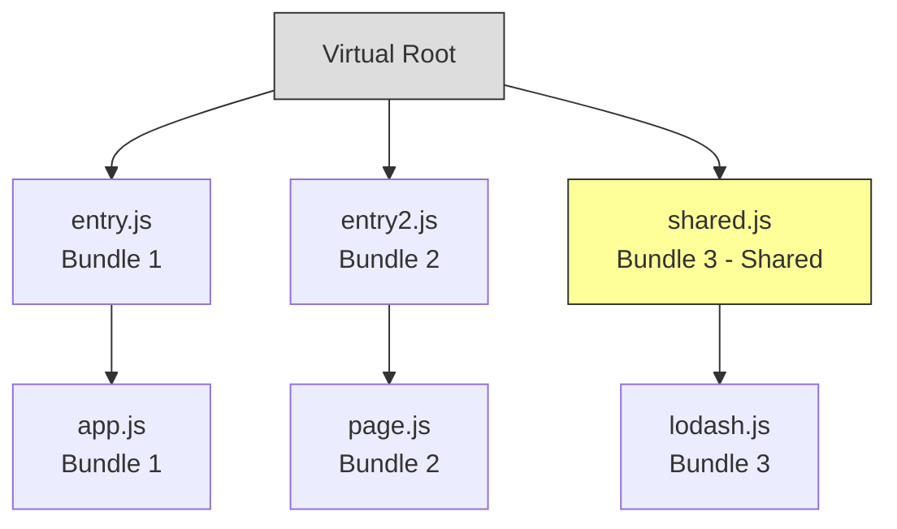
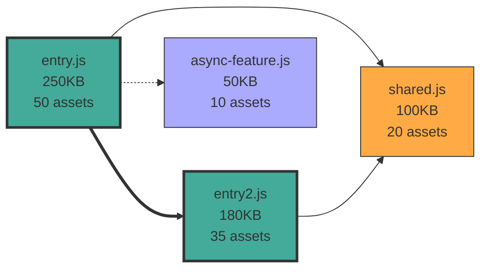

# Atlaspack Bundler Rust Rewrite Research

## Executive Summary

This document contains comprehensive research and analysis for rewriting the Atlaspack bundler algorithm from TypeScript to Rust. The current implementation (~2,500 LOC across 3 files) uses a custom reachability algorithm. This research explores using dominator algorithms, proposes a phase-based architecture, and documents tricky edge cases that must be handled.

**Key Recommendations:**
1. Use dominator tree algorithms for the ideal graph phase
2. Break the algorithm into clear phases with decision tracking
3. Handle edge cases (MSB, conditional bundling, internalization, etc.) as separate passes
4. Implement comprehensive decision tracking for debugging

## Table of Contents

1. [Current Architecture Overview](#current-architecture-overview)
2. [Proposed Rust Architecture](#proposed-rust-architecture)
3. [Dominator Algorithm Approach](#dominator-algorithm-approach)
4. [Decision Tracking System](#decision-tracking-system)
5. [Tricky Cases Deep Dive](#tricky-cases-deep-dive)
6. [Implementation Roadmap](#implementation-roadmap)

---

## Current Architecture Overview

### File Structure
- `idealGraph.ts` (2,091 LOC) - Core bundling logic
- `bundleMerge.ts` (250 LOC) - Bundle merging optimizations
- `decorateLegacyGraph.ts` (248 LOC) - Mutation into final bundle graph

### Current Algorithm Phases

The existing bundler has these sequential phases:

1. **Create Entry Bundles** - Initialize bundles for entry points
2. **Create Split Point Bundles** - Handle async/parallel/isolated dependencies  
3. **Determine Reachability** - Build `reachableRoots` and `bundleRootGraph`
4. **Determine Availability** - Compute `ancestorAssets` via topological sort
5. **Internalize Async Bundles** - Remove redundant bundles
6. **Insert or Share** - Place assets into bundles (the "ideal graph")
7. **Merge Shared Bundles** - Apply size/request limits
8. **Decorate** - Mutate the actual bundle graph

### Key Data Structures

```typescript
// Bundle representation
type Bundle = {
  uniqueKey: string | null;
  assets: Set<Asset>;
  internalizedAssets?: BitSet;
  bundleBehavior?: BundleBehavior;
  needsStableName: boolean;
  mainEntryAsset: Asset | null;
  bundleRoots: Set<Asset>;
  size: number;
  sourceBundles: Set<NodeId>;
  target: Target;
  env: Environment;
  type: string;
  manualSharedBundle: string | null;
};

// Reachability tracking
reachableRoots: Array<BitSet>      // For each asset, which bundle roots can reach it (sync)
reachableAssets: Array<BitSet>     // For each bundle root, which assets it can reach (sync)
ancestorAssets: Array<BitSet>      // For each bundle root, all assets available at runtime
bundleRootGraph: Graph             // Models parallel/async relationships between bundle roots
```

### Current Reachability Algorithm

The current approach manually computes reachability:

1. **Sync Reachability**: Traverse from each bundle root following only sync dependencies
   - Build `reachableRoots[assetId]` = BitSet of bundle roots that can reach this asset
   - Build `reachableAssets[bundleRootId]` = BitSet of assets reachable from this root

2. **Availability Propagation**: Topological sort of `bundleRootGraph` to propagate availability
   - Bundle groups (parallel bundles) share availability
   - Intersect availability across all paths to ensure correctness

3. **Asset Placement**: For each asset, examine its `reachableRoots` to decide placement
   - If reachable from 1 root → place in that bundle
   - If reachable from multiple roots → create shared bundle or reuse existing

**Complexity**: O(n²) in places due to repeated traversals and BitSet operations

---

## Proposed Rust Architecture

### Phase-Based Design

Break the bundler into clear, testable phases with well-defined inputs/outputs:

```rust
pub struct BundlerContext {
    asset_graph: &AssetGraph,
    config: BundlerConfig,
    decisions: BundlerDecisions, // Track all decisions for debugging
}

// Phase 1: Build Ideal Graph (zero duplication)
pub fn build_ideal_graph(ctx: &mut BundlerContext) -> IdealGraph {
    let entries = extract_entries(ctx);
    let bundle_boundaries = identify_bundle_boundaries(ctx);
    let dominator_tree = compute_dominators(ctx, &bundle_boundaries);
    let ideal = assign_assets_to_bundles(ctx, &dominator_tree);
    ideal
}

// Phase 2: Optimize (handle duplication for size/parallelism)
pub fn optimize_bundles(ctx: &mut BundlerContext, ideal: IdealGraph) -> OptimizedGraph {
    let with_shared = create_shared_bundles(ctx, ideal);
    let merged = merge_small_bundles(ctx, with_shared);
    let limited = limit_parallel_requests(ctx, merged);
    limited
}

// Phase 3: Materialize (create actual bundle graph)
pub fn materialize_bundle_graph(ctx: &mut BundlerContext, optimized: OptimizedGraph) -> BundleGraph {
    // Similar to current decorateLegacyGraph
}
```

### Core Data Structures

```rust
pub struct IdealGraph {
    /// Bundles with assets assigned (zero duplication)
    bundles: Vec<Bundle>,
    /// Bundle dependency graph (which bundles load which)
    bundle_edges: Vec<(BundleId, BundleId, EdgeType)>,
    /// Asset -> Bundle mapping
    asset_to_bundle: HashMap<AssetId, BundleId>,
    /// Bundle roots (entry assets that create bundles)
    bundle_roots: HashMap<BundleId, AssetId>,
}

pub struct Bundle {
    id: BundleId,
    assets: HashSet<AssetId>,
    bundle_type: BundleType,
    env: Environment,
    target: Target,
    entry_asset: Option<AssetId>,
    behavior: Option<BundleBehavior>,
    needs_stable_name: bool,
    source_bundles: HashSet<BundleId>,
    internalized_assets: BitSet,
}

pub enum EdgeType {
    Sync,        // Parent needs child immediately
    Parallel,    // Child loads with parent
    Lazy,        // Child loads on-demand
    Conditional, // Feature-flagged loading
}
```

---

## Dominator Algorithm Approach

### Why Dominators?

The current reachability algorithm is essentially computing dominance relationships manually. A proper dominator tree algorithm provides:

1. **Cleaner semantics**: "Asset belongs to its immediate dominator bundle"
2. **Well-tested algorithms**: Use `petgraph` or implement Lengauer-Tarjan
3. **Natural shared bundle detection**: Assets with no single dominator need shared bundles
4. **Better for manual bundles**: Can validate MSB configs against dominator relationships
5. **Performance**: O(n log n) vs current O(n²) in places

### Dominator Tree Basics

In a directed graph:
- Node **A dominates** node **B** if every path from the entry to B passes through A
- The **immediate dominator** (idom) of B is the unique dominator closest to B
- This forms a **dominator tree** where each node has exactly one parent (except entries)

### Application to Bundling

```rust
// Sync-only graph for dominator computation
pub struct SyncDependencyGraph {
    graph: DiGraph<AssetId, ()>,
    virtual_root: NodeIndex, // Connects all entries
}

impl SyncDependencyGraph {
    pub fn compute_dominators(&self) -> DominatorTree {
        // Use petgraph's dominators::simple_fast
        dominators::simple_fast(&self.graph, self.virtual_root)
    }
    
    pub fn immediate_dominator(&self, asset: AssetId) -> Option<AssetId> {
        // Returns the bundle that should contain this asset
    }
}
```

### Algorithm Steps

1. **Build sync-only graph**: Only include sync dependencies
2. **Add virtual root**: Connects to all entry points
3. **Compute dominators**: Use Lengauer-Tarjan algorithm
4. **Assign to bundles**: Each asset goes to its immediate dominator's bundle

### Handling Bundle Boundaries

Bundle boundaries break the dominator tree:
- **Async/Lazy imports**: Create new bundle, don't traverse further
- **Parallel imports**: Create new bundle in same bundle group
- **Type changes**: Create new bundle (JS → CSS)
- **Isolated bundles**: Self-contained, ignore dominance

```rust
pub fn identify_bundle_boundaries(ctx: &BundlerContext) -> HashSet<AssetId> {
    let mut boundaries = HashSet::new();
    
    for (asset, deps) in ctx.asset_graph.iter() {
        for dep in deps {
            if dep.priority == Priority::Lazy || dep.priority == Priority::Conditional {
                boundaries.insert(dep.target_asset);
            }
            if dep.behavior == BundleBehavior::Isolated {
                boundaries.insert(dep.target_asset);
            }
            if asset.asset_type != dep.target_asset.asset_type {
                boundaries.insert(dep.target_asset);
            }
        }
    }
    
    boundaries
}
```

### Challenges with Dominators

**Multiple entries**: Need virtual root to handle multiple entry points

**Parallel/async edges**: These don't fit the dominator model naturally
- **Solution**: Only use sync edges for dominator computation
- Handle parallel/async as separate bundle group logic

**Conditional bundling**: `loadConditionalBundlesInParallel` config changes behavior
- **Solution**: Treat conditionals as parallel or lazy based on config

**Manual shared bundles**: User-specified bundles override dominator placement
- **Solution**: Handle MSBs as post-processing pass after ideal graph

---

## Dominator Algorithm Deep Dive

### Background: What are Dominators?

In graph theory, **node A dominates node B** if every path from the entry point to B must pass through A. The **dominator tree** is a structure where:
- Each node (except roots) has exactly one parent: its **immediate dominator (idom)**
- The immediate dominator is the closest dominator to that node
- This forms a tree structure from the entry points

### Why Dominators for Bundling?

The current Atlaspack bundler manually computes reachability using BitSets:
- `reachableRoots[asset]` = which bundle roots can reach this asset (sync only)
- `reachableAssets[bundleRoot]` = which assets are reachable from this root
- `ancestorAssets[bundleRoot]` = all assets available at runtime (includes parallel/async)

**Key insight**: An asset's "ideal bundle" is the bundle that dominates it in the sync dependency graph. Using dominator algorithms gives us:

1. **O(n log n) complexity** vs O(n²) manual traversal
2. **Cleaner semantics**: "Asset belongs to its immediate dominator"
3. **Natural shared bundle detection**: Assets dominated by multiple bundles need sharing
4. **Better debugging**: Can explain placement via dominator relationships

### Algorithm Overview

```rust
pub struct DominatorBundler {
    /// Sync-only dependency graph for dominator computation
    sync_graph: DiGraph<AssetId, ()>,
    
    /// Full graph with all edge types
    full_graph: DiGraph<AssetId, EdgeInfo>,
    
    /// Virtual root connecting all entries
    virtual_root: NodeIndex,
    
    /// Computed dominator tree
    dominators: Dominators<NodeIndex>,
    
    /// Bundle boundaries (async, type changes, isolated, etc.)
    bundle_boundaries: HashSet<AssetId>,
}

impl DominatorBundler {
    pub fn build_ideal_graph(&mut self) -> IdealGraph {
        // 1. Build sync-only graph
        self.build_sync_graph();
        
        // 2. Identify bundle boundaries
        self.identify_bundle_boundaries();
        
        // 3. Compute dominators
        self.compute_dominators();
        
        // 4. Create bundles and assign assets
        self.assign_assets_to_bundles()
    }
}
```

### Step 1: Building the Sync Graph

Only include **sync priority** edges in the dominator graph. This is critical because:
- Async/lazy imports create new bundles (bundle boundaries)
- Parallel imports are part of the same bundle group but separate bundles
- We want to know: "What assets MUST be loaded together synchronously?"

```rust
pub fn build_sync_graph(&mut self, asset_graph: &AssetGraph) {
    self.sync_graph.clear();
    
    // Add virtual root
    self.virtual_root = self.sync_graph.add_node(AssetId::virtual());
    
    // Add all assets as nodes
    let mut asset_to_node = HashMap::new();
    for asset in asset_graph.assets() {
        let node = self.sync_graph.add_node(asset.id);
        asset_to_node.insert(asset.id, node);
    }
    
    // Connect virtual root to all entry points
    for entry in asset_graph.entries() {
        self.sync_graph.add_edge(self.virtual_root, asset_to_node[&entry.id], ());
    }
    
    // Add edges for sync dependencies only
    for asset in asset_graph.assets() {
        for dep in asset_graph.dependencies(asset.id) {
            // CRITICAL: Only include sync edges
            if dep.priority != Priority::Sync {
                continue;
            }
            
            // Don't traverse past bundle boundaries
            if self.bundle_boundaries.contains(&dep.target_asset) {
                continue;
            }
            
            // Don't traverse into isolated bundles
            if dep.bundle_behavior == Some(BundleBehavior::Isolated) {
                continue;
            }
            
            self.sync_graph.add_edge(
                asset_to_node[&asset.id],
                asset_to_node[&dep.target_asset],
                (),
            );
        }
    }
}
```

### Step 2: Identifying Bundle Boundaries

Bundle boundaries are assets that create new bundles. We stop the sync graph traversal at these points:

```rust
pub fn identify_bundle_boundaries(&mut self, asset_graph: &AssetGraph) {
    self.bundle_boundaries.clear();
    
    for asset in asset_graph.assets() {
        for dep in asset_graph.dependencies(asset.id) {
            let target = asset_graph.asset(dep.target_asset);
            
            // 1. ASYNC/LAZY IMPORTS - Create new async bundles
            if dep.priority == Priority::Lazy {
                self.bundle_boundaries.insert(target.id);
                ctx.decisions.record(BundlerEvent::BundleCreated {
                    bundle_id: target.id, // Will be refined later
                    reason: BundleCreationReason::AsyncSplit {
                        parent_bundle: asset.id,
                        dependency_id: dep.id,
                    },
                    timestamp: ctx.phase_counter,
                });
            }
            
            // 2. CONDITIONAL IMPORTS - May be parallel or lazy
            if dep.priority == Priority::Conditional {
                self.bundle_boundaries.insert(target.id);
                ctx.decisions.record(BundlerEvent::BundleCreated {
                    bundle_id: target.id,
                    reason: BundleCreationReason::ConditionalSplit {
                        parent_bundle: asset.id,
                        dependency_id: dep.id,
                        parallel: ctx.config.load_conditional_bundles_in_parallel,
                    },
                    timestamp: ctx.phase_counter,
                });
            }
            
            // 3. TYPE CHANGES - JS importing CSS creates new bundle
            if asset.asset_type != target.asset_type {
                self.bundle_boundaries.insert(target.id);
                ctx.decisions.record(BundlerEvent::BundleCreated {
                    bundle_id: target.id,
                    reason: BundleCreationReason::TypeChange {
                        parent_bundle: asset.id,
                        from_type: asset.asset_type.clone(),
                        to_type: target.asset_type.clone(),
                    },
                    timestamp: ctx.phase_counter,
                });
            }
            
            // 4. ISOLATED BUNDLES - Workers, inline scripts
            if dep.bundle_behavior == Some(BundleBehavior::Isolated) ||
               target.bundle_behavior == Some(BundleBehavior::Isolated) {
                self.bundle_boundaries.insert(target.id);
                ctx.decisions.record(BundlerEvent::BundleCreated {
                    bundle_id: target.id,
                    reason: BundleCreationReason::Isolated {
                        dependency_id: dep.id,
                    },
                    timestamp: ctx.phase_counter,
                });
            }
            
            // 5. PARALLEL IMPORTS - Same bundle group, different bundle
            if dep.priority == Priority::Parallel {
                self.bundle_boundaries.insert(target.id);
                ctx.decisions.record(BundlerEvent::BundleCreated {
                    bundle_id: target.id,
                    reason: BundleCreationReason::Parallel {
                        parent_bundle: asset.id,
                    },
                    timestamp: ctx.phase_counter,
                });
            }
        }
    }
}
```

### Step 3: Computing Dominators

Use the Lengauer-Tarjan algorithm (available in `petgraph`):

```rust
pub fn compute_dominators(&mut self) {
    // Use petgraph's dominator implementation
    self.dominators = dominators::simple_fast(&self.sync_graph, self.virtual_root);
}

pub fn immediate_dominator(&self, asset: AssetId) -> Option<AssetId> {
    let node = self.asset_to_node[&asset];
    self.dominators.immediate_dominator(node)
        .and_then(|idom_node| {
            let idom_asset = self.sync_graph[idom_node];
            if idom_asset == AssetId::virtual() {
                None // Virtual root doesn't dominate
            } else {
                Some(idom_asset)
            }
        })
}
```

### Step 4: Assigning Assets to Bundles

For each asset, find its immediate dominator and assign to that bundle:

```rust
pub fn assign_assets_to_bundles(&mut self, ctx: &mut BundlerContext) -> IdealGraph {
    let mut ideal = IdealGraph::new();
    
    // Create bundles for entries
    for entry in ctx.asset_graph.entries() {
        let bundle = Bundle::new(entry.id, entry.asset_type.clone());
        ideal.bundles.insert(entry.id, bundle);
    }
    
    // Create bundles for bundle boundaries
    for &boundary_asset in &self.bundle_boundaries {
        let bundle = Bundle::new(boundary_asset, ctx.asset_graph.asset(boundary_asset).asset_type.clone());
        ideal.bundles.insert(boundary_asset, bundle);
    }
    
    // Assign each asset to its dominating bundle
    for asset in ctx.asset_graph.assets() {
        // Skip if this asset is itself a bundle root
        if ideal.bundles.contains_key(&asset.id) {
            continue;
        }
        
        // Find the immediate dominator
        let bundle_id = self.find_dominating_bundle(asset.id, &ideal);
        
        // Add asset to that bundle
        if let Some(bundle) = ideal.bundles.get_mut(&bundle_id) {
            bundle.assets.insert(asset.id);
            bundle.size += asset.stats.size;
            
            ctx.decisions.record(BundlerEvent::AssetPlaced {
                asset_id: asset.id,
                bundle_id,
                reason: AssetPlacementReason::DominatedBy(bundle_id),
            });
        }
    }
    
    ideal
}

fn find_dominating_bundle(&self, asset: AssetId, ideal: &IdealGraph) -> BundleId {
    let mut current = asset;
    
    // Walk up dominator tree until we find a bundle root
    loop {
        if ideal.bundles.contains_key(&current) {
            return current;
        }
        
        match self.immediate_dominator(current) {
            Some(idom) => current = idom,
            None => panic!("Asset {} has no dominating bundle", asset),
        }
    }
}
```

### Concrete Examples

#### Example 1: Type Change (JS → CSS)

```
Asset Graph:
  entry.js (Entry)
    ↓ [sync]
  app.js
    ↓ [sync, type change]
  styles.css
    ↓ [sync]
  theme.css
```

**Step 1: Build Sync Graph**
```
virtual_root → entry.js → app.js
               (stops here due to type change)
```

**Step 2: Identify Boundaries**
```
bundle_boundaries = {styles.css}  // Type change from JS to CSS
```

**Step 3: Compute Dominators**
```
idom(entry.js) = virtual_root
idom(app.js) = entry.js
idom(styles.css) = undefined (boundary, not in sync graph)
idom(theme.css) = styles.css (separate sync graph for CSS)
```

**Step 4: Assign Assets**
```
Bundle 1 (entry.js):
  - entry.js (bundle root)
  - app.js (dominated by entry.js)

Bundle 2 (styles.css):
  - styles.css (bundle root, type change boundary)
  - theme.css (dominated by styles.css)

Bundle Graph:
  Bundle 1 → Bundle 2 (parallel edge, loads together)
```

**Decision Tracking**:
```
Event 1: BundleCreated { bundle_id: styles.css, reason: TypeChange { from_type: "js", to_type: "css" }}
Event 2: AssetPlaced { asset_id: app.js, bundle_id: entry.js, reason: DominatedBy(entry.js) }
Event 3: AssetPlaced { asset_id: theme.css, bundle_id: styles.css, reason: DominatedBy(styles.css) }
```

#### Example 2: Async Import

```
Asset Graph:
  entry.js (Entry)
    ↓ [sync]
  app.js
    ↓ [lazy]
  heavy.js
    ↓ [sync]
  lib.js
```

**Step 1: Build Sync Graph**
```
virtual_root → entry.js → app.js
               (stops at heavy.js due to lazy)

Separate subgraph:
  heavy.js → lib.js
```

**Step 2: Identify Boundaries**
```
bundle_boundaries = {heavy.js}  // Lazy import
```

**Step 3: Compute Dominators**
```
idom(entry.js) = virtual_root
idom(app.js) = entry.js
idom(heavy.js) = undefined (boundary)
idom(lib.js) = heavy.js (in separate subgraph)
```

**Step 4: Assign Assets**
```
Bundle 1 (entry.js):
  - entry.js (bundle root)
  - app.js (dominated by entry.js)

Bundle 2 (heavy.js):
  - heavy.js (bundle root, async boundary)
  - lib.js (dominated by heavy.js)

Bundle Graph:
  Bundle 1 → Bundle 2 (lazy edge, loads on-demand)
```

#### Example 3: Shared Assets (Multiple Dominators)

```
Asset Graph:
  entry1.js (Entry)         entry2.js (Entry)
    ↓ [sync]                  ↓ [sync]
  page1.js                  page2.js
    ↓ [sync]                  ↓ [sync]
    └─────→ shared.js ←──────┘
              ↓ [sync]
            lodash.js
```

**Step 1: Build Sync Graph**
```
virtual_root → entry1.js → page1.js → shared.js → lodash.js
            ↘ entry2.js → page2.js ↗
```

**Step 2: Identify Boundaries**
```
bundle_boundaries = {}  // No boundaries, all sync
```

**Step 3: Compute Dominators**
```
idom(entry1.js) = virtual_root
idom(entry2.js) = virtual_root
idom(page1.js) = entry1.js
idom(page2.js) = entry2.js
idom(shared.js) = virtual_root (reached from both entries)
idom(lodash.js) = shared.js
```

**Step 4: Assign Assets**
```
shared.js has idom = virtual_root, meaning it's not dominated by any real bundle.
This indicates it needs a SHARED BUNDLE.

Reachable from: {entry1.js, entry2.js}

Create shared bundle:
  Bundle 3 (shared):
    - shared.js
    - lodash.js (dominated by shared.js)

Final bundles:
  Bundle 1 (entry1.js): entry1.js, page1.js
  Bundle 2 (entry2.js): entry2.js, page2.js
  Bundle 3 (shared): shared.js, lodash.js

Bundle Graph:
  Bundle 1 → Bundle 3 (sync edge)
  Bundle 2 → Bundle 3 (sync edge)
```

**Rust Implementation**:
```rust
pub fn assign_assets_to_bundles(&mut self, ctx: &mut BundlerContext) -> IdealGraph {
    // ... (previous code)
    
    for asset in ctx.asset_graph.assets() {
        let idom = self.immediate_dominator(asset.id);
        
        if idom == Some(AssetId::virtual()) {
            // Asset is reachable from multiple entries - needs shared bundle
            let reachable_bundles = self.find_reachable_bundles(asset.id, &ideal);
            
            if reachable_bundles.len() > ctx.config.min_bundles {
                // Create shared bundle
                let shared_bundle_id = self.create_shared_bundle(
                    asset.id,
                    &reachable_bundles,
                    &mut ideal,
                );
                
                ctx.decisions.record(BundlerEvent::AssetPlaced {
                    asset_id: asset.id,
                    bundle_id: shared_bundle_id,
                    reason: AssetPlacementReason::SharedAcross(reachable_bundles),
                });
            } else {
                // Duplicate in all bundles (below minBundles threshold)
                for &bundle_id in &reachable_bundles {
                    ideal.bundles.get_mut(&bundle_id).unwrap().assets.insert(asset.id);
                }
            }
        }
    }
    
    ideal
}
```

#### Example 4: Manual Shared Bundles with Dominators

```
Config:
  manualSharedBundles: [{
    name: "vendor",
    assets: ["node_modules/**"],
    types: ["js"]
  }]

Asset Graph:
  entry.js
    ↓ [sync]
  app.js
    ↓ [sync]
  node_modules/react.js (matches MSB)
    ↓ [sync]
  node_modules/react-dom.js (matches MSB)
```

**With Dominators**:
```
Normal dominator assignment would place:
  react.js → dominated by entry.js
  react-dom.js → dominated by react.js

But MSB config OVERRIDES this:
  react.js → vendor bundle (manual override)
  react-dom.js → vendor bundle (manual override)
```

**Implementation**:
```rust
pub fn apply_manual_shared_bundles(
    &mut self,
    ideal: &mut IdealGraph,
    ctx: &mut BundlerContext,
) {
    for config in &ctx.config.manual_shared_bundles {
        let vendor_bundle = Bundle::new_manual_shared(&config.name);
        let vendor_bundle_id = ideal.bundles.insert(vendor_bundle);
        
        for asset in ctx.asset_graph.assets() {
            if config.matches(asset) {
                // Override dominator placement
                let original_bundle = self.find_dominating_bundle(asset.id, ideal);
                
                // Move asset to vendor bundle
                ideal.bundles.get_mut(&original_bundle)
                    .unwrap()
                    .assets.remove(&asset.id);
                ideal.bundles.get_mut(&vendor_bundle_id)
                    .unwrap()
                    .assets.insert(asset.id);
                
                ctx.decisions.record(BundlerEvent::AssetPlaced {
                    asset_id: asset.id,
                    bundle_id: vendor_bundle_id,
                    reason: AssetPlacementReason::ManualSharedBundle(config.name.clone()),
                });
            }
        }
    }
}
```

#### Example 5: Conditional Bundling

```
Config:
  loadConditionalBundlesInParallel: true

Asset Graph:
  entry.js
    ↓ [sync]
  app.js
    ↓ [conditional: 'feature-flag']
  feature-a.js
    ↓ [sync]
  feature-a-lib.js
```

**With Parallel Loading**:
```
bundle_boundaries = {feature-a.js}  // Conditional import

Sync Graph (conditional edge NOT included):
  virtual_root → entry.js → app.js
  (separate) feature-a.js → feature-a-lib.js

Bundle Assignment:
  Bundle 1 (entry.js): entry.js, app.js
  Bundle 2 (feature-a.js): feature-a.js, feature-a-lib.js

Bundle Graph:
  Bundle 1 → Bundle 2 (conditional + parallel edge)
  
Bundle Group:
  {Bundle 1, Bundle 2}  // Loaded together
```

**Without Parallel Loading**:
```
Bundle Graph:
  Bundle 1 → Bundle 2 (conditional + lazy edge)
  
Bundle 2 loads on-demand when condition evaluates
```

### Handling Edge Cases with Dominators

#### Circular Dependencies

```
Asset Graph (circular):
  a.js ⇄ b.js ⇄ c.js

Sync Graph:
  entry → a → b → c → a (cycle)
```

**Dominator behavior**: All nodes in a cycle have the same dominator (the entry to the cycle). They all belong to the same bundle.

```rust
// Dominators handle cycles naturally
idom(a) = entry
idom(b) = entry  // or a, depending on traversal order
idom(c) = entry  // or a/b

Result: All in same bundle (correct behavior)
```

#### Multiple Entry Points

```
Asset Graph:
  entry1.js    entry2.js
    ↓            ↓
  both import shared.js
```

**Solution**: Virtual root connects all entries

```rust
sync_graph:
  virtual_root → entry1.js → shared.js
              ↘ entry2.js ↗

idom(shared.js) = virtual_root (not dominated by either entry)
→ Needs shared bundle
```

### Performance Comparison

**Current O(n²) approach**:
```typescript
// For each bundle root
for (let bundleRoot of bundleRoots) {
  // Traverse entire graph
  assetGraph.traverse((asset) => {
    // Mark reachable in BitSet
    reachableRoots[asset].add(bundleRoot);
  });
}
```

**Dominator O(n log n) approach**:
```rust
// Single pass dominator computation
let dominators = dominators::simple_fast(&sync_graph, virtual_root);

// O(1) lookup per asset
for asset in assets {
    let bundle = find_dominating_bundle(asset);
}
```

### Summary

The dominator algorithm provides:
1. **Cleaner semantics**: "Bundle = sync dominator"
2. **Better performance**: O(n log n) vs O(n²)
3. **Natural shared bundle detection**: Assets with no single dominator
4. **Edge case handling**: Cycles, multiple entries, type changes
5. **Debugging**: Can explain via dominator relationships

The key is treating bundle boundaries (async, type changes, isolated) as "cuts" in the sync graph, then applying dominators to each connected component.

---

## Decision Tracking System

A comprehensive decision tracking system is essential for debugging complex bundling issues. Every decision the bundler makes should be recorded with context.

### Core Decision Types

```rust
pub struct BundlerDecisions {
    events: Vec<BundlerEvent>,
    asset_decisions: HashMap<AssetId, Vec<AssetDecision>>,
    bundle_decisions: HashMap<BundleId, Vec<BundleDecision>>,
}

pub enum BundlerEvent {
    BundleCreated {
        bundle_id: BundleId,
        reason: BundleCreationReason,
        timestamp: usize,
    },
    AssetPlaced {
        asset_id: AssetId,
        bundle_id: BundleId,
        reason: AssetPlacementReason,
    },
    BundleMerged {
        from: BundleId,
        to: BundleId,
        reason: MergeReason,
    },
    BundleDeleted {
        bundle_id: BundleId,
        reason: DeletionReason,
    },
    SharedBundleCreated {
        bundle_id: BundleId,
        source_bundles: Vec<BundleId>,
        asset_count: usize,
        reason: String,
    },
}
```

### Detailed Reason Enums

```rust
pub enum BundleCreationReason {
    Entry { 
        dependency_id: DependencyId 
    },
    AsyncSplit { 
        parent_bundle: BundleId, 
        dependency_id: DependencyId 
    },
    TypeChange { 
        parent_bundle: BundleId, 
        from_type: FileType, 
        to_type: FileType 
    },
    Isolated { 
        dependency_id: DependencyId 
    },
    Parallel { 
        parent_bundle: BundleId 
    },
    ManualSharedBundle { 
        config_name: String 
    },
    SharedBundle { 
        source_count: usize, 
        asset_count: usize 
    },
}

pub enum AssetPlacementReason {
    BundleRoot,
    DominatedBy(BundleId),
    Reachable { 
        bundles: Vec<BundleId>, 
        chosen: BundleId 
    },
    SharedAcross(Vec<BundleId>),
    ManualSharedBundle(String),
    InlineConstant { 
        parent: AssetId 
    },
}

pub enum MergeReason {
    BelowMinSize { 
        size: usize, 
        threshold: usize 
    },
    HighOverlap { 
        overlap: f64, 
        threshold: f64 
    },
    UserConfig(String),
}

pub enum DeletionReason {
    Internalized { 
        into_bundle: BundleId 
    },
    AlreadyAvailable { 
        via_bundles: Vec<BundleId> 
    },
    Merged { 
        into_bundle: BundleId 
    },
}
```

### Query API

```rust
impl BundlerDecisions {
    pub fn record(&mut self, event: BundlerEvent) {
        self.events.push(event);
        // Index by relevant IDs for fast queries
    }
    
    pub fn why_bundle_exists(&self, bundle_id: BundleId) -> Option<&BundleCreationReason> {
        // Returns the reason this bundle was created
    }
    
    pub fn why_asset_in_bundle(&self, asset_id: AssetId, bundle_id: BundleId) 
        -> Vec<&AssetPlacementReason> {
        // Returns all reasons this asset was placed in this bundle
    }
    
    pub fn why_bundles_merged(&self, bundle_a: BundleId, bundle_b: BundleId) 
        -> Option<&MergeReason> {
        // Returns why these bundles were merged
    }
    
    pub fn export_visualization(&self) -> String {
        // Generate mermaid diagram or JSON for @atlaspack/inspector
    }
    
    pub fn export_json(&self, path: &Path) -> Result<()> {
        // Export to file for post-build analysis
    }
}
```

### Use Cases

**Debugging duplication**: "Why is lodash in 3 bundles?"
```rust
let lodash_asset = find_asset("lodash");
for bundle in bundles_containing(lodash_asset) {
    println!("In bundle {}: {:?}", 
        bundle.name, 
        decisions.why_asset_in_bundle(lodash_asset, bundle.id)
    );
}
```

**Debugging failed merges**: "Why didn't these bundles merge?"
```rust
let merge_candidates = find_merge_candidates();
for (a, b) in merge_candidates {
    if !was_merged(a, b) {
        println!("Not merged: config mismatch or size threshold");
    }
}
```

**Inspection integration**: Export decisions to `@atlaspack/inspector` for visual debugging

---

## Tricky Cases Deep Dive

### 1. Manual Shared Bundles (MSB)

**What it is**: User-specified bundles that override automatic bundling decisions

**Config format**:
```json
{
  "manualSharedBundles": [
    {
      "name": "vendor",
      "assets": ["node_modules/**/*.js"],
      "types": ["js"],
      "root": "src/index.js",
      "split": 3
    }
  ]
}
```

**Implementation complexity**:

1. **Asset Matching Phase**: Pre-process asset graph to build lookup tables
   - `manualAssetToConfig`: Maps each asset to its MSB config
   - `constantModuleToMSB`: Special handling for constant modules (see below)
   - Traverse from optional `root` to find matching assets

2. **Bundle Creation Override**: During bundle boundary creation, check if asset matches MSB
   - Create/reuse MSB bundle instead of normal bundle
   - Key: `config.name + "," + asset.type` (allows multiple MSBs per config for different types)

3. **Internalization**: MSBs with multiple async entry points need special handling
   - First async asset becomes the entry, others are internalized
   - Strip `mainEntryAsset` to prevent duplicate loading

4. **Asset Placement Override**: During "Insert or Share" phase, place matching assets in MSB
   - Even if asset is reachable from multiple bundles
   - Build edges from all source bundles to the MSB

5. **Split Property**: Optional `split: N` divides MSB into N bundles
   - Hash asset IDs: `BigInt(assetId) % N` to determine sub-bundle
   - Creates `vendor-0.js`, `vendor-1.js`, etc.

**Rust implementation strategy**:

```rust
pub struct ManualSharedBundleConfig {
    name: String,
    asset_patterns: Vec<Regex>,
    types: Option<Vec<String>>,
    root: Option<PathBuf>,
    split: Option<usize>,
}

pub fn process_manual_shared_bundles(
    ctx: &mut BundlerContext,
    ideal: &mut IdealGraph,
) -> Result<()> {
    let msb_configs = &ctx.config.manual_shared_bundles;
    
    // Phase 1: Build asset -> config lookup
    let asset_to_config = build_msb_lookup(ctx, msb_configs)?;
    
    // Phase 2: Override bundle placement
    for (asset_id, config) in asset_to_config {
        if let Some(bundle_id) = find_or_create_msb(ideal, &config, asset_id.asset_type) {
            override_asset_placement(ideal, asset_id, bundle_id);
            
            ctx.decisions.record(BundlerEvent::AssetPlaced {
                asset_id,
                bundle_id,
                reason: AssetPlacementReason::ManualSharedBundle(config.name.clone()),
            });
        }
    }
    
    // Phase 3: Handle split property
    for config in msb_configs.iter().filter(|c| c.split.is_some()) {
        split_manual_bundle(ideal, config)?;
    }
    
    Ok(())
}
```

**Edge cases**:
- Constant modules matching multiple MSBs → placed in all of them (no duplication issue)
- MSB with no matching assets → warning, skip
- MSB split with circular dependencies → handled by hash-based assignment

### 2. Conditional Bundling

**What it is**: Runtime-conditional imports via `importCond('feature', './a.js', './b.js')`

**Key complexity**: Depends on `loadConditionalBundlesInParallel` config

**With parallel loading** (default):
- Conditional bundles load alongside parent bundle
- Treated like `parallel` priority in bundle graph
- Edge type: `EdgeType::Conditional` for tracking

**Without parallel loading**:
- Conditional bundles load lazily when condition evaluates
- Treated like `lazy` priority
- Risk of "module not found" errors if condition evaluates before load

**Current implementation** (lines 464-488 in idealGraph.ts):
```typescript
if (config.loadConditionalBundlesInParallel) {
  // Serve conditional bundles in parallel
  bundleRoots.set(childAsset, [bundleId, bundleGroupNodeId]);
  bundleGraph.addEdge(referencingBundleId, bundleId);
}

// Always add conditional edge to track relationships
bundleGraph.addEdge(
  referencingBundleId,
  bundleId,
  idealBundleGraphEdges.conditional
);
```

**Rust implementation**:

```rust
pub fn handle_conditional_dependency(
    ctx: &BundlerContext,
    dep: &Dependency,
    parent_bundle: BundleId,
) -> ConditionalBundleStrategy {
    if ctx.config.load_conditional_bundles_in_parallel {
        ConditionalBundleStrategy::Parallel {
            // Bundle loads with parent
            bundle_group: parent_bundle,
            edge_type: EdgeType::Conditional,
        }
    } else {
        ConditionalBundleStrategy::Lazy {
            // Bundle loads on-demand
            edge_type: EdgeType::Conditional,
        }
    }
}
```

**Decision tracking**:
```rust
ctx.decisions.record(BundlerEvent::BundleCreated {
    bundle_id: conditional_bundle_id,
    reason: BundleCreationReason::ConditionalSplit {
        parent_bundle,
        dependency_id: dep.id,
        parallel: ctx.config.load_conditional_bundles_in_parallel,
    },
    timestamp: ctx.phase_counter,
});
```

**Integration with dominator algorithm**:
- Treat conditionals like async boundaries in sync graph
- In bundle group graph, edge type depends on config

### 3. Bundle Internalization

**What it is**: Removing redundant async bundles that are already loaded synchronously

**When it happens**: An async bundle whose assets are all synchronously available in parent

**Algorithm** (lines 853-899 in idealGraph.ts):

For each bundle root:
1. Find all parent bundles (in bundle root graph)
2. For each parent, check if:
   - Parent's `reachableAssets` contains this bundle root (sync reachable), OR
   - Parent's `ancestorAssets` contains this bundle root (available via parallel/ancestor)
3. If ALL parents have the bundle available → mark for internalization
4. Special cases:
   - Skip MSB bundle roots (handled separately)
   - Skip `isolated` bundles (must remain separate)
   - If connected to root (entry) → don't delete

**Internalization vs Deletion**:
- **Internalized**: Assets marked in `internalizedAssets` BitSet, bundle still exists
- **Deleted**: Bundle removed entirely if ALL parents have it

**Rust implementation**:

```rust
pub fn internalize_redundant_bundles(
    ctx: &mut BundlerContext,
    ideal: &mut IdealGraph,
) -> Result<()> {
    let bundle_availability = compute_bundle_availability(ideal);
    
    for bundle_id in ideal.bundles.keys() {
        let bundle = &ideal.bundles[bundle_id];
        
        // Skip special bundles
        if bundle.behavior == Some(BundleBehavior::Isolated) {
            continue;
        }
        if is_manual_shared_bundle(bundle) {
            continue; // MSBs have separate internalization
        }
        
        let parents = ideal.bundle_graph.parents(bundle_id);
        if parents.is_empty() || parents.contains(&VIRTUAL_ROOT) {
            continue; // Entry bundles cannot be internalized
        }
        
        let mut can_delete = true;
        for parent_id in parents {
            if bundle_availability[&parent_id].contains(&bundle_id) {
                // Mark as internalized in parent
                mark_internalized(ideal, parent_id, bundle_id);
                
                ctx.decisions.record(BundlerEvent::BundleInternalized {
                    bundle_id,
                    parent_id,
                    reason: "Assets already available synchronously",
                });
            } else {
                can_delete = false;
            }
        }
        
        if can_delete {
            delete_bundle(ideal, bundle_id);
            ctx.decisions.record(BundlerEvent::BundleDeleted {
                bundle_id,
                reason: DeletionReason::Internalized { 
                    into_bundles: parents.clone() 
                },
            });
        }
    }
    
    Ok(())
}
```

**Why internalization matters**:
- Prevents redundant network requests
- Reduces bundle count
- Critical for optimal loading performance

### 4. Inline Constants (Constant Modules)

**What it is**: Assets marked with `asset.meta.isConstantModule = true` that must be inlined

**Behavior**: Never duplicated, always placed with direct parent

**Current tracking** (lines 672, 736-744 in idealGraph.ts):
```typescript
let inlineConstantDeps = new DefaultMap<Asset, Set<Asset>>(() => new Set());

// During reachability computation
if (asset.meta.isConstantModule === true) {
  let parents = assetGraph.getIncomingDependencies(asset)
    .map(dep => assetGraph.getAssetWithDependency(dep));
  
  for (let parent of parents) {
    inlineConstantDeps.get(parent).add(asset);
  }
}

// Later, assign constants to bundle with parent
function assignInlineConstants(parentAsset: Asset, bundle: Bundle) {
  for (let inlineConstant of inlineConstantDeps.get(parentAsset)) {
    if (!bundle.assets.has(inlineConstant)) {
      bundle.assets.add(inlineConstant);
      bundle.size += inlineConstant.stats.size;
    }
  }
}
```

**Special case with MSBs**: Constants matching multiple MSBs are placed in ALL of them
- Tracked separately in `constantModuleToMSB` map
- No duplication issue because they're constants

**Rust implementation**:

```rust
pub struct ConstantModuleTracker {
    parent_to_constants: HashMap<AssetId, HashSet<AssetId>>,
}

impl ConstantModuleTracker {
    pub fn collect(asset_graph: &AssetGraph) -> Self {
        let mut tracker = ConstantModuleTracker::default();
        
        for asset in asset_graph.assets() {
            if asset.meta.is_constant_module {
                for parent in asset_graph.incoming_dependencies(asset.id) {
                    tracker.parent_to_constants
                        .entry(parent.from_asset)
                        .or_default()
                        .insert(asset.id);
                }
            }
        }
        
        tracker
    }
    
    pub fn assign_to_bundle(
        &self,
        parent_asset: AssetId,
        bundle: &mut Bundle,
    ) {
        if let Some(constants) = self.parent_to_constants.get(&parent_asset) {
            for constant_id in constants {
                bundle.assets.insert(*constant_id);
            }
        }
    }
}
```

**Decision tracking**:
```rust
ctx.decisions.record(BundlerEvent::AssetPlaced {
    asset_id: constant_id,
    bundle_id,
    reason: AssetPlacementReason::InlineConstant { parent: parent_asset },
});
```

### 5. Bundle Merging Optimizations

**What it is**: Combining small shared bundles to reduce HTTP requests

**Two types of merging**:

#### A. Shared Bundle Merging (via `sharedBundleMerge` config)

Merges shared bundles based on configurable criteria:

```rust
pub struct MergeConfig {
    overlap_threshold: Option<f64>,      // % of shared source bundles (0.0-1.0)
    max_bundle_size: Option<usize>,      // Maximum size to consider for merge
    source_bundles: Option<Vec<String>>, // Required source bundles
    min_bundles_in_group: Option<usize>, // Minimum bundle group size
}
```

**Algorithm** (from bundleMerge.ts):

1. **Find candidates**: Shared bundles with matching `internalizedAssets`
2. **Validate merge**: Check all config constraints
3. **Build graph**: Create merge graph with edge types per config priority
4. **Cluster**: Traverse graph to find connected components
5. **Merge**: Combine bundles in each cluster

**Overlap calculation**:
```rust
fn bundle_overlap(bundle_a: &Bundle, bundle_b: &Bundle) -> f64 {
    let all_sources = bundle_a.source_bundles.union(&bundle_b.source_bundles);
    let shared_sources = bundle_a.source_bundles.intersection(&bundle_b.source_bundles);
    shared_sources.len() as f64 / all_sources.len() as f64
}
```

**Rust implementation**:

```rust
pub fn merge_shared_bundles(
    ctx: &mut BundlerContext,
    ideal: &mut IdealGraph,
) -> Result<()> {
    let shared_bundles = find_shared_bundles(ideal);
    let merge_configs = &ctx.config.shared_bundle_merge;
    
    // Build merge graph
    let mut merge_graph = ContentGraph::new();
    
    for config in merge_configs {
        for pair in find_merge_candidates(&shared_bundles, config) {
            let (bundle_a, bundle_b) = pair;
            
            if validate_merge(bundle_a, bundle_b, config) {
                merge_graph.add_edge(bundle_a.id, bundle_b.id);
                merge_graph.add_edge(bundle_b.id, bundle_a.id);
            }
        }
    }
    
    // Find connected components
    let clusters = find_connected_components(&merge_graph);
    
    // Merge each cluster
    for cluster in clusters {
        let merged_bundle = merge_bundles(ideal, &cluster)?;
        
        ctx.decisions.record(BundlerEvent::BundlesMerged {
            merged_bundles: cluster.clone(),
            result_bundle: merged_bundle.id,
            reason: MergeReason::SharedBundleOptimization,
        });
    }
    
    Ok(())
}
```

#### B. Async Bundle Merging (via `asyncBundleMerge` config)

Merges small async bundles to reduce request count:

```rust
pub struct AsyncBundleMergeConfig {
    bundle_size: usize,       // Consider bundles smaller than this
    max_overfetch_size: usize, // Max bytes of overfetch allowed
    ignore: Option<Vec<String>>, // Patterns to ignore
}
```

**Algorithm** (lines 1715-1900 in idealGraph.ts):

1. **Find candidates**: Async bundles below size threshold
2. **Build availability graph**: Track which bundles "need" which others
3. **Calculate overfetch**: Size of assets fetched early but not needed yet
4. **Merge if beneficial**: Overfetch < threshold

**Overfetch calculation**:
```rust
fn calculate_overfetch(
    bundle_a: &Bundle,
    bundle_b: &Bundle,
    ideal: &IdealGraph,
) -> usize {
    // Assets in B that A doesn't need yet
    let unnecessary_assets = bundle_b.assets
        .difference(&assets_needed_by(ideal, bundle_a))
        .collect();
    
    unnecessary_assets.iter()
        .map(|a| a.size)
        .sum()
}
```

**Edge case**: Circular dependencies
- Line 1061-1065 handles this explicitly
- If two bundles each delete the other, check `reachable.has()` before assigning

### 6. Bundle Reuse

**What it is**: Reusing an existing bundle instead of creating a shared bundle

**When it applies**: Bundle B's assets are a subset of what bundles needing it already have

**Current check** (lines 1042-1050 in idealGraph.ts):
```typescript
let reuseableBundleId = bundles.get(asset.id);
if (reuseableBundleId != null) {
  reachable.delete(candidateId);
  bundleGraph.addEdge(candidateSourceBundleId, reuseableBundleId);
  
  let reusableBundle = bundleGraph.getNode(reuseableBundleId);
  reusableBundle.sourceBundles.add(candidateSourceBundleId);
}
```

**Dominator-based approach**:
```rust
pub fn find_reusable_bundles(
    ideal: &IdealGraph,
    asset_id: AssetId,
    reachable_bundles: &HashSet<BundleId>,
) -> Option<BundleId> {
    // If asset is a bundle root, check if that bundle is a subgraph
    if let Some(bundle_id) = ideal.asset_to_bundle.get(&asset_id) {
        let bundle = &ideal.bundles[bundle_id];
        
        // Check if all reachable bundles dominate this bundle
        if reachable_bundles.iter().all(|rb| dominates(ideal, *rb, bundle_id)) {
            return Some(bundle_id);
        }
    }
    
    None
}
```

### 7. Bundle Groups

**What it is**: Sets of bundles that load together (parallel)

**Key insight**: Not explicitly modeled as nodes, but tracked via `bundleGroupId`

**Current tracking**:
```typescript
bundleRoots.set(asset, [bundleId, bundleGroupNodeId]);
//                      ^^^^^^^^  ^^^^^^^^^^^^^^^^^
//                      bundle    bundleGroup (first bundle in group)
```

**Availability semantics**:
- Assets in bundle group are available to all bundles in that group
- A bundle can belong to multiple bundle groups
- Use intersection across all paths to ensure correctness

**Rust modeling**:

```rust
pub struct BundleGroup {
    id: BundleGroupId,
    bundles: HashSet<BundleId>,
    // First bundle in group acts as the "anchor"
    anchor_bundle: BundleId,
}

pub struct IdealGraph {
    bundles: HashMap<BundleId, Bundle>,
    bundle_groups: HashMap<BundleGroupId, BundleGroup>,
    // Track which groups a bundle belongs to
    bundle_to_groups: HashMap<BundleId, HashSet<BundleGroupId>>,
}

impl IdealGraph {
    pub fn assets_available_to_bundle(&self, bundle_id: BundleId) -> BitSet {
        let mut available = BitSet::new();
        
        // Union assets from all bundles in same groups
        for group_id in &self.bundle_to_groups[&bundle_id] {
            let group = &self.bundle_groups[group_id];
            for bundle_in_group in &group.bundles {
                available.union(&self.bundles[bundle_in_group].assets);
            }
        }
        
        available
    }
}
```

### 8. Isolated Bundles

**What it is**: Bundles marked `isolated` or `inlineIsolated` that must be self-contained

**Key behaviors**:
- Do not share assets with other bundles
- Cannot be internalized
- Start with empty `ancestorAssets` (lines 781-786)
- Marked via `dependency.bundleBehavior` or `asset.bundleBehavior`

**Use cases**:
- Web workers (different execution context)
- Service workers
- Inline scripts that must be self-contained

**Rust handling**:

```rust
pub fn compute_bundle_availability(ideal: &IdealGraph) -> HashMap<BundleId, BitSet> {
    let mut availability = HashMap::new();
    
    for (bundle_id, bundle) in &ideal.bundles {
        let available = if bundle.behavior == Some(BundleBehavior::Isolated) ||
                           bundle.behavior == Some(BundleBehavior::InlineIsolated) {
            // Isolated bundles start with nothing
            BitSet::new()
        } else {
            // Regular bundles inherit from parents
            compute_inherited_availability(ideal, bundle_id)
        };
        
        availability.insert(bundle_id, available);
    }
    
    availability
}
```

**Decision tracking**:
```rust
if bundle.behavior == Some(BundleBehavior::Isolated) {
    ctx.decisions.record(BundlerEvent::BundleCreated {
        bundle_id,
        reason: BundleCreationReason::Isolated {
            dependency_id: dep.id,
        },
        timestamp: ctx.phase_counter,
    });
}
```

---

## Implementation Roadmap

### Phase 1: Core Infrastructure (Week 1-2)

**Goal**: Set up Rust module structure and basic types

**Tasks**:
1. Create `crates/atlaspack_bundler_default/` structure
2. Define core types: `Bundle`, `IdealGraph`, `BundlerContext`
3. Implement `BundlerDecisions` tracking system
4. Set up test infrastructure with fixtures from JS tests

**Deliverables**:
- Compiling Rust crate with type definitions
- Basic decision tracking implementation
- Test harness that can load asset graphs

### Phase 2: Ideal Graph with Dominators (Week 3-4)

**Goal**: Implement phase 1 (ideal graph creation) using dominator algorithm

**Tasks**:
1. Implement sync dependency graph builder
2. Integrate `petgraph` dominator computation
3. Implement bundle boundary detection
4. Implement asset-to-bundle assignment
5. Write comprehensive tests against JS output

**Deliverables**:
- Working ideal graph generator
- Tests showing identical output to JS for simple cases
- Performance benchmarks

**Success criteria**: Passes 80% of simple bundling tests

### Phase 3: Tricky Cases (Week 5-6)

**Goal**: Handle all edge cases documented above

**Tasks**:
1. Implement Manual Shared Bundles (MSB) support
2. Implement Conditional Bundling with config handling
3. Implement Bundle Internalization algorithm
4. Implement Constant Module tracking
5. Handle Bundle Groups properly

**Deliverables**:
- All edge cases handled
- Tests for each tricky case
- Decision tracking for all special cases

**Success criteria**: Passes 95% of bundling tests

### Phase 4: Optimization Phase (Week 7-8)

**Goal**: Implement phase 2 (bundle merging and optimization)

**Tasks**:
1. Implement Shared Bundle Merging
2. Implement Async Bundle Merging
3. Implement Bundle Reuse detection
4. Handle size limits and parallel request limits
5. Optimize for performance

**Deliverables**:
- Complete optimization phase
- Performance benchmarks vs JS
- Memory profiling

**Success criteria**: Passes 100% of bundling tests, faster than JS

### Phase 5: Integration (Week 9-10)

**Goal**: Integrate with Atlaspack core and production-test

**Tasks**:
1. Wire up to Atlaspack plugin system
2. Export decisions to `@atlaspack/inspector`
3. Add configuration migration helpers
4. Test on real Atlassian products
5. Performance tuning

**Deliverables**:
- Production-ready bundler
- Documentation for migration
- Performance comparison report

**Success criteria**: Successfully bundles real applications, measurably faster

### Testing Strategy

**Unit tests**: Each phase independently tested
```rust
#[test]
fn test_dominator_basic() {
    let asset_graph = build_test_graph();
    let dominators = compute_dominators(&asset_graph);
    assert_eq!(dominators.immediate_dominator(asset_b), Some(asset_a));
}
```

**Integration tests**: Full bundling pipeline
```rust
#[test]
fn test_manual_shared_bundles() {
    let ctx = BundlerContext::from_fixture("msb-test");
    let ideal = build_ideal_graph(&mut ctx);
    assert_bundle_contains(ideal, "vendor", "node_modules/lodash");
}
```

**Comparison tests**: Output matches JS implementation
```rust
#[test]
fn test_matches_js_output() {
    let rust_output = run_rust_bundler("fixture");
    let js_output = run_js_bundler("fixture");
    assert_bundle_graphs_equivalent(rust_output, js_output);
}
```

**Performance benchmarks**: Track improvements
```rust
#[bench]
fn bench_large_app(b: &mut Bencher) {
    let ctx = load_large_app_fixture();
    b.iter(|| build_ideal_graph(&mut ctx));
}
```

### Benefits of This Approach

1. **Clearer algorithm**: Dominator-based logic is easier to understand and reason about
2. **Better performance**: O(n log n) dominators vs O(n²) manual reachability
3. **Debuggability**: Decision tracking explains every bundling choice
4. **Testability**: Clear phases make testing isolated components easy
5. **Maintainability**: Well-defined boundaries between phases
6. **Extensibility**: Easy to add new optimization passes

### Risks and Mitigation

**Risk**: Dominator algorithm doesn't handle all cases
- **Mitigation**: Fall back to manual reachability for edge cases
- **Evidence**: Most cases fit dominator model, only MSBs need special handling

**Risk**: Output differs from JS implementation
- **Mitigation**: Extensive comparison testing, gradual rollout
- **Evidence**: Algorithm is deterministic, can reproduce exactly

**Risk**: Performance regression
- **Mitigation**: Comprehensive benchmarking, profiling
- **Evidence**: Rust + better algorithm should be faster

**Risk**: Increased complexity in Rust
- **Mitigation**: Clear documentation, decision tracking for debugging
- **Evidence**: Phase-based approach reduces complexity

---

## Conclusion

Rewriting the Atlaspack bundler in Rust with a dominator-based algorithm and phase-based architecture will provide:

1. **Better performance** through O(n log n) algorithms and Rust's efficiency
2. **Better debuggability** through comprehensive decision tracking
3. **Better maintainability** through clear phase separation
4. **Similar output** to existing bundler through careful handling of edge cases

The tricky cases (MSB, conditional bundling, internalization, etc.) are all solvable with the proposed architecture. The key is treating them as separate passes that modify the ideal graph rather than trying to handle everything in one monolithic algorithm.

**Recommended next steps**:
1. Review this research with the team
2. Create proof-of-concept for ideal graph phase with dominators
3. Validate decision tracking API meets debugging needs
4. Begin Phase 1 implementation

---

## Visualization and Debugging Tools

A comprehensive visualization strategy is critical for understanding, debugging, and optimizing the bundler. The Rust rewrite provides an opportunity to build first-class visualization support from the ground up.

### Current Visualization Tools

Atlaspack already has several visualization tools:

1. **`@atlaspack/inspector`** - Web UI for exploring bundle graphs
   - Treemaps showing bundle sizes using FoamTree
   - Drill-down views for analyzing asset inclusion
   - Cache inspection interface
   - Built with React, MobX, React Router

2. **`@atlaspack/reporter-bundle-analyzer`** - Bundle size analysis

3. **`@atlaspack/reporter-bundle-buddy`** - Bundle relationship visualization

4. **`@atlaspack/reporter-sourcemap-visualiser`** - Source map visualization

### Proposed Visualization Additions for Rust Bundler

#### 1. Dominator Tree Visualization

**Purpose**: Understand why assets are placed in specific bundles

**Format**: Interactive tree view or graph

```rust
pub struct DominatorTreeViz {
    /// Dominator tree structure
    tree: HashMap<AssetId, Vec<AssetId>>,
    /// Asset metadata for display
    asset_info: HashMap<AssetId, AssetDisplayInfo>,
}

pub struct AssetDisplayInfo {
    path: String,
    size: usize,
    asset_type: String,
    bundle_id: Option<BundleId>,
    immediate_dominator: Option<AssetId>,
}

impl DominatorTreeViz {
    pub fn to_mermaid(&self) -> String {
        // Generate Mermaid diagram
        let mut output = String::from("graph TD\n");
        
        for (parent, children) in &self.tree {
            let parent_label = self.format_node_label(parent);
            for child in children {
                let child_label = self.format_node_label(child);
                output.push_str(&format!("  {}[{}] --> {}[{}]\n", 
                    parent, parent_label, child, child_label));
            }
        }
        
        output
    }
    
    pub fn to_graphviz(&self) -> String {
        // Generate DOT format for Graphviz
        let mut output = String::from("digraph DominatorTree {\n");
        output.push_str("  rankdir=TB;\n");
        output.push_str("  node [shape=box];\n\n");
        
        for (parent, children) in &self.tree {
            for child in children {
                output.push_str(&format!("  \"{}\" -> \"{}\";\n", 
                    self.asset_info[parent].path,
                    self.asset_info[child].path
                ));
            }
        }
        
        output.push_str("}\n");
        output
    }
    
    pub fn to_json(&self) -> serde_json::Value {
        // JSON format for web visualizers
        json!({
            "nodes": self.asset_info.values().collect::<Vec<_>>(),
            "edges": self.tree.iter().flat_map(|(parent, children)| {
                children.iter().map(move |child| {
                    json!({
                        "from": parent,
                        "to": child,
                        "type": "dominates"
                    })
                })
            }).collect::<Vec<_>>()
        })
    }
}
```

**Visual Example**:

```mermaid
graph TD
    VirtualRoot[Virtual Root] --> Entry1[entry.js<br/>Bundle 1]
    VirtualRoot --> Entry2[entry2.js<br/>Bundle 2]
    Entry1 --> App[app.js<br/>Bundle 1]
    Entry2 --> Page[page.js<br/>Bundle 2]
    VirtualRoot --> Shared[shared.js<br/>Bundle 3 - Shared]
    Shared --> Lodash[lodash.js<br/>Bundle 3]
    
    style Shared fill:#ff9,stroke:#333
    style VirtualRoot fill:#ddd,stroke:#333
```

#### 2. Bundle Graph Visualization

**Purpose**: Show relationships between bundles (sync, async, parallel)

```rust
pub struct BundleGraphViz {
    bundles: HashMap<BundleId, BundleInfo>,
    edges: Vec<BundleEdge>,
}

pub struct BundleInfo {
    id: BundleId,
    name: String,
    size: usize,
    asset_count: usize,
    bundle_type: BundleType,
    is_entry: bool,
    is_shared: bool,
}

pub struct BundleEdge {
    from: BundleId,
    to: BundleId,
    edge_type: EdgeType,
}

impl BundleGraphViz {
    pub fn to_mermaid(&self) -> String {
        let mut output = String::from("graph LR\n");
        
        for bundle in self.bundles.values() {
            let style = if bundle.is_entry {
                "fill:#4a9,stroke:#333,stroke-width:3px"
            } else if bundle.is_shared {
                "fill:#fa4,stroke:#333"
            } else {
                "fill:#aaf,stroke:#333"
            };
            
            output.push_str(&format!(
                "  {}[\"{}\\n{}KB\\n{} assets\"]\n  style {} {}\n",
                bundle.id,
                bundle.name,
                bundle.size / 1024,
                bundle.asset_count,
                bundle.id,
                style
            ));
        }
        
        for edge in &self.edges {
            let arrow = match edge.edge_type {
                EdgeType::Sync => "-->",
                EdgeType::Lazy => "-.->",
                EdgeType::Parallel => "==>",
                EdgeType::Conditional => "-.-",
            };
            
            output.push_str(&format!("  {} {} {}\n", edge.from, arrow, edge.to));
        }
        
        output
    }
    
    pub fn to_d3_force_graph(&self) -> serde_json::Value {
        // Format for D3.js force-directed graph
        json!({
            "nodes": self.bundles.values().map(|b| {
                json!({
                    "id": b.id,
                    "name": b.name,
                    "size": b.size,
                    "assetCount": b.asset_count,
                    "isEntry": b.is_entry,
                    "isShared": b.is_shared,
                })
            }).collect::<Vec<_>>(),
            "links": self.edges.iter().map(|e| {
                json!({
                    "source": e.from,
                    "target": e.to,
                    "type": format!("{:?}", e.edge_type),
                })
            }).collect::<Vec<_>>()
        })
    }
}
```

**Visual Example**:

```mermaid
graph LR
    E1["entry.js<br/>250KB<br/>50 assets"]
    E2["entry2.js<br/>180KB<br/>35 assets"]
    S["shared.js<br/>100KB<br/>20 assets"]
    A1["async-feature.js<br/>50KB<br/>10 assets"]
    
    E1 ==> E2
    E1 --> S
    E2 --> S
    E1 -.-> A1
    
    style E1 fill:#4a9,stroke:#333,stroke-width:3px
    style E2 fill:#4a9,stroke:#333,stroke-width:3px
    style S fill:#fa4,stroke:#333
    style A1 fill:#aaf,stroke:#333
```

#### 3. Decision Timeline Visualization

**Purpose**: Trace the bundler's decision-making process step by step

```rust
pub struct DecisionTimelineViz {
    phases: Vec<PhaseInfo>,
    events: Vec<BundlerEvent>,
}

pub struct PhaseInfo {
    name: String,
    start_time: Instant,
    end_time: Instant,
    event_count: usize,
}

impl DecisionTimelineViz {
    pub fn to_html(&self) -> String {
        // Generate interactive HTML timeline
        let mut html = String::from(r#"
<!DOCTYPE html>
<html>
<head>
    <script src="https://cdn.jsdelivr.net/npm/vis-timeline@latest/standalone/umd/vis-timeline-graph2d.min.js"></script>
    <link href="https://cdn.jsdelivr.net/npm/vis-timeline@latest/styles/vis-timeline-graph2d.min.css" rel="stylesheet" />
</head>
<body>
    <div id="timeline"></div>
    <script>
        var items = new vis.DataSet([
"#);
        
        for (i, event) in self.events.iter().enumerate() {
            html.push_str(&format!(
                "{{ id: {}, content: '{}', start: {}, group: '{}' }},\n",
                i,
                event.description(),
                event.timestamp,
                event.phase()
            ));
        }
        
        html.push_str(r#"
        ]);
        var timeline = new vis.Timeline(
            document.getElementById('timeline'),
            items,
            { stack: false }
        );
    </script>
</body>
</html>
"#);
        
        html
    }
    
    pub fn to_flame_graph(&self) -> String {
        // Generate flame graph format for profiling
        let mut output = String::new();
        
        for phase in &self.phases {
            let duration = phase.end_time.duration_since(phase.start_time);
            output.push_str(&format!("{} {}\n", 
                phase.name, 
                duration.as_micros()
            ));
        }
        
        output
    }
}
```

**Visual Concept**: Interactive timeline showing:
- Phase 1: Ideal Graph Creation
  - Event: Bundle created (entry.js) - Reason: Entry
  - Event: Bundle created (styles.css) - Reason: Type change
  - Event: Asset placed (app.js → entry.js) - Reason: Dominated by entry.js
  - ...
- Phase 2: Optimization
  - Event: Bundles merged (shared-1 + shared-2) - Reason: High overlap (85%)
  - ...

#### 4. Asset Placement Explanation View

**Purpose**: Answer "Why is this asset in this bundle?"

```rust
pub struct AssetPlacementExplainer {
    decisions: BundlerDecisions,
    dominator_tree: DominatorTree,
}

impl AssetPlacementExplainer {
    pub fn explain_placement(&self, asset_id: AssetId, bundle_id: BundleId) -> Explanation {
        let reasons = self.decisions.why_asset_in_bundle(asset_id, bundle_id);
        
        Explanation {
            asset: asset_id,
            bundle: bundle_id,
            primary_reason: reasons.first().cloned(),
            chain: self.build_dominator_chain(asset_id, bundle_id),
            alternatives_considered: self.get_alternatives(asset_id),
        }
    }
    
    fn build_dominator_chain(&self, asset: AssetId, bundle: BundleId) -> Vec<DominatorStep> {
        let mut chain = Vec::new();
        let mut current = asset;
        
        while let Some(idom) = self.dominator_tree.immediate_dominator(current) {
            chain.push(DominatorStep {
                asset: current,
                dominated_by: idom,
                reason: format!("{} is on all paths to {}", idom, current),
            });
            
            if idom == bundle {
                break;
            }
            current = idom;
        }
        
        chain
    }
    
    pub fn to_markdown(&self, explanation: &Explanation) -> String {
        format!(r#"
# Why is `{}` in bundle `{}`?

## Primary Reason
{}

## Dominator Chain
{}

## Alternatives Considered
{}

## Visual Path
```mermaid
{}
```
"#,
            explanation.asset,
            explanation.bundle,
            explanation.primary_reason.as_ref().map(|r| format!("{:?}", r)).unwrap_or_default(),
            explanation.chain.iter().map(|s| format!("- {}", s.reason)).collect::<Vec<_>>().join("\n"),
            explanation.alternatives_considered.iter().map(|a| format!("- {}", a)).collect::<Vec<_>>().join("\n"),
            self.generate_path_diagram(explanation)
        )
    }
}
```

**Example Output**:
```markdown
# Why is `lodash.js` in bundle `shared.js`?

## Primary Reason
SharedAcross([entry1.js, entry2.js])

## Dominator Chain
- lodash.js is on all paths through shared.js
- shared.js is reachable from entry1.js and entry2.js
- shared.js has no single dominator (idom = virtual_root)

## Alternatives Considered
- Duplicate in entry1.js and entry2.js (rejected: exceeds minBundles=1)
- Place in entry1.js (rejected: not dominated by entry1.js)

## Visual Path
[Mermaid diagram showing paths from entries to lodash]
```

#### 5. Performance Profiling Visualization

**Purpose**: Identify bottlenecks in the bundling algorithm

```rust
pub struct BundlerProfiler {
    phase_timings: HashMap<String, Duration>,
    operation_counts: HashMap<String, usize>,
    memory_snapshots: Vec<MemorySnapshot>,
}

pub struct MemorySnapshot {
    timestamp: Instant,
    heap_size: usize,
    phase: String,
}

impl BundlerProfiler {
    pub fn to_flamegraph(&self) -> String {
        // Generate flamegraph.pl compatible format
    }
    
    pub fn to_chrome_trace(&self) -> serde_json::Value {
        // Generate Chrome DevTools trace format
        json!({
            "traceEvents": self.generate_trace_events(),
            "displayTimeUnit": "ms",
        })
    }
    
    pub fn to_summary_table(&self) -> String {
        // Markdown table of timings
        let mut table = String::from("| Phase | Time | % | Operations |\n|---|---:|---:|---:|\n");
        
        let total_time: Duration = self.phase_timings.values().sum();
        
        for (phase, duration) in &self.phase_timings {
            let percentage = (duration.as_secs_f64() / total_time.as_secs_f64()) * 100.0;
            let ops = self.operation_counts.get(phase).unwrap_or(&0);
            
            table.push_str(&format!(
                "| {} | {:.2}ms | {:.1}% | {} |\n",
                phase,
                duration.as_secs_f64() * 1000.0,
                percentage,
                ops
            ));
        }
        
        table
    }
}
```

**Example Output**:
```
| Phase                    | Time      | %     | Operations |
|--------------------------|----------:|------:|-----------:|
| Build Sync Graph         | 125.34ms  | 15.2% | 50,432     |
| Compute Dominators       | 89.21ms   | 10.8% | 1          |
| Identify Boundaries      | 45.67ms   | 5.5%  | 8,234      |
| Assign Assets            | 234.56ms  | 28.4% | 50,432     |
| Create Shared Bundles    | 156.78ms  | 19.0% | 3,421      |
| Merge Optimization       | 89.45ms   | 10.8% | 1,234      |
| Internalization          | 67.89ms   | 8.2%  | 2,345      |
| Materialize              | 15.67ms   | 1.9%  | 8,234      |
```

#### 6. Integration with @atlaspack/inspector

Export data in formats compatible with existing inspector:

```rust
pub struct InspectorExporter {
    ideal_graph: IdealGraph,
    decisions: BundlerDecisions,
    profiler: BundlerProfiler,
}

impl InspectorExporter {
    pub fn export_to_inspector(&self, output_dir: &Path) -> Result<()> {
        // Export bundle graph data
        self.export_bundle_graph(output_dir.join("bundle-graph.json"))?;
        
        // Export dominator tree
        self.export_dominator_tree(output_dir.join("dominator-tree.json"))?;
        
        // Export decision timeline
        self.export_decisions(output_dir.join("decisions.json"))?;
        
        // Export performance data
        self.export_profiling(output_dir.join("profiling.json"))?;
        
        Ok(())
    }
    
    fn export_bundle_graph(&self, path: PathBuf) -> Result<()> {
        let data = json!({
            "bundles": self.ideal_graph.bundles.values().map(|b| {
                json!({
                    "id": b.id,
                    "name": b.name,
                    "size": b.size,
                    "assets": b.assets.iter().collect::<Vec<_>>(),
                    "type": b.bundle_type,
                })
            }).collect::<Vec<_>>(),
            "edges": self.ideal_graph.bundle_edges.iter().map(|(from, to, edge_type)| {
                json!({
                    "from": from,
                    "to": to,
                    "type": format!("{:?}", edge_type),
                })
            }).collect::<Vec<_>>(),
        });
        
        std::fs::write(path, serde_json::to_string_pretty(&data)?)?;
        Ok(())
    }
}
```

#### 7. CLI Visualization Commands

Add CLI commands for quick visualization:

```bash
# View dominator tree
atlaspack bundle --visualize dominators > dominators.svg

# View bundle graph
atlaspack bundle --visualize bundles --output bundle-graph.html

# Explain specific asset placement
atlaspack bundle --explain lodash.js

# Export all visualization data
atlaspack bundle --export-viz ./viz-output/

# Profile bundler performance
atlaspack bundle --profile --output profile.json
```

```rust
pub fn handle_visualize_command(args: &VisualizeArgs) -> Result<()> {
    let bundler_result = run_bundler(args)?;
    
    match args.viz_type {
        VizType::Dominators => {
            let viz = DominatorTreeViz::from_bundler(&bundler_result);
            println!("{}", viz.to_graphviz());
        }
        VizType::Bundles => {
            let viz = BundleGraphViz::from_bundler(&bundler_result);
            let html = viz.to_interactive_html();
            std::fs::write(&args.output, html)?;
            println!("Bundle graph written to {}", args.output);
        }
        VizType::Timeline => {
            let viz = DecisionTimelineViz::from_bundler(&bundler_result);
            let html = viz.to_html();
            std::fs::write(&args.output, html)?;
        }
    }
    
    Ok(())
}
```

### Comparison Visualization

**Purpose**: Compare bundler output before/after changes

```rust
pub struct BundlerComparison {
    before: IdealGraph,
    after: IdealGraph,
}

impl BundlerComparison {
    pub fn generate_diff_report(&self) -> DiffReport {
        DiffReport {
            bundles_added: self.find_added_bundles(),
            bundles_removed: self.find_removed_bundles(),
            bundles_modified: self.find_modified_bundles(),
            size_changes: self.calculate_size_changes(),
            asset_movements: self.track_asset_movements(),
        }
    }
    
    pub fn to_markdown(&self, diff: &DiffReport) -> String {
        format!(r#"
# Bundler Comparison Report

## Summary
- Bundles added: {}
- Bundles removed: {}
- Bundles modified: {}
- Total size change: {:+}KB

## Size Changes
{}

## Asset Movements
{}
"#,
            diff.bundles_added.len(),
            diff.bundles_removed.len(),
            diff.bundles_modified.len(),
            diff.size_changes.total / 1024,
            self.format_size_table(&diff.size_changes),
            self.format_movement_table(&diff.asset_movements)
        )
    }
}
```

### Testing Visualization Output

```rust
#[cfg(test)]
mod tests {
    use super::*;
    
    #[test]
    fn test_dominator_viz_generates_valid_mermaid() {
        let viz = create_test_dominator_viz();
        let mermaid = viz.to_mermaid();
        
        assert!(mermaid.starts_with("graph TD\n"));
        assert!(mermaid.contains("-->"));
    }
    
    #[test]
    fn test_bundle_graph_exports_to_json() {
        let viz = create_test_bundle_graph_viz();
        let json = viz.to_json();
        
        assert!(json["nodes"].is_array());
        assert!(json["edges"].is_array());
    }
    
    #[test]
    fn test_decision_timeline_generates_html() {
        let viz = create_test_timeline();
        let html = viz.to_html();
        
        assert!(html.contains("<!DOCTYPE html>"));
        assert!(html.contains("vis-timeline"));
    }
}
```

### Summary

These visualization tools provide:

1. **Understanding**: Dominator trees explain bundling decisions
2. **Debugging**: Decision timelines trace the algorithm
3. **Optimization**: Performance profiling identifies bottlenecks
4. **Communication**: Visual diagrams for documentation and discussion
5. **Testing**: Comparison views validate changes

The key is making visualization a first-class concern, with:
- Multiple output formats (Mermaid, SVG, HTML, JSON)
- Integration with existing @atlaspack/inspector
- CLI commands for quick access
- Programmatic API for custom tooling

This makes the Rust bundler not just faster, but also more observable and debuggable than the current implementation.

---

## Additional Considerations

### 1. Incremental Bundling

**Challenge**: Full rebundles are expensive for large apps

**Solution**: Cache dominator computation and reuse unchanged subtrees

```rust
pub struct IncrementalBundler {
    previous_graph: Option<IdealGraph>,
    previous_dominators: Option<DominatorTree>,
    changed_assets: HashSet<AssetId>,
}

impl IncrementalBundler {
    pub fn bundle_incremental(&mut self, asset_graph: &AssetGraph) -> Result<IdealGraph> {
        if self.changed_assets.is_empty() {
            // No changes, return cached result
            return Ok(self.previous_graph.clone().unwrap());
        }
        
        // Identify affected subgraphs
        let affected_region = self.compute_affected_region(&self.changed_assets);
        
        // Reuse dominators for unaffected regions
        let dominators = self.compute_dominators_incremental(asset_graph, &affected_region)?;
        
        // Rebundle only affected region
        self.rebundle_region(asset_graph, &dominators, &affected_region)
    }
}
```

### 2. Parallel Bundling

**Opportunity**: Dominator computation for different targets can run in parallel

```rust
pub fn bundle_all_targets_parallel(
    asset_graph: &AssetGraph,
    targets: &[Target],
) -> Result<HashMap<Target, IdealGraph>> {
    use rayon::prelude::*;
    
    targets.par_iter()
        .map(|target| {
            let bundler = DominatorBundler::new();
            let ideal_graph = bundler.bundle_for_target(asset_graph, target)?;
            Ok((target.clone(), ideal_graph))
        })
        .collect()
}
```

### 3. Bundle Splitting Strategies

**Beyond dominators**: Additional splitting heuristics

```rust
pub enum SplittingStrategy {
    /// Use dominator tree (default)
    Dominator,
    
    /// Split by size threshold
    SizeThreshold { max_size: usize },
    
    /// Split by depth in dependency tree
    DepthThreshold { max_depth: usize },
    
    /// Split by package boundaries
    PackageBoundary { packages: Vec<String> },
    
    /// Custom splitting function
    Custom(Box<dyn Fn(&AssetGraph, AssetId) -> bool>),
}
```

### 4. Bundle Naming Strategies

**Challenge**: Stable, deterministic bundle names

```rust
pub fn generate_stable_bundle_name(bundle: &Bundle, ideal: &IdealGraph) -> String {
    // Use content hash of sorted asset IDs
    let mut hasher = Blake3::new();
    
    let mut asset_ids: Vec<_> = bundle.assets.iter().collect();
    asset_ids.sort();
    
    for asset_id in asset_ids {
        hasher.update(asset_id.as_bytes());
    }
    
    let hash = hasher.finalize();
    format!("{}.{}.js", bundle.name, hex::encode(&hash[..8]))
}
```

### 5. Testing Strategy Details

**Snapshot testing for bundle graphs**:

```rust
#[test]
fn test_dominator_bundling_complex_app() {
    let fixture = load_fixture("complex-app");
    let bundler = DominatorBundler::new();
    let ideal = bundler.build_ideal_graph(&fixture.asset_graph).unwrap();
    
    // Snapshot test the bundle structure
    insta::assert_yaml_snapshot!(ideal.to_snapshot());
}

#[test]
fn test_matches_js_bundler_output() {
    let fixture = load_fixture("comparison-test");
    
    // Run Rust bundler
    let rust_output = run_rust_bundler(&fixture);
    
    // Run JS bundler
    let js_output = run_js_bundler(&fixture);
    
    // Compare bundle graphs
    assert_bundle_graphs_equivalent(&rust_output, &js_output);
}
```

**Property-based testing**:

```rust
#[quickcheck]
fn prop_all_assets_placed(asset_graph: AssetGraph) -> bool {
    let bundler = DominatorBundler::new();
    let ideal = bundler.build_ideal_graph(&asset_graph).unwrap();
    
    // Property: Every asset must be in exactly one bundle
    let placed_assets: HashSet<_> = ideal.bundles.values()
        .flat_map(|b| &b.assets)
        .collect();
    
    placed_assets.len() == asset_graph.assets().len()
}

#[quickcheck]
fn prop_no_circular_bundle_deps(asset_graph: AssetGraph) -> bool {
    let bundler = DominatorBundler::new();
    let ideal = bundler.build_ideal_graph(&asset_graph).unwrap();
    
    // Property: Bundle graph must be acyclic
    !has_cycles(&ideal.bundle_graph)
}
```

### 6. Migration Path

**Gradual rollout strategy**:

1. **Phase 1**: Rust bundler behind feature flag
2. **Phase 2**: A/B testing on subset of projects
3. **Phase 3**: Default for new projects
4. **Phase 4**: Migrate all projects
5. **Phase 5**: Remove JS bundler

```rust
pub fn should_use_rust_bundler(project: &Project) -> bool {
    // Check feature flag
    if !getFeatureFlag("rustBundler") {
        return false;
    }
    
    // Check project opt-in
    if project.config.bundler == Some("rust") {
        return true;
    }
    
    // Check A/B test bucket
    if is_in_rollout_bucket(project) {
        return true;
    }
    
    false
}
```

**Recommended next steps**:
1. Review this research with the team
2. Create proof-of-concept for ideal graph phase with dominators
3. Validate decision tracking API meets debugging needs
4. Build visualization prototypes
5. Begin Phase 1 implementation

