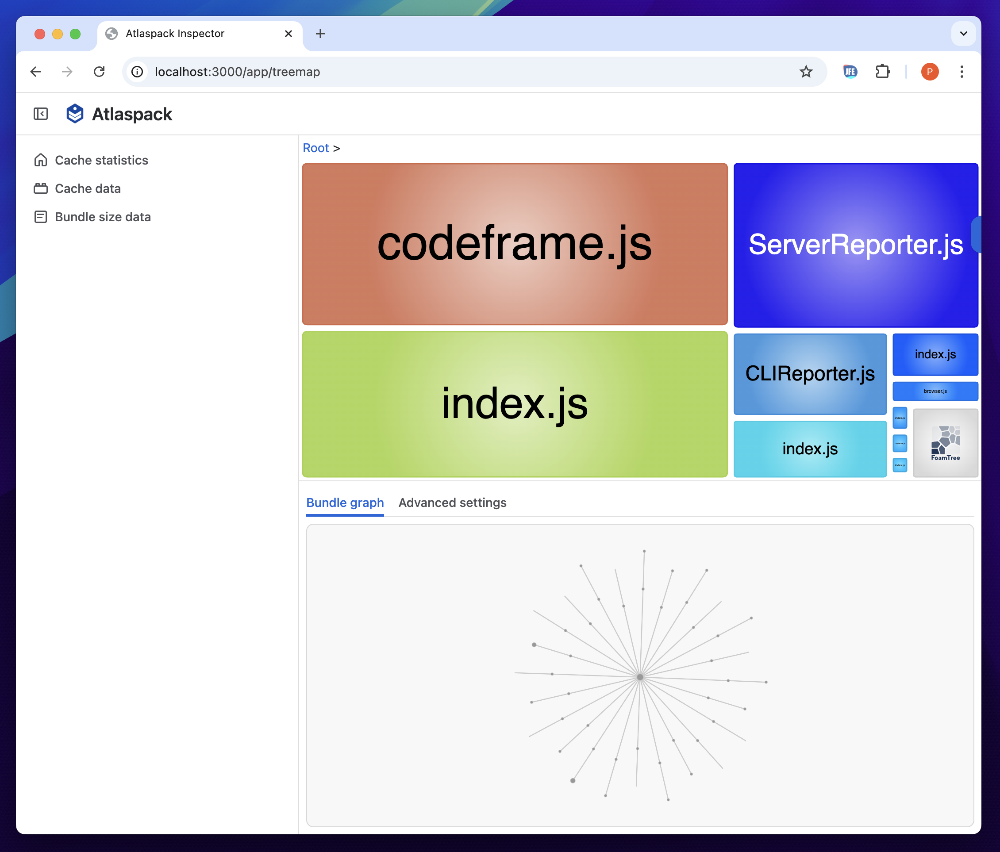
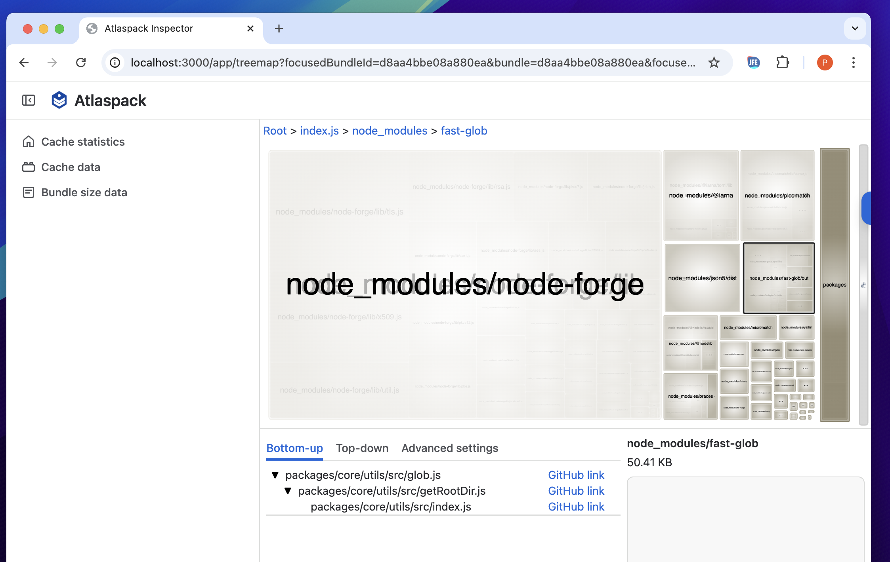
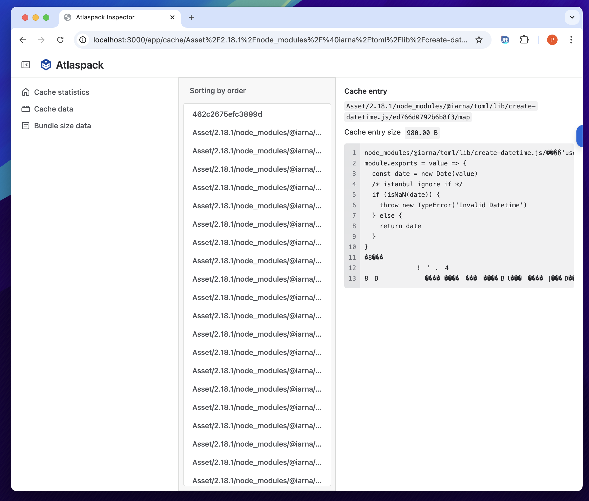

# @atlaspack/inspector

> _experimental quality, lacks verification and testing of certain features_

`@atlaspack/inspector` provides a UI for looking at `atlaspack` cache data, including bundle
sizes and reasons why certain files are included in bundles.

## Usage

- this will only work with a cache that is built with the same version of `atlaspack/*` packages
  the inspector is using
- the `cachePerformanceImprovements` feature-flag must have been enabled when building the cache

```
atlaspack-inspector --target ./my-project-directory
# or
atlaspack-inspector --target ./my-project-directory/.atlaspack-cache
```

Please see "Building" and "Developing" to how to build this project.

## Feature overview

### Treemaps

`@atlaspack/inspector` renders tree-maps using the [FoamTree](https://get.carrotsearch.com/foamtree/)
library. Users can open tree-maps of the largest scale applications bundle graphs.



- Clicking a bundle will focus on all related bundles
- Double clicking a bundle will open it for analysis on a drill-down page

### Treemap drill-down



When on the drill-down page, clicking a directory will "open" its contents and allow the developer
to drill-down on the sizes.

The bottom panel will render tables with different ways of traversing the data and understanding
why a certain directory or dependency has been included into the bundle.

### Cache analysis



A separate route shows raw cache information. At the moment this is simply a view where an `atlaspack`
developer can open individual cache entries, but ideally it'd be expanded to render more semantic
information about the cache, such as relationships between cache nodes.

## Building

To build the inspector, first build the `atlaspack` repository:

```
yarn run build
```

Then build the inspector back-end and front-end with:

```
yarn workspace @atlaspack/inspector prepack
```

## Developing

### Example starting the server in development mode

```
yarn workspace @atlaspack/inspector dev --target $PWD/.parcel-cache
```

### Example starting the frontend in development mode

```
yarn workspace @atlaspack/inspector-frontend dev
```

## Testing

Tests are a work-in-progress. We are missing a layer of UI testing.

There are few unit-tests for the back-end and express integration tests in `test/backend`.
Those will use `mocha`, `sinon` and `superagent`, mostly for consistency with the rest of this repository.

End-to-end tests are mostly visual regression tests on `test/e2e-test`. Those tests will build a project,
spawn an inspector server and open its front-end on a web-browser, then check it is rendering correctly.

# @atlaspack/inspector front-end

The inspector front-end is using `@atlaskit/*` packages from the Atlassian design system.

Its tech-stack at the moment is:

- `react`
- `react-router`
- `mobx`
- `CSS modules`
- `foamtree`
- `react-query`, and other `tanstack` packages
